<script>hljs.highlightAll();</script>

<!--jump to anchor tag adjusted to header height offset-->
<script>
// Get the header element
let header = document.querySelector('header');

// Get the height of the header
document.querySelectorAll('a[href^="#"]')
.forEach(function (anchor) {
    anchor.addEventListener('click', 
    function (event) {
        event.preventDefault();

        // Get the target element that 
        // the anchor link points to
        let target = document.querySelector(
            this.getAttribute('href')
        );
        
        let headerHeight = header.offsetHeight*2;
        
        let targetPosition = target
            .getBoundingClientRect().top - headerHeight;

        window.scrollTo({
            top: targetPosition + window.scrollY,
            behavior: 'smooth'
        });
    });
});
</script>

# Intro to Game Engine, Unity, and C&#35;

---

## What is a Game Engine?

Let's break this question down. First of all...

### What is a Game?

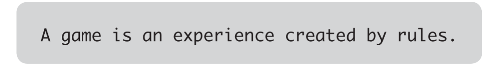
<figure>
<blockquote>
<p>A game is an experience, and that experience has a certain character. [...] And if we’re discussing an experience, then that implies someone is there to have that experience, someone we refer to as a player. We can’t talk about a game without talking about the experience of the player playing that game, even if the playing experience we’re talking about is often our own.</p>
<p>
<mark>The experience we call a game is created by the interaction between different rules</mark>, but the rules themselves aren’t the game, the interaction is! <mark>A game can’t exist without a player or players</mark>: someone needs to be engaging with the rules for the experience to happen.</p>
</blockquote>
<figcaption>-- Chapter Three, Rise of the Videogame Zinesters. Anna Anthropy.</figcaption>
</figure>

For example, in a game of tag, what are the rules for...

1. **THE SETUP** -- how do you decide who's "it"? when can they start tagging people?
2. **THE LEVEL / PLAYING FIELD** -- how far can players go before they're "out-of-bounds"? are there safe zones where people can't be tagged? 
3. **PLAYER BEHAVIOUR** -- are players only allowed to travel in a certain manner (e.g. speedwalking, but no running), and how can that be enforced (e.g. speedwalking means both feet cannot be lifted off the ground at the same time at any moment.) If someone gets tagged, what happens to them? Do they freeze in position, become "it", or are they out of the game? 
4. **CONCLUDING THE EXPERIENCE** -- how do you know when the game has ended, and who the winner/loser is (if any)?

</br>

#### "Is xxx a game?"

<figure>
<iframe class="itch-html-embed" frameborder="0" src="https://html-classic.itch.zone/html/5171563/index.html" width="100%" height="400" ></iframe>
<figcaption>-- <a href="https://sweetfish.itch.io/game">is this a game?</a> by sweetfish on itch.io.</figcaption>
</figure>

Regardless of what you end up making for your assignments, you'll eventually have to make decisions about the **parameters and conditions** of your project (which you could think of as being "the rules of your game") and consider how one's interaction / encounter of these "rules" will affect their overall experience of it.

In this class, we will focus on **how to implement these rules using game engines**, so that you can explore its creative affordances for designing particular experiences.

### What is an Engine?

<figure>

<figcaption>-- Marine Diesel Engine Animation GIF (<a href="https://tenor.com/en-GB/view/marine-diesel-engine-engine-gif-8550503">Source</a>)</figcaption>
</figure>

<figure>

<figcaption>-- Animation of Eadweard Muybridge’s Jockey riding a race horse from his ‘Animal Locomotion’ series, 1878/87 / J. Paul Getty Museum, Los Angeles, USA / Bridgeman Images</figcaption>
</figure>

</br>
Consider the following definitions from the Wikitionary page for <a href ="https://en.wiktionary.org/wiki/engine#English">"Engine"</a>:

</br>

> "A complex mechanical device which converts energy into useful motion or physical effects."

In a mechanical sense, <mark>an engine is an energy converter</mark> that can transform certain type(s) of input into other type(s) of "productive" output.

</br>

<blockquote><p>"A person or group of people which influence a larger group; a driving force." </p></blockquote>
<blockquote><p>"Anything used to effect a purpose; any device or contrivance; an agent."</p></blockquote>

In an abstract sense, <mark>an engine is an information carrier</mark> that can contain, transfer, and transform ideas, beliefs, and principles. 

</br>

<blockquote><p>"A large construction used in warfare, such as a battering ram, catapult etc. [from 14th c.]"</p></blockquote>
<blockquote><p>"The part of a car or other vehicle which provides the force for motion, now especially one powered by internal combustion. [from 19th c.]"</p></blockquote>

From a historical and infrastructural standpoint, <mark>an engine is a catalyst of both the production and destruction of worlds, societies, and cultures.</mark>

</br>

> "A software or hardware system responsible for a specific technical task (usually with qualifying word)."
>>   a graphics engine; </br> a physics engine.

In computing, <mark>an engine is a specialised machine</mark> for performing a specific task.

</br>

In this class, we will be mostly using software programs designed specifically for game development... but really, <a href="#what-is-a-game-engine_1">anything can be a "game engine."</a>

It is also worth considering the various contexts in which the engine emerges, so that we can better grasp the possibilities and implications of this technology, and then decide how and where we would like to proceed with this tool.

### Put them together... GAME ENGINE! 

Returning to our first question: 

#### What is a game engine?

<figure>

<figcaption>-- <a href="https://wttdotm.com/guess_we_doin_games_now/desktop.html">guess we doin games now</a> by morry kolman (@WTTDOTM)</figcaption>
</figure>

- Tools designed specifically for developing games (e.g. Unity, [Bitsy](https://www.bitsy.org/), [PICO-8](https://www.lexaloffle.com/pico-8.php), [in-game](https://create.roblox.com/) [level](https://supermariomaker.nintendo.com/) [builders](https://www.minecraft.net/en-us/about-minecraft))
- Platforms which primarily serve some other non-game-making function (if any at all), but are nonetheless used for making games. (e.g. [Spread](https://eieio.games/nonsense/game-10-realtime-gsheet/)[sheets](https://www.youtube.com/watch?v=N2QC6VQXo8U), [Checkboxes](https://eieio.games/nonsense/game-14-one-million-checkboxes/), [Post-war junkyards and bombsites](https://www.ludozofi.com/home/library/adventure-playgrounds-and-postwar-reconstruction/))

<figure>

<figcaption>-- <a href="https://truthout.org/articles/when-play-is-criminalized-racial-disparities-in-childhood/">When Play Is Criminalized: Racial Disparities in Childhood</a>. Eisa Nefertari Ulen, TRUTHOUT.
</figure>

If a game is ["an experience that is made from the interaction between different rules"](#what-is-a-game), then broadly speaking, <mark>a game engine could be anything that converts rules and interaction into playable experiences. </mark>

### Unity is a Game Engine

We'll spend most of this course working in the Unity game engine. 


<!--HOST THIS IMAGE LOCALLY!-->

Unity, initially released in 2005, is a closed-source game engine, and Unity Technologies, the developer of the engine, has been a publicly traded company since 2020. 

The engine gained popularity through being free for small, independent developers, with a relatively easy learning curve. 

Compared to most other game engines, Unity also tries to avoid being aesthetically identifiable and not be tied to a particular genre of game. 

Other industries use Unity for things like [Architectural](https://unity.com/solutions/architecture-engineering-construction) and [Auto](https://unity.com/solutions/automotive-and-transportation) rendering, [Film and TV production](https://unity.com/solutions/real-time-filmmaking-explained), [AI training](https://unity.com/products/machine-learning-agents) and [computer vision](https://unity.com/products/computer-vision).

Unity also contracts with the US Department of Defense for [military training](https://www.vice.com/en/article/y3d4jy/unity-workers-question-company-ethics-as-it-expands-from-video-games-to-war) and [simulation.](https://www.youtube-nocookie.com/embed/0lLBnGe6Ecc?si=DGJKtpGZ18pKe-Dr)

<br>

## Anatomy of the Unity Editor

<figure>

<figcaption>-- Unity Editor window in default workspace layout</figcaption>
</figure>

<br>

Read the following articles from the Unity User Manual:

- [Unity's interface](https://docs.unity3d.com/Manual/UsingTheEditor.html)
- [GameObjects](https://docs.unity3d.com/Manual/GameObjects.html)
- [Using Components](https://docs.unity3d.com/Manual/UsingComponents.html)

## Positioning Game Objects in Unity

> Read more in the Unity User Manual: [https://docs.unity3d.com/Manual/PositioningGameObjects.html](https://docs.unity3d.com/Manual/PositioningGameObjects.html)

Remember the shortcut **QWERTY**:

<u>Hand tool</u><br>Pans scene view. Shortcut: [Q]

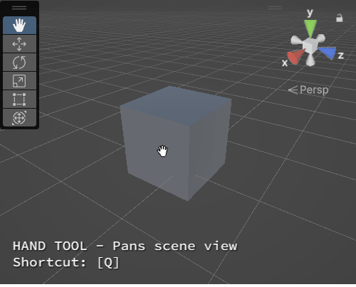

<br>

<u>Move tool</u><br>Transforms object position. Shortcut: [W]

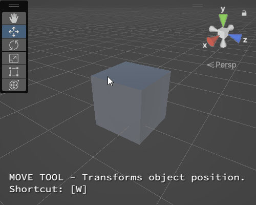

<br>

<u>Rotate tool</u><br>Transforms object rotation. Shortcut: [E]

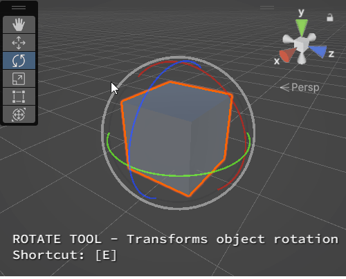

<br>

<u>Scale tool</u><br>Transforms object scale. Shortcut: [R]

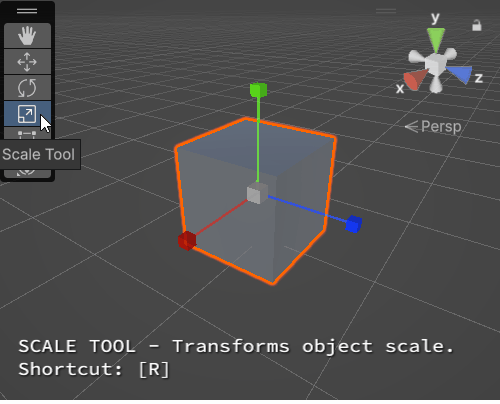

<br>

<u>Rect Transform tool</u><br>Transform GUI objects. Shortcut: [T]

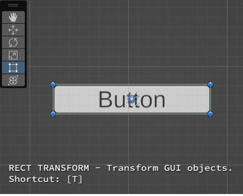

<br>

<u>Transform tool</u><br> Moves, rotates, and scales object. Shortcut: [Y]

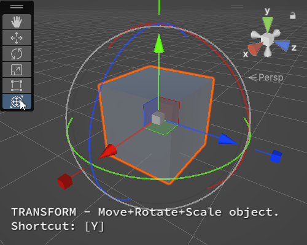

<br>

## Scene Navigation in Unity

> Read more in the Unity User Manual: [https://docs.unity3d.com/Manual/SceneViewNavigation.html](https://docs.unity3d.com/Manual/SceneViewNavigation.html)

<u>Pan scene view (Hand Tool)</u><br> Click + Drag Mouse Scroll Wheel Button.

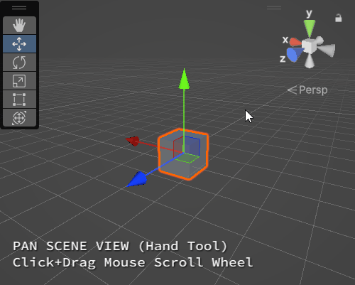

<br>

<u>Rotate scene view around central pivot</u><br> Click + Drag Left Mouse Button while holding down [ALT].

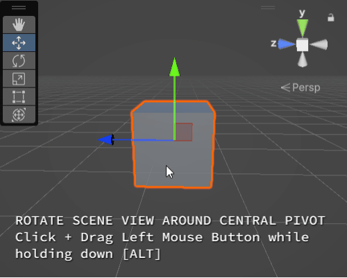

<br>

<u>Zoom scene view</u><br> Option 1: Mouse Scroll Wheel Up / Down

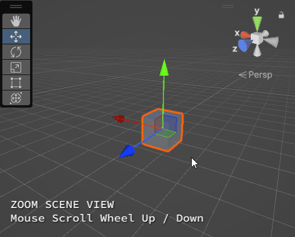

<br>

Option 2: Click + Drag Left Mouse Button while holding down [ALT].

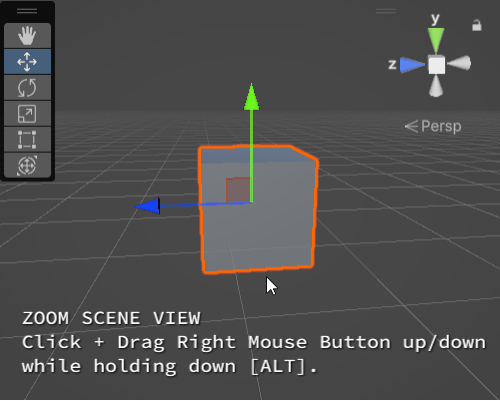

<br>

<u>Flythrough Mode</u><br> Hold down Right Mouse Button. <br> Fly around scene using WASD and [Q][E]. <br> Hold down [SHIFT] to move faster.

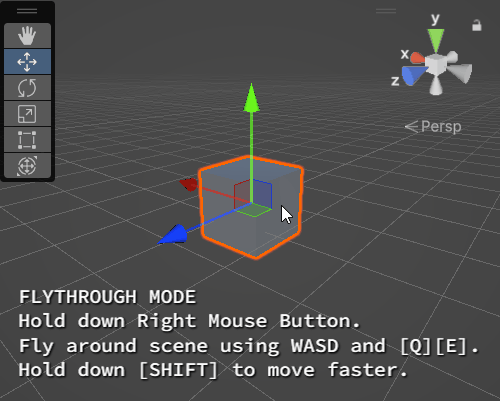

<br>

<u>Focus scene view on selected object</u><br> Select object > Press [F]

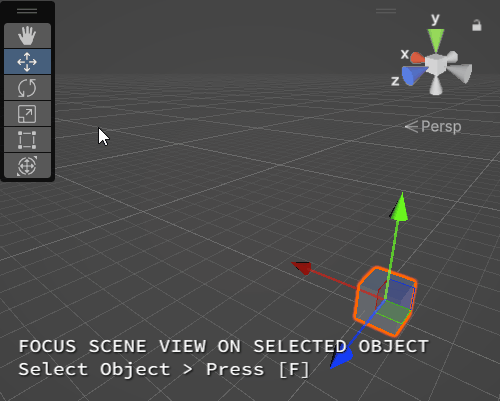

<br>

<u>Toggle Perspective / Isometric View</u><br> Click the Gizmo box.

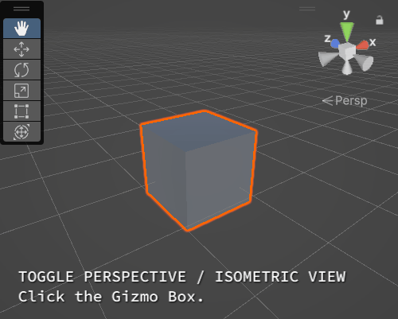

<br>

<u>Snap to World Axis View</u><br> Click the Gizmo axes.

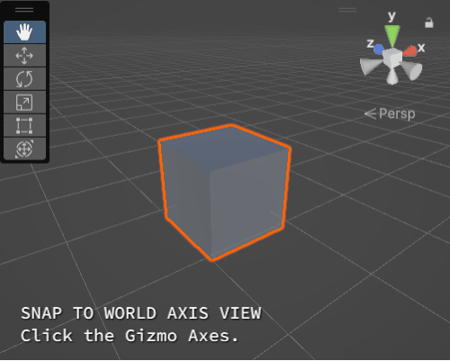

<br>

## Unity C&#35;

Unity uses <mark>C#, a type of object-oriented language</mark>, as one of its primary scripting languages.

We typically write Unity C# scripts to make customised blueprints for accessing, organising, and implementing data inside our game project. This is helpful for:

1. storing information such as **variables** and **functions** inside an **object** or **class**;
2. programming interactive / dynamic behaviour in objects;


<br> 

## How to write a Unity C&#35; script

> **If you are new to coding in C#**, watch this video for a brief introduction to [C# Variables and Functions](https://www.youtube.com/watch?v=-c1RsydH2nA) in Unity.

<br>

A script typically contains the following elements:

- **Variable**: a labelled container for data of a specific type.
- **Functions**: lines of code that contain a set of instructions (i.e. lines of code) and determine the frequency and order at which they should be executed. Functions may take INPUT variables (**arguments**), perform operations , and/or return OUTPUT variables (**result**). 

<br>

When writing any sort of code, here's the general thought process:

<div style="border: 1px solid black;">
<p style="text-align:center;">
<u><b>OUTPUT</b></u><br><i>"I need my script to do <b>THIS</b>..."</i><br>
⬇<br>
<u><b>INPUT</b></u><br><i>"... so I need to access <b>THESE VARIABLES</b>..."</i><br>
⬇<br>
<u><b>METHOD</b></u><br><i>"... and need <b>THESE FUNCTIONS</b> to be called in this order sequence."</i><br>
</p>
</div>

<br>

In this class, you'll learn to identify which information you'll need for each of your scripts, and where + how to retrieve/modify this data. However, **there is no expectation to memorise every single programming term or method you come across.** 

The longer you work in Unity, the more accustomed you'll become with its interface and workflow, and eventually you'll find yourself not needing to look up information as often as you used to. 


When in doubt, try searching for solutions on [Unity's Documentation page](https://docs.unity.com/) or other community forums / blogs like [Stack Exchange](https://gamedev.stackexchange.com/) or [gamedevbeginner](https://gamedevbeginner.com/). 

<br>

**To create a script**
Right click in the Project Panel > Create > Monobehaviour or C# script > Let's name this script "DemoScript". 

It's a good idea to create a "Scripts" folder to store all the scripts in your project. 

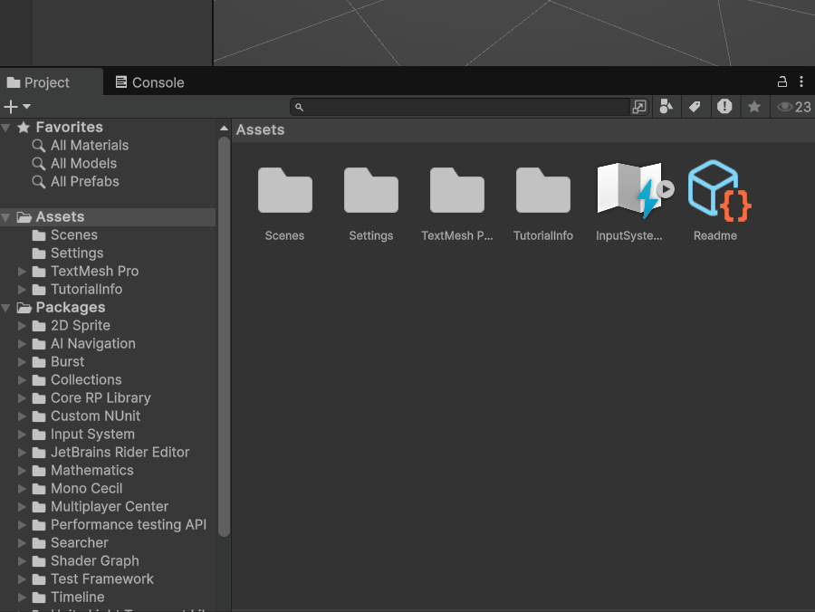

<br>

**When naming your script, remember to follow these rules:**

- the name must be **unique** -- no two MonoBehaviours should have the same name.
- use **pascal case**, (i.e. first alphabetical letter is capitalised, and every new word is marked with a capitalised case, no spaces.) *e.g. MyScript.cs*
- the file name of the script and the name of the MonoBehaviour must be **exactly the same (case-sensitive)**.
    - e.g. if your C# file name is "ScoreManager.cs", then the line declaring your Monobehaviour class in that script file should look like this: </br><pre><code>public class ScoreManager : MonoBehaviour
    {...}</code></pre>

<br>

Your script should look something like this: 

```csharp
using UnityEngine;

public class DemoScript : MonoBehaviour
{
    // Start is called once before the first execution of Update after the MonoBehaviour is created
    void Start()
    {
        
    }

    // Update is called once per frame
    void Update()
    {
        
    }
}
```

<br>

## Anatomy of a Unity C&#35; Script

Let's break down the script we just made.

### Namespaces

```csharp
using UnityEngine;
```

**Namespaces** are reference libraries containing all the methods and classes for a specific context. 

A C# script typically begins with a list of namespaces. The name of each namespace is placed after `using`.


<br>

### MonoBehaviours

```csharp
public class DemoScript : Monobehaviour{...}
```

In Unity C#, we're mostly working with a class called <a href="https://docs.unity3d.com/ScriptReference/MonoBehaviour.html">MonoBehaviour</a>, which tells our script to behave like a component so that it can be attached to any gameobject in our scene.

When we create a new C# script in Unity, we are creating **custom classes that inherit from a MonoBehaviour class** (default). This allows our script to adopt the functionality and methods of a Monobehaviour class. You may think of this in terms of a hierarchal model of classification: our "DemoScript" class exists as a sub-category of MonoBehaviours.

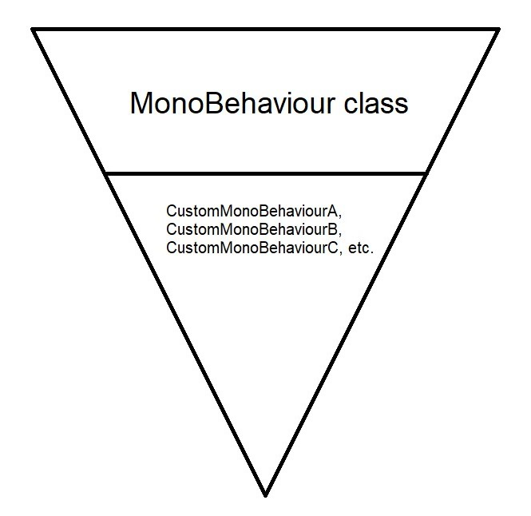

Followed by the MonoBehaviour declaration are a pair of curly braces `{ }`. When writing new properties and methods for this class, we typically want to write **within these curly braces**. 

<br>

### Variables

Variables are labelled data containers that represent properties for that class. These variables can be assigned values, and whose read/write access can be set by declaring them as public or private.

Most properties in a component are likely accessible via scripting by calling their labels ([Unity scripting reference](https://docs.unity3d.com/ScriptReference/index.html) is your best dictionary!)

**When creating variables:**

1. Declare access permissions in *lowercase*, either `public` or `private`. 
    * public variables can be accessed and used by other classes outside of the current class' scope.
    * private variables cannot be accessed nor used by other classes. 
    * if not specified, the variable defaults to `private` access.
2. Declare what type of variable it is
    * `float` - a numerical value that can be in decimals
    * `int` - a numerical integer (whole numbers only)
    * `bool` - binary property that can be either assigned 'true' or 'false'
    * `string` - a sequence of characters
    * other public classes including `GameObject` and components (e.g. `Transform` )
3. Name the variable
    - no spaces allowed.
    - use *camel case*. </br><pre><code>int numberOfCamels;</code></pre>
    - use clear and descriptive nouns -- the intent of this variable should be immediately apparent from its name
        - e.g. if it is a bool, prefix with a verb (typically phrase as a question.) </br><pre><code>bool isWalking;
        bool hasSpecialAbility;</code></pre>
    - use prefixes with an underscore to differentiate private member variables from public ones.</br><pre><code>private bool _currentHealth; 
    public bool currentHealth;</code></pre>
4. Assign a value that fits the declared variable type. </br><pre><code>public float speed = 0.4f;
public int pointsToWin = 10;
public bool hasWon = false;
public string winText = "You won!";</code></pre>

### Functions

By default, a newly created MonoBehaviour script should alread contain two **event functions** (i.e. functions that are automatically triggered during specific events), along with commented lines on what they do: 

```csharp
public class DemoScript : MonoBehaviour
{
	// Start is called once before the first execution of Update after the MonoBehaviour is created
    void Start()
    {
        //anything inside here will run only once at the start of the game, or when the script is set to active. 
    }

    // Update is called once per frame
    void Update()
    {
        //anything inside here will run once every frame update in project runtime. 
    }
}
```

<br>

Functions may accept arguments (input parameters) inside the parentheses. Multiple arguments are separated by commas.

```
float result;

void MultiplyNumbers(float a, float b){
    result = a*b;
}
```

<br>

**When creating functions:**

1. declare access permissions in lowercase  (default: `private`)
2. what type of value it returns in lowercase (if any)</br><pre><code>//function returns a float
public float MultiplyNumbersFloat(float a, float b){
    return a\*b;
    //this method can be called elsewhere
    //in the following manner:
    //float result = MultiplyNumbersFloat(float1, float2);
}
//function returns null value
public void MultiplyNumbers(float a, float b){
    float result = a\*b;
    Debug.Log(result); //logs result to console.
}
</code></pre>
3. name of the function in *pascal case*, followed by parenthesis containing any argument variables. </br><pre><code>float MultiplyByTwo(float initialFloat){...}</code></pre>

<br>

## Key principles of Programming in Unity C&#35;

- **Single Responsibility** -- Every module of code (class, function, etc.) should have a one and only purpose in the software functionality. This will be very helpful for:
    - debugging scripts
    - making your scripts easily reusable for other projects.
- **Keep everything private unless it *absolutely* needs to be public.**
    - this is to avoid any conflicts, confusion, and unintended overwriting of information in other classes. 
    - if a variable just needs to be visible / editable in the Inspector but does not need to be publicly accessible to other classes, you should keep it private then add [SerializeField] before it. </br><pre><code>[SerializeField] bool _currentIndex;</code></pre>
- **Anticipate errors, and help your script help you catch them**
    - use `Debug.Log()` or `print()` as checkpoints to ensure your properties and methods are correct.
    - use `Debug.LogError()` to trigger error messages during incorrect values / null references.
    
```csharp
    int score = 0;
    Debug.Log("score: "+score); //prints "score: 0" to the console
    score++; //adds 1 to score.
    Debug.Log("score: "+score); //prints "score: 1" to the console
    score--; //subtracts 1 from score.
    Debug.Log("score: "+score); //prints "score: 0" to the console
```

```csharp
    int totalScore;
    if (totalScore == null){
        Debug.LogError("totalScore has not been initialised!");
    }
```

    
- **Use comments to contextualise your lines of code**. </br><pre><code>//Unity will ignore everything inside this line
//player's total score
float score = 0;</code></pre><pre><code>/\*
you can also
comment across
multiple lines
\*/
</code></pre>
    - **Toggle Comment Hotkey Command **<br>Visual Studio Community: CTRL/Cmd + [K], then CTRL/Cmd + [C] <br>Visual Studio Code: CTRL/Cmd + [/]

<br>

---

## In-class exercise

Write a C&#35; script to store, set, and update character information.

```csharp
using UnityEngine;

//MonoBehvaiour class name "GooseInfo" is the same as our file name "GooseInfo.cs".
public class GooseInfo : MonoBehaviour
{
    //basic variable types (string, int, float, bool)
    //are all in small-case letters.

    public string gooseName = "danny"; //a string of characters, aka text.
    public int numberOfTeeth = 3; //integers; whole numbers, no decimals.
    public float age = 10f; //floats; numbers with decimal ranges.
    public bool isHappy = true; //boolean; can only be true or false. 

    //Unity-specific variable types like "Color" and "Material"
    //need to start with a capitalised letter.

    Color furColor = Color.blue;
    [SerializeField] Material baseMat; 
        //[SerializeField] allows us to initialise
        //this variable via drag-and-dropping
        //a material asset into the inspector.

    //Start() runs exactly once
    //at the start of run time,
    //or when the script is set to active.
    private void Start()
    {
        //get the MeshRenderer component from the same gameobject
        //that this script is attached to.
        MeshRenderer renderer = GetComponent<MeshRenderer>();

        //set this mesh renderer's material as baseMat.
        renderer.material = baseMat;

        //set the colour of the material in the mesh renderer as furColor.
        renderer.material.color = furColor;
    }

    //Update() runs once every frame update
    //as long as this script is active in the scene. 
    private void Update()
    {
        //increase age by 0.01f each time
        //using our custom function
        AddAge(0.01f);

        //OR
        //age = NewAge(0.01f);

        //shorthand for increasing age by 1
        //age++; //same as age+=1;
    }

    //increases age by a float called "amount"
    private void AddAge(float amount)
    {
        age += amount;
    }

    //returns a float equal to "age + amount" 
    private float NewAge(float amount)
    {
        float result = age+amount;
        return result;
    }
}
```

---

## Exercise before next class

Can you write a script that forces a GameObject to start at a specific position in the scene? 

*(Hint: A GameObject's position is stored in the [Transform](https://docs.unity3d.com/ScriptReference/Transform.html) component; and positional values are stored as [Vector3](https://docs.unity3d.com/6000.0/Documentation/ScriptReference/Vector3.html) data types.)*