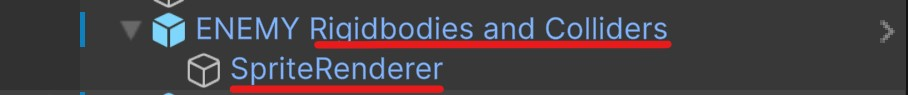

<script>hljs.highlightAll();</script>
<!--jump to anchor tag adjusted to header height offset-->
<script>
// Get the header element
let header = document.querySelector('header');

// Get the height of the header
document.querySelectorAll('a[href^="#"]')
.forEach(function (anchor) {
    anchor.addEventListener('click', 
    function (event) {
        event.preventDefault();

        // Get the target element that 
        // the anchor link points to
        let target = document.querySelector(
            this.getAttribute('href')
        );
        
        let headerHeight = header.offsetHeight*2;
        
        let targetPosition = target
            .getBoundingClientRect().top - headerHeight;

        window.scrollTo({
            top: targetPosition + window.scrollY,
            behavior: 'smooth'
        });
    });
});
</script>

# Sprites and Video players

---

📦 **Unity packages from today's class:**
> 
> - Class Demo: [Sprites](https://drive.google.com/file/d/1U_zZTX5CNS9JyD6dVzaZD5a-FDTEBhiE/view?usp=drive_link) (continuation from demo on [input systems in week 7](./7-inputsystem-statemachine-event.md))
> - Class Demo: [Video Player](https://drive.google.com/file/d/118rMSklqyxJz00-TkoGh_F1lcFIpvJm1/view?usp=drive_link)

<br>

📚 **Other relevant resources to today's topic:**
>
> - [Example character Sprite Sheet for Class Demo](https://drive.google.com/file/d/1KSmyTj-9Q5NIcUfgZNh-W-xuZoH1emmC/view?usp=drive_link).

<br>

---

### Using the Sprite Component on a 3D Moving Rigidbody 

If you're applying a sprite to a moving 3D object (let's say a player gameobject), I recommend attaching the sprite component **inside a separate gameobject**, then **parent it to your player GameObject** that has your Rigidbody, collider components, and player movement scripts.

In my package example, here is how my enemy object is arranged in my scene hierarchy:

> - **Parent Gameobject** with Rigidbody, colliders, and physics-based movement script. 
>       - **Child Gameobject** with Sprite component and sprite-related scripts (eg. rotating towards player camera, sprite switcher)



<br>

### Switching between Sprites using Scripts

```csharp
public class EnemyInfo : MonoBehaviour
{
    public Sprite defaultSprite,onHitSprite; // attach your sprite textures in the inspector
    public SpriteRenderer sprRend; // attach your sprite renderer
    bool crIsRunning; // we'll need this bool to check if a coroutine is currently running

    private void Start()
    {
        crIsRunning = false;
    }

    //we could call this public function inside a UnityEvent
    public void ChangeToOnHitSprite()
    {
        //if the coroutine is currently running, then stop it.
        if (crIsRunning)
        {
            StopCoroutine("ChangeSpriteForSeconds");
        }

        //start the coroutine.
        crIsRunning = true;
        StartCoroutine(ChangeSpriteForSeconds(onHitSprite,1f));
    }

    //a coroutine that changes to a non-default sprite "spr" 
    //for "interval" amount of seconds
    //then switches back to the default sprite at the end. 
    IEnumerator ChangeSpriteForSeconds(Sprite spr, float interval)
    {
        sprRend.sprite = spr;
        yield return new WaitForSeconds(interval);
        sprRend.sprite = defaultSprite;
        crIsRunning = false;
    }
}

```

### Rotate Sprite Towards Camera

This method uses the [Vector3.RotateTowards()](https://docs.unity3d.com/2022.3/Documentation/ScriptReference/Vector3.RotateTowards.html) function to rotate sprites towards the camera. 

```csharp
public class RotateTowardsPlayer : MonoBehaviour
{
    public float rotationSpeed;

    //Late update happens after update. 
    private void LateUpdate()
    {
        //Camera.main is a method for getting your camera that's tagged "MainCamera" 
        //typically only a single MainCamera exists in your scene
        //make sure to tag your player camera as MainCamera.

        //first get directional vector3 from this object to camera position.
        Vector3 targetDirection = Camera.main.transform.position - transform.position;

        float step = rotationSpeed * Time.deltaTime;

        //Rotate the forward vector towards the target direction by one step
        Vector3 newDirection = Vector3.RotateTowards(transform.forward, targetDirection, step, 0.0f);

        //rotate our object along this new direction.
        //here, i'm setting the y-vector as 0 so it rotates along the world Y-axis.
        transform.rotation = Quaternion.LookRotation(new Vector3(newDirection.x,0,newDirection.z));
    }
}
```

<br>

...or if you can use the [Transform.LookAt](https://docs.unity3d.com/6000.0/Documentation/ScriptReference/Transform.LookAt.html) method to rotate your sprite towards the camera without setting a prior rotation speed (ie. there won't be any transition delay during a change in rotation.)

```csharp
void LateUpdate(){
    transform.LookAt(Camera.main.transform);
}
```

<br>


<br>

---

## Video Player Component

> Read the documentation for the video player component on [Unity's Manual](https://docs.unity3d.com/2022.3/Documentation/Manual/class-VideoPlayer.html).

### Importing a Video into your Assets folder.

> Check out the following documentation on Unity's Manual: 
> 
> - [video file compatibilities](https://docs.unity3d.com/2022.3/Documentation/Manual/VideoSources-FileCompatibility.html) across different target platforms;
> - [video transparency support](https://docs.unity3d.com/2022.3/Documentation/Manual/VideoTransparency.html), if you're using videos with alpha channel renders. 

Select the video clip in your assets folder. Make sure to tick the checkbox for **"Transcode"** in the Inspector panel, and then hit **Apply**.


<br>

The simplest way of attaching a video onto a mesh object is to add a video player component, then attach the transcoded video clip asset inside the video player as a "Video Clip". 

The default render mode should be set to "Material Override", which replaces the current material base texture with the video. 

<figure>
    
    <figcaption>-- Video Player on different 3D primitive objects.
    </figcaption>
</figure>

<br>

### Video Player Properties


Here are some notable properties to take note of when setting up your video player:

- **Source**: Defaults to "Video Clip." You may change this to URL if you want to paste an online video link -- note that you may need Wi-fi access during runtime for your video to play. 
- **Play On Awake**: Automatically plays the video at the start of the scene. To manually trigger the video playback, call the [Play()](https://docs.unity3d.com/2022.3/Documentation/ScriptReference/Video.VideoPlayer.Play.html) command from the Video Player class in a C# script. 
- **Loop**: loops the video playback.
- **Playback speed**: Defaults at 1. Change this number if you want the video to play faster (higher float) or slower (lower float).
- **Render Mode**: Defaults to "Material Override". More info about using other render modes are listed in the sections below. 
- **Alpha**: Defaults to 1. Transparency level of the video. 
- **Audio Output Mode**: Defaults to "Audio Source". You may set a different Audio Source, or set the Audio Output Mode to "None" if you want the video to play without any audio tracks. 

<br>

### Video to Render Texture workflow

If you want to further customise how the video renders onto a material, you may consider setting the video player output to a **render texture** instead. 

The following demonstrates the workflow of this method: 

| Video Player | → | Render Texture | → | Texture Map on Material |
|--------------|---|----------------|---|----------------|
| Takes a video clip and renders its playback according to the selected render mode, which in this case would be "Render Texture". | | An asset that receives the video player's output as a texture | | Render texture can be plugged into a material's base colour, normal, emission, etc. | 

<br>

**STEP BY STEP INSTRUCTIONS:**

1. Create a video player component in an empty GameObject in your scene. You will only need **one video player component per video clip** in your scene, i.e. you don't need a video player component on every mesh object that's rendering the video. 
<br><br>Set the **render mode** to "Render Texture."<br><br><br><br>
2. In your assets folder, create a **Render Texture** asset. You may set the size of the texture to match your video clip's resolution or aspect ratio.<br><br><br><br>
3. Attach this render texture to the **Target Texture** property in the video player component. <br><br><br><br>
4. Create a new **Material** asset, then attach your render texture asset as a texture for the material's base colour property. This workflow also allows you the option to plug in the video texture to other material properties besides the base colour. 
<br><br><br><br>

<br>

### Video to Camera Plane

Setting the video player's render mode to **"Camera Far Plane"** allows you to project the video along the far plane of the selected camera view. This could be an option for playing a video in the camera's background.


<br>

Setting the video player's render mode to **"Camera Near Plane"** allows you to project the video along the nearest plane of the selected camera view. This could be an option for playing a video over other objects in the scene. 


<br>

---

## Some course reminders

- **Project 2** is due next Tuesday! 