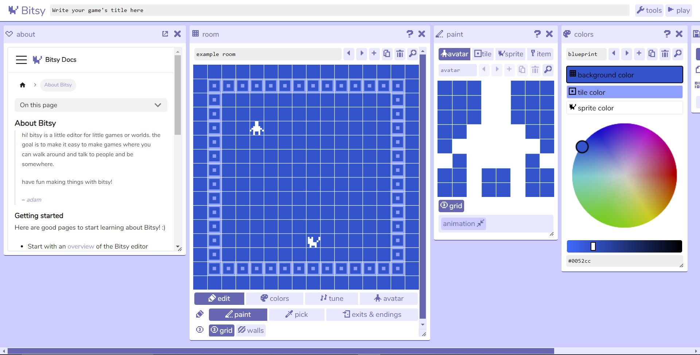
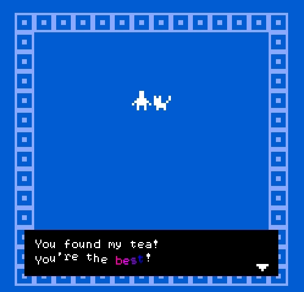

<script>hljs.highlightAll();</script>
<!--jump to anchor tag adjusted to header height offset-->
<script>
// Get the header element
let header = document.querySelector('header');

// Get the height of the header
document.querySelectorAll('a[href^="#"]')
.forEach(function (anchor) {
    anchor.addEventListener('click', 
    function (event) {
        event.preventDefault();

        // Get the target element that 
        // the anchor link points to
        let target = document.querySelector(
            this.getAttribute('href')
        );
        
        let headerHeight = header.offsetHeight*2;
        
        let targetPosition = target
            .getBoundingClientRect().top - headerHeight;

        window.scrollTo({
            top: targetPosition + window.scrollY,
            behavior: 'smooth'
        });
    });
});
</script>

# ALT-Engine Micro game jam

---

<embed type="text/html" src="../bitsyjam/on_a_thursday_afternoon___.html" width="100%" height="500">

## What is Bitsy? 

This "tiny" engine was made by Adam Le Doux who writes:

> hi! bitsy is a little editor for little games or worlds. the goal is to make it easy to make games where you can walk around and talk to people and be somewhere.

<br>

## What are we doing today?

By the end of class, we'd have made a Bitsy game in groups of 2-3 and (hopefully) also do a class presentation of our projects! The time limit is part of the game jam challenge ✨  

<br>

### Schedule

| Time | Activity |
|---|---|
| 1400 | 🍎 Intro to Game Jam activity and Bitsy game engine |
| 1420 | 💡 Brainstorm Ideas |
| 1430 | 🗳️ Voting for Ideas |
| 1440 | 🤝 Form Groups |
| 1450 | ⚒️ WORK WORK WORK |
| 1620 | ⏱️ TIMES UP -- Submit and Present ! |
| 1650 | 🏁 Game Jam end ! |

### Prompt

Generate your bitsy game ideas with the following sentence:

> a **(noun)** is wandering in **(a place)**. upon **(arriving at / encountering)** **(a specific location / object / person in the place)**, a story about **(a topic)** unfolds.

<br>

We’ll return to this in a moment. But first how do you do things in bitsy?

## Intro to Bitsy



Get to the engine here: [https://ledoux.itch.io/bitsy](https://ledoux.itch.io/bitsy)

We’ll take a stroll through the engine using this [bitsy pdf handout](https://zeroday.camp/wp-content/uploads/2018/09/Bitsy-Guides.pdf)

Look at what others have made: [https://itch.io/games/tag-bitsy](https://itch.io/games/tag-bitsy)



<br>

If you want to look at even more tutorials / info / hacks/ etc…

- bitsy docs has the latest information about how to do things in the editor: [https://make.bitsy.org/docs/](https://make.bitsy.org/docs/)
- [Another tutorial](https://www.shimmerwitch.space/bitsyTutorial.html) (also in [Chinese](https://zhuanlan.zhihu.com/p/527178844) and [Japanese](https://gamewriter.jp/2022/11/15/bitsy%e3%81%ae%e3%83%81%e3%83%a5%e3%83%bc%e3%83%88%e3%83%aa%e3%82%a2%e3%83%ab/)):
- bitsy handout (lots of links to other things): [https://rahji.github.io/bitsy-handout/web/](https://rahji.github.io/bitsy-handout/web/)
- bitsy tools map (also lots of links): [https://haraiva.neocities.org/bitsytools#1,4](https://haraiva.neocities.org/bitsytools#1,4)

<figure>
    
    <figcaption>-- <a href="https://haraiva.itch.io/endless-scroll">Endless Scroll</a>. Cecile Richard (haraiva).</figcaption>
</figure>


<br>

## Let's brainstorm some ideas! 

You’ve gotten a quick taste of the engine, so let’s come up with some ideas!

1. Grab a paper.
2. Write a version of this sentence with the parenthesis filled in with your own ideas:
    
    > a **(noun)** is wandering in **(a place)**. upon **(arriving at / encountering)** **(a specific location / object / person in the place)**, a story about **(a topic)** unfolds.

3. When you’re done. Put your paper on the designated idea table.

<br>

## Let's put it to a vote!

Each person gets ***Three votes***


Read through the ideas. Place a star **✰** on your favorite ones.


We’ll take the top 4-5 ideas and write them on the board!

<figure>
    
    <figcaption>-- <a href="https://hellodri.itch.io/anti-field-guide">Anti-Guide to Field Guides</a>. Dri Chiu Tattersfield (hellodri).</figcaption>
</figure>

<br>

## Let's get into groups! 

- Three people max.
- Workshop the idea, make a sketch, storyboard, plan what you’ll make (remember that your game can be small)
- Divide up the work if needed. (writing, drawing, sounds, bitsy assembly)
- Make sure to add an **ending** somewhere in your project!

<br>

### Notes on collaborating across multiple devices

Behind the scenes, bitsy is just storing everything as text.

Take a look at the **“Game Data”** tool. If you scroll around (or search for names), you’ll be able to find the data connected with your sprite / room / color palette

**You can copy and paste things from one game data file to another.**

If you’ve decided to use any hacks or plugins this might be a bit more tricky.

<br>

### Exporting and sharing the game

From the “Download” tool you can export your game as an HTML file -- **email this HTML file to me** so I can add your project to the Bitsy Museum!

To share bitsy projects online, you can embed it on your website using an iframe:

```html
<iframe src="path/to/my-fancy-bitsy.html"></iframe>
```

<br>

You can also upload it directly to itch.io and make a project page!

<figure>
    
    <figcaption>-- <a href="https://haraiva.itch.io/novena">Novena</a>. Cecile Richard (haraiva).</figcaption>
</figure>

<br>

---

## ... THE MOMENT YOU'VE ALL BEEN WAITING FOR!

<embed type="text/html" src="../bitsyjam/museum/index.html" width="100%" height="500">

<br>


---

## Some course reminders

- **Homeplay 2 (Extra Credit)** is due next Tuesday.
- **Project 3 Sketch** is due next Thursday.
