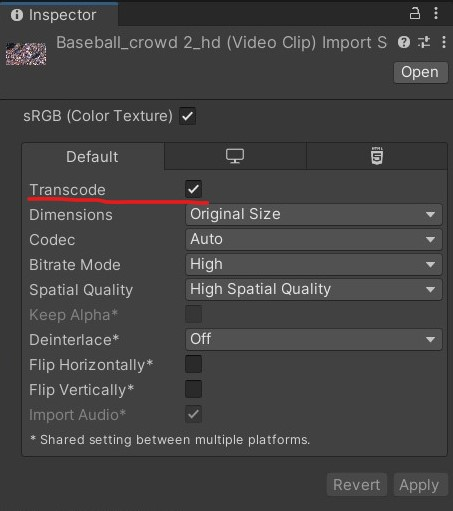
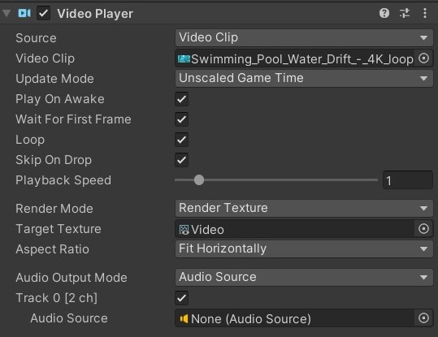
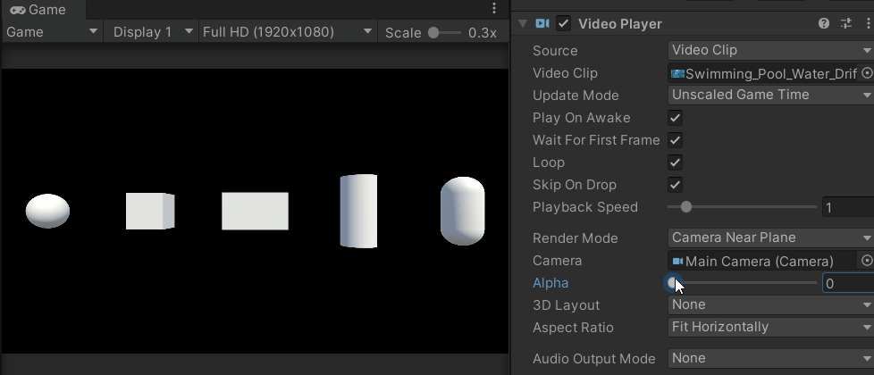
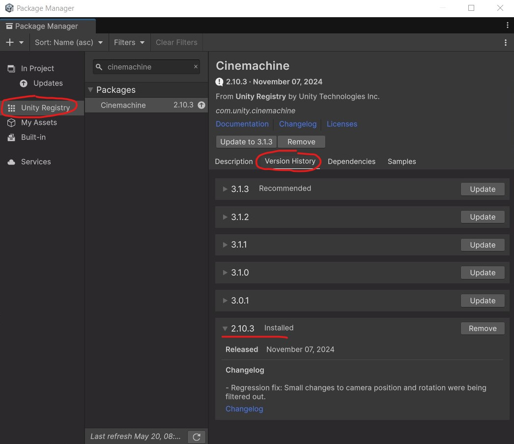
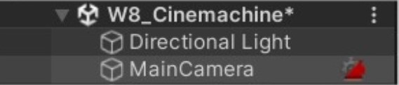
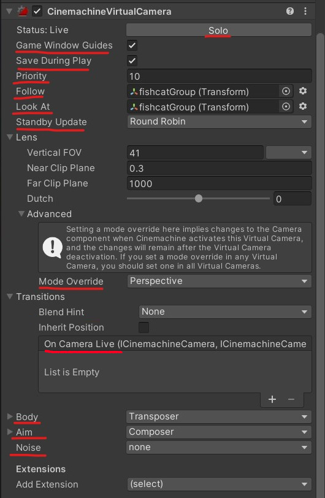
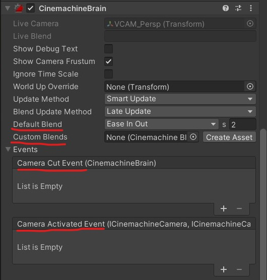

<script>hljs.highlightAll();</script>
<!--jump to anchor tag adjusted to header height offset-->
<script>
// Get the header element
let header = document.querySelector('header');

// Get the height of the header
document.querySelectorAll('a[href^="#"]')
.forEach(function (anchor) {
    anchor.addEventListener('click', 
    function (event) {
        event.preventDefault();

        // Get the target element that 
        // the anchor link points to
        let target = document.querySelector(
            this.getAttribute('href')
        );
        
        let headerHeight = header.offsetHeight*2;
        
        let targetPosition = target
            .getBoundingClientRect().top - headerHeight;

        window.scrollTo({
            top: targetPosition + window.scrollY,
            behavior: 'smooth'
        });
    });
});
</script>

# Sprites in 2.5D, Video players, Cinemachine

---

📦 **Unity packages from today's class:**
> 
> - [**Class Demo**](https://drive.google.com/file/d/1Zfs8qNNDYjaI_TTR2N7eV2QA2gUOnuMo/view?usp=drive_link), including examples of Sprites that rotate towards the camera, Video Players, Simple Multiple Camera Setup and Cinemachine

<br>

📚 **Other relevant resources to today's topic:**
>
> - [**Configuring Multiple Cameras in URP**](https://docs.unity3d.com/6000.1/Documentation/Manual/urp/cameras-multiple.html), including camera stacking, split-screen rendering, and using different post-processing for separate cameras.
> - Intro to Cinemachine Video tutorials by iHeartGameDev: an overview of Cinemachine's features and properties. 
>       - [**Cinemachine Overview and Brain Explained**](https://www.youtube.com/watch?v=P_ibDJhFVMU)
>       - [**Cinemachine Virtual Cameras Explained**](https://www.youtube.com/watch?v=asruvbmUyw8)

<br>

---

## Sprites in 2.5D 

<figure>

<figcaption> -- Paper Mario 3D Land. </figcaption>
</figure>

You may consider working with 2D sprites in 3D space for your projects. 

Here's some approaches you may consider:

### Using the Sprite Component on a 3D Object 

If you're applying a sprite to a 3D object (let's say a player gameobject), I recommend attaching the sprite renderer component **inside a separate gameobject**, then **parent it to your player GameObject**. This is so that we can reorient our sprite independently of the player parent group's transform component. 

> - **Parent Gameobject** with scripts for player movement, player info, etc. 
>       - **Child Gameobject** with Sprite Renderer component and sprite-related scripts (eg. rotating towards player camera, sprite switcher)


<br>

### Rotate Sprite Towards Camera

One common technique for 2.5D games is to use **billboarding**, which forces the sprite to face the camera at a perpendicular angle.

This method uses the [Vector3.RotateTowards()](https://docs.unity3d.com/2022.3/Documentation/ScriptReference/Vector3.RotateTowards.html) function to rotate sprites towards the camera. 

```csharp
public class RotateTowardsPlayer : MonoBehaviour
{
    public float rotationSpeed;

    //Late update happens after update. 
    private void LateUpdate()
    {
        //Camera.main is a method for getting your camera that's tagged "MainCamera" 
        //typically only a single MainCamera exists in your scene
        //make sure to tag your player camera as MainCamera.

        //first get directional vector3 from this object to camera position.
        Vector3 targetDirection = Camera.main.transform.position - transform.position;

        float step = rotationSpeed * Time.deltaTime;

        //Rotate the forward vector towards the target direction by one step
        Vector3 newDirection = Vector3.RotateTowards(transform.forward, targetDirection, step, 0.0f);

        //rotate our object along this new direction.
        //here, i'm setting the y-vector as 0 so it rotates along the world Y-axis.
        transform.rotation = Quaternion.LookRotation(new Vector3(newDirection.x,0,newDirection.z));
    }
}
```

<br>

...or if you can use the [Transform.LookAt](https://docs.unity3d.com/6000.0/Documentation/ScriptReference/Transform.LookAt.html) method to rotate your sprite towards the camera without setting a prior rotation speed (ie. there won't be any transition delay during a change in rotation.)

```csharp
void LateUpdate(){
    transform.LookAt(Camera.main.transform);
}
```

<br>

---

## Video Player Component

> Read the documentation for the video player component on [**Unity's Manual**](https://docs.unity3d.com/2022.3/Documentation/Manual/class-VideoPlayer.html).

### Importing a Video into your Assets folder.

> Check out the following documentation on Unity's Manual: 
> 
> - [**video file compatibilities**](https://docs.unity3d.com/2022.3/Documentation/Manual/VideoSources-FileCompatibility.html) across different target platforms;
> - [**video transparency support**](https://docs.unity3d.com/2022.3/Documentation/Manual/VideoTransparency.html), if you're using videos with alpha channel renders. 

Select the video clip in your assets folder. Make sure to tick the checkbox for **"Transcode"** in the Inspector panel, and then hit **Apply**.



<br>

The simplest way of attaching a video onto a mesh object is to add a video player component, then attach the transcoded video clip asset inside the video player as a "Video Clip". 

The default render mode should be set to "Material Override", which replaces the current material base texture with the video. 

<figure>
    
    <figcaption>-- Video Player on different 3D primitive objects.
    </figcaption>
</figure>

<br>

### Video Player Properties



Here are some notable properties to take note of when setting up your video player:

- **Source**: Defaults to "Video Clip." You may change this to URL if you want to paste an online video link -- note that you may need Wi-fi access during runtime for your video to play. 
- **Play On Awake**: Automatically plays the video at the start of the scene. To manually trigger the video playback, call the [Play()](https://docs.unity3d.com/2022.3/Documentation/ScriptReference/Video.VideoPlayer.Play.html) command from the Video Player class in a C# script. 
- **Loop**: loops the video playback.
- **Playback speed**: Defaults at 1. Change this number if you want the video to play faster (higher float) or slower (lower float).
- **Render Mode**: Defaults to "Material Override". More info about using other render modes are listed in the sections below. 
- **Alpha**: Defaults to 1. Transparency level of the video. 
- **Audio Output Mode**: Defaults to "Audio Source". You may set a different Audio Source, or set the Audio Output Mode to "None" if you want the video to play without any audio tracks. 

<br>

### Video to Render Texture workflow

If you want to further customise how the video renders onto a material, you may consider setting the video player output to a **render texture** instead. 

The following demonstrates the workflow of this method: 

| Video Player | → | Render Texture | → | Texture Map on Material |
|--------------|---|----------------|---|----------------|
| Takes a video clip and renders its playback according to the selected render mode, which in this case would be "Render Texture". | | An asset that receives the video player's output as a texture | | Render texture can be plugged into a material's base colour, normal, emission, etc. | 

<br>

**STEP BY STEP INSTRUCTIONS:**

1. Create a video player component in an empty GameObject in your scene. You will only need **one video player component per video clip** in your scene, i.e. you don't need a video player component on every mesh object that's rendering the video. 
<br><br>Set the **render mode** to "Render Texture."<br><br><br><br>
2. In your assets folder, create a **Render Texture** asset. You may set the size of the texture to match your video clip's resolution or aspect ratio.<br><br><br><br>
3. Attach this render texture to the **Target Texture** property in the video player component. <br><br><br><br>
4. Create a new **Material** asset, then attach your render texture asset as a texture for the material's base colour property. This workflow also allows you the option to plug in the video texture to other material properties besides the base colour. 
<br><br><br><br>

<br>

### Video to Camera Plane

Setting the video player's render mode to **"Camera Far Plane"** allows you to project the video along the far plane of the selected camera view. This could be an option for playing a video in the camera's background.


<br>

Setting the video player's render mode to **"Camera Near Plane"** allows you to project the video along the nearest plane of the selected camera view. This could be an option for playing a video over other objects in the scene. 



<br>

---

## Switching between Multiple Cameras

For each camera object in your scene, set the gameObject tag to be "MainCamera". 

Then, we can use a public method to toggle select cameras on or off. `Camera.main` will refer to whichever camera is currently active or has the highest priority level (available in the Camera component > Rendering > Priority).

```csharp
using UnityEngine;

public class CameraHandler : MonoBehaviour
{
    public void SwitchMainCamTo(Camera cam)
    {
        //disable old camera
        Camera.main.enabled = false;

        //enable new camera
        cam.enabled = true;

    }
}
```

<br>

---

## Cinemachine

> Here's the [**scripting API**](https://docs.unity3d.com/Packages/com.unity.cinemachine@2.3/api/Cinemachine.html) and [**documentation manual**](https://docs.unity3d.com/Packages/com.unity.cinemachine@2.3/manual/index.html) for Cinemachine 2. It's a bit difficult to sift through, so you may have better luck by directly looking up your Cinemachine question in a search browser or community forum... 
> 
> If you need an overview of Cinemachine's components and properties, I recommend these tutorials by iHeartGameDev:
> 
> - [**Cinemachine Overview and Brain Explained**](https://www.youtube.com/watch?v=P_ibDJhFVMU)
> - [**Cinemachine Virtual Cameras Explained**](https://www.youtube.com/watch?v=asruvbmUyw8)

### Installing Cinemachine from the Package Manager

Cinemachine is available as a package on the Unity Registry. 

Go to **Window > Package Manager > Install Cinemachine from the Unity Registry**

⚠️ **IF YOU'RE USING UNITY 6**, the default Cinemachine package is currently version 3, which will look entirely different from what's in the class notes! We want to be on **Cinemachine Version 2.0+** for this class. When installing Cinemachine from the Package Manager, go to **Version History** and **install the latest version of Cinemachine 2.0 release**. 



<br>

### How Cinemachine works

There are two main components that you will encounter when using Cinemachine -- the **Cinemachine Brain** and the **Cinemachine Virtual Camera**.

<figure>
    
    <figcaption>-- Screenshot taken from iHeartGameDev's <a href="https://www.youtube.com/watch?v=asruvbmUyw8">Cinemachine Tutorial Video.</a></figcaption>
</figure>

In Cinemachine, we're only controlling a single camera object that has a **Cinemachine Brain** component attached to it. The Cinemachine Brain forces our camera to match the settings of a selected virtual camera from our scene, including instructions for transitioning from one virtual camera to another. 

**When using Cinemachine, you won't be able to change your camera's orientation from its transform properties -- you would have to make those changes in the corresponding Cinemachine Virtual Camera component.**

<br>

**Cinemachine virtual cameras** behave like independent camera stations that can be simultaneously active in our scene, but only become "live" when their priority level is set to the highest order. Virtual cameras contain specific instructions for how our camera should behave, including: 

- the follow target, ie. which object to follow for positional tracking;
- the look target, ie. which object our camera should aim at;
- camera settings like field of vision (FOV) and mode overrides (eg. perspective, orthogonal);
- camera shaking presets using noise.

<br>

The main benefit of using Cinemachine is that it allows us to achieve the cinematic effects of smoothly interpolated camera transitions and object tracking without having to code everything from scratch.

<br>

### Setting up Virtual Cameras

Right click in your scene hierarchy, then go to **Cinemachine > Virtual Camera**. This will make two changes to our scene:

1. A new GameObject with a Virtual Camera component is added to our scene
2. The main camera now has a Cinemachine Brain component, as indicated by the tiny logo to the right of its name.



<br>

Here are some features you may consider using in these two components: 

#### Cinemachine Virtual Camera Component




##### <u>Previewing Virtual Cameras</u>

- **Solo button**: an easy way to selectively previewing virtual cameras one by one. 
- **Save During Play**: saves any changes made to your virtual camera during Play Mode. 
- **Game Window Guides**: useful for composing the camera's body/aim settings for Dead Zone and Soft Zone (availability is dependent on the selected mode.)

##### <u>Calibrating Multiple Cameras</u>

- **Priority**: when there are multiple active virtual cameras in the scene, the Cinemachine Brain will prioritise virtual cameras with higher priority values. 
- **Standby Update**: Tells the virtual camera whether / how often to update when it is not live.

##### <u>Setting up follow targets</u>

- **Follow**: the virtual camera's position will follow this object. 
- **Body**: determines the movement of your virtual camera while it is following an object. Defaults to "Transposer", which allows us to set the offset and damping. Can set this to "None" if we're not following anything. 


##### <u>Setting up look at targets</u>

- **Look At**: the virtual camera will always aim at this object.
- **Aim**: determines the movement of your virtual camera while it is aiming at an object. Defaults to "Composer", which allows us to set the offset and damping. Can set this to "Do Nothing" if we're not looking at anything. 


##### <u>Other camera features</u>

- **Mode Override** (inside Lens > Advanced): forces the camera mode to be perspective, orthogonal, etc.
- **On Camera Live** (inside Transitions): a Unity Event that gets invoked when the camera is live. You can add public methods here to listen for this event.
- **Noise**: adds a camera shake effect. 

<br>

#### Cinemachine Brain Component




##### <u>Camera Transitions</u>

- **Default Blend**: The default interpolation when transitioning across any two virtual cameras. 
- **Custom Blends**: You can create a custom Cinemachine Blend asset to set different blends for different camera transitions. 


##### <u>Events</u>

- **Camera Cut Event**: a Unity Event that gets invoked when a cut transition happens. 
- **Camera Activated Event**: a Unity Event that gets invoked at the start of a transition blend between two virtual cameras.

<br>