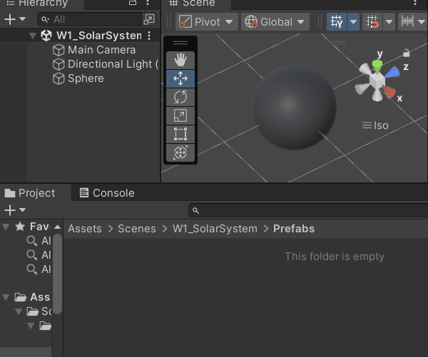
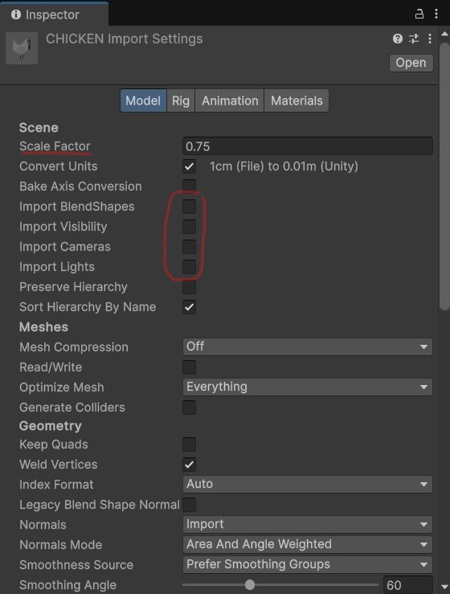
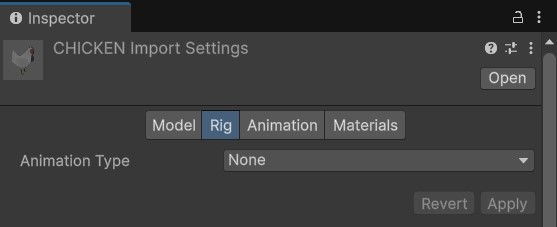
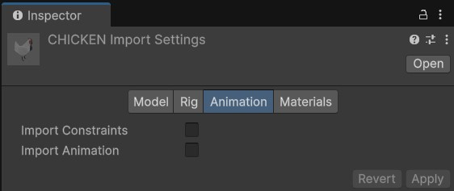
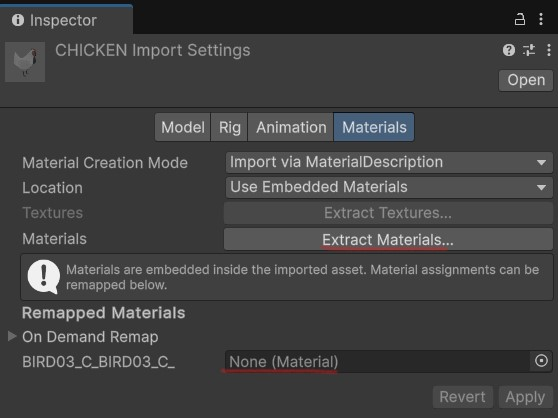
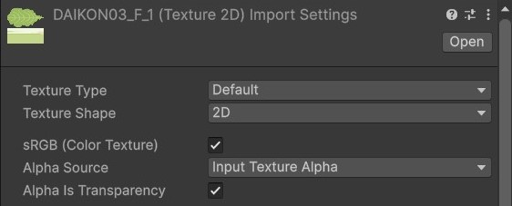
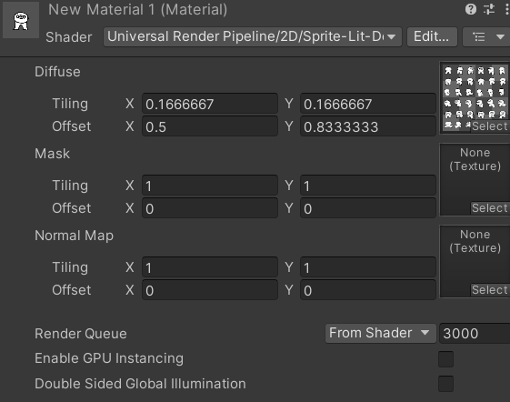
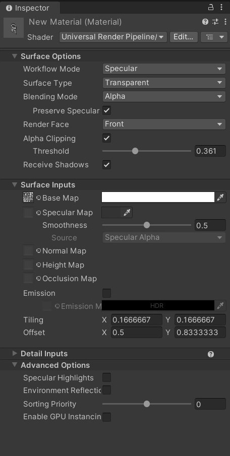
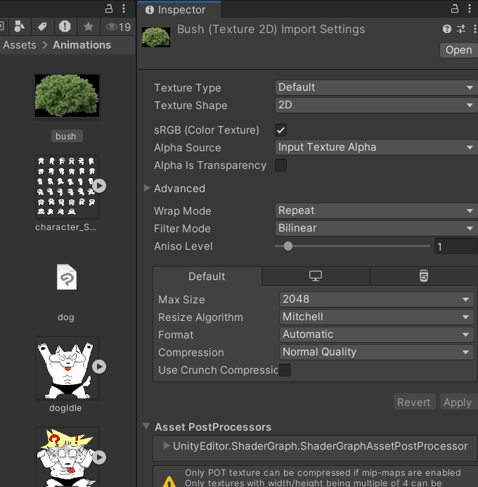
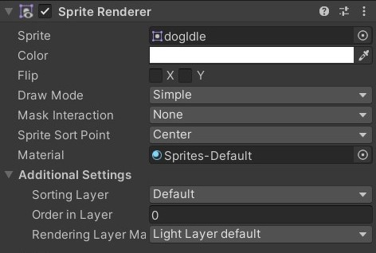

<script>hljs.highlightAll();</script>
<!--jump to anchor tag adjusted to header height offset-->
<script>
// Get the header element
let header = document.querySelector('header');

// Get the height of the header
document.querySelectorAll('a[href^="#"]')
.forEach(function (anchor) {
    anchor.addEventListener('click', 
    function (event) {
        event.preventDefault();

        // Get the target element that 
        // the anchor link points to
        let target = document.querySelector(
            this.getAttribute('href')
        );
        
        let headerHeight = header.offsetHeight*2;
        
        let targetPosition = target
            .getBoundingClientRect().top - headerHeight;

        window.scrollTo({
            top: targetPosition + window.scrollY,
            behavior: 'smooth'
        });
    });
});
</script>

# Prefabs, Loops, Arrays, Importing 2D and 3D Assets


📦 **Unity packages from today's class:**
> 
> - Exercise from last class: [**Solar System Generator**](https://drive.google.com/file/d/1uBBVTtAAEvbKtbLRWtLmyPOb0eR1-lsm/view?usp=sharing)
> - [**Exquisite Corpse Demo**](https://drive.google.com/file/d/1sH16po2eEjkW3uxHKE4OTx0q28x1QpMh/view?usp=drive_link)
> - In-class exercise: [**Spawn Random Prefab at Random Position**](https://drive.google.com/file/d/1xR83VQw-ZQqmZih9ZSWRj2UKqHl56O44/view?usp=sharing)
>     - Spawn at random position within set maximum distance.
>     - Spawn at random position within set min-max range along X Y and Z axes.
>     - Spawn at random positions selected from a given array of positions (without repeats).

📚 **Other relevant resources to today's topic:**
> 
> - Sample [**3D Models**](https://drive.google.com/file/d/12aXLuE8FMkveyTF5uzSK46hW1kOhXLQ_/view?usp=drive_link) and [**2D Assets**](https://drive.google.com/file/d/1ApYp9t8fvPvWEHPQsjc5RsMTygZ3nKHA/view?usp=drive_link) to practice asset import into Unity.


---

Before we begin...

## Review from last class

- 📌 **Reading Response 1 is DUE today!**
- [Transform component](https://docs.unity3d.com/Manual/GameObjects.html) and its properties
- [Vectors](https://docs.unity3d.com/Manual/UsingComponents.html) and how to use them
    - Vector math operations and method functions
    - Using vectors for procedural animation


---

## Exercise from last class

**How do we make a solar system that dynamically generates at the start of the scene:**

1. **a random number of planets and moons;**
2. **a set distance interval between each consecutive sibling planet?**


<iframe width="100%" height="315" src="https://www.youtube-nocookie.com/embed/GFa_E9BCoUg?si=qQja99oKoHmzb9t-&amp;controls=0" title="YouTube video player" frameborder="0" allow="accelerometer; autoplay; clipboard-write; encrypted-media; gyroscope; picture-in-picture; web-share" referrerpolicy="strict-origin-when-cross-origin" allowfullscreen></iframe>

<iframe width="100%" height="315" src="https://www.youtube-nocookie.com/embed/2_GG6TGaoII?si=wz_ArkzXmQFZcVxl&amp;controls=0" title="YouTube video player" frameborder="0" allow="accelerometer; autoplay; clipboard-write; encrypted-media; gyroscope; picture-in-picture; web-share" referrerpolicy="strict-origin-when-cross-origin" allowfullscreen></iframe>

---

## Prefabs

> Read about [Prefabs](https://docs.unity3d.com/Manual/Prefabs.html) in the Unity Manual.

Prefabs allow you to **store a GameObject and its information** (including its components, property values, child objects, etc.) into your Unity project folder **as a reusable Asset**. 

This Prefab Asset can be used as a base template from which you can create and modify new Prefab instances in the scene.

<br>

### How to create a Prefab from an existing GameObject in the scene

**Click and drag the GameObject from the Scene Hierarchy into your project folder panel.**

The GameObject should now be marked with a blue icon, and have an arrow button to the right of its name that leads you to the Prefab editor.



<br>

### How to Instantiate a GameObject

We use the [Instantiate()](https://docs.unity3d.com/ScriptReference/Object.Instantiate.html) method function to **spawn new instances of a GameObject** in our scene.

```csharp
Instantiate(someGameObject);
```

<br>

You could also **pass a GameObject instance into a GameObject variable**. This allows you to reference it later in your script. 

```csharp
GameObject obj = Instantiate(someGameObject);

//let's say we want to change the position of this instance
obj.transform.position = someVector;

//or set it to a new parent
obj.transform.parent = someParentObject;

```

<br>

The Instantiate() method can also be called in other ways that allow you to **pass multiple parameters at once**. 

The Unity Scripting API lists all the different ways you can declare the [Instantiate()](https://docs.unity3d.com/ScriptReference/Object.Instantiate.html) function.

For example:

```csharp
GameObject obj = Instantiate(
    spawnThisGameObject, //GameObject
    atSomePosition, //Vector3
    atSomeQuaternionRotation, //Quaternion
    underSomeParent); //Transform

```

<br>

### Instantiate and Destroy VS SetActive()

If you need to completely remove a gameobject or component from the scene, you may use the [Destroy()](https://docs.unity3d.com/6000.0/Documentation/ScriptReference/Object.Destroy.html) function like so:

```csharp
//removes the gameObject from the scene
Destroy(gameObject);

//removes a script component called "ThisScript" from the gameobject
Destroy(GetComponent<ThisScript>());
```

<br>

However, instantiating and destroying objects over and over again can add a toll on your build's performance. 

Whenever possible, you may want to opt for **toggling objects' active state / components' enabled state** in your scene instead. 

```csharp
//checks if gameobject is currently active
if (gameObject.activeSelf){
    //deactivates the gameObject in your scene
    gameObject.SetActive(false);
}


//checks if this component's behaviour is enabled
if (GetComponent<ThisScript>().enabled){

//OR

//checks if this component's behaviour is enabled 
//AND if the associated gameObject is active

//if (GetComponent<ThisScript>().isActiveAndEnabled){

    //deactivates the component called "ThisScript" in your gameObject
    GetComponent<ThisScript>().enabled = false;
}

//OR

//you can make a toggle function that switches
//the boolean enabled state between true and false
void ToggleComponentEnabled(){

    //someBool = !someBool;
    //i.e. set this bool to be NOT what it currently is

    GetComponent<ThisScript>().enabled = !GetComponent<ThisScript>().enabled  
}

```

---

## Loops

Loop functions allow you to repeat an action multiple times. 

Watch the Unity Tutorial below to learn about: 

- **While loops**
- **Do-while Loops**
- **For Loops**

<iframe width="100%" height="315" src="https://www.youtube.com/embed/Jefkb3Gm7vE?si=tyLETphQQTI-FwwH" title="YouTube video player" frameborder="0" allow="accelerometer; autoplay; clipboard-write; encrypted-media; gyroscope; picture-in-picture; web-share" referrerpolicy="strict-origin-when-cross-origin" allowfullscreen></iframe>

<br>

... and one more video about **Foreach Loops**.

<iframe width="100%" height="315" src="https://www.youtube-nocookie.com/embed/WhACXlObR8s?si=vHWChlqbapALZ_Of&amp;controls=0" title="YouTube video player" frameborder="0" allow="accelerometer; autoplay; clipboard-write; encrypted-media; gyroscope; picture-in-picture; web-share" referrerpolicy="strict-origin-when-cross-origin" allowfullscreen></iframe>

---

## Arrays

> Read about [Arrays](https://docs.unity3d.com/2020.1/Documentation/ScriptReference/Array.html) in the Unity Manual.

Arrays allow you to **store multiple objects in a single variable**. 

Each object stored in an array (ie. an array element) is assigned **an index number**, starting with **the first element being numbered as zero, not one**. To call an element from an array, we must reference its index number like this: `arrayName[indexNumber]`

<br>

For example, below is a string array called "fruits".

Array Index | 0 | 1 | 2 | 
------------|---|---|---|
Array Element| "apples" | "pears" | "oranges" |

```csharp
string[] fruits = {"apples", "pears", "oranges"};

Debug.Log(fruits[0]); //returns "apples"
Debug.Log(fruits[1]); //returns "pears"
Debug.Log(fruits[2]); //returns "oranges"

```


<br> 

Every array has a **Length** property, which gives you the number elements in the array.

```csharp
string[] fruits = {"apples", "pears", "oranges"};

Debug.Log("Length of fruits array: "+ fruits.Length); 
// console will print "Length of fruits array: 3".
```

<br>

**Arrays cannot be resized while the project is running.** If you need to resize a container of objects, either recreate the array with a different length, or use a [List](https://learn.unity.com/tutorial/lists-and-dictionaries#63561975edbc2a0cf1ad33b2) instead.

<br>

### How to declare an array

**Declare the type of variable** that is being stored in the array, followed by **square brackets** `[]` . 

```csharp
float[] someFloats; // a private float array
private Transform[] someTransforms; // a private Transform array
public Vector3[] someVectors; // a public Vector3 array
[SerializeField] GameObject[] someGameObjects; // a private GameObject array that is visible in the Inspector.
```

<br>

You can initialise the array by:

- **using an array constructor method in your scripts;** </br><pre><code class="language-csharp hljs">// Creates an array with 5 empty elements
int[] numbers = new int[5]; 
<br>
// Initialises array with elements
numbers = {1, 2, 3, 4, 5};
<br>
//OR declare and initialise at once
int[] numbers = new int[] {1,2,3,4,5};
</code></pre><br>
- **storing elements in the Inspector**, if your array is either public OR private with a [SerializeField] attribute;<br><br><figure><figcaption></figcaption></figure><br>
- **using a method that sets the contents of an array** </br><pre><code class="language-csharp hljs">//stores all GameObjects in the scene with tag "Respawn" into the array
GameObject[] respawns = GameObject.FindGameObjectsWithTag("Respawn");</code></pre>

---

## Importing 3D Assets

Generally, .fbx is the preferred format for 3D asset imports in Unity, but .obj formats are also acceptable if there is no animation data involved. 

If there are any texture files or material data (such as .mtl files that accompany .obj formats, or texture images), it's best to keep them in the same file directory as the 3D asset that they belong to. 

### Import settings for 3D models

You can calibrate your import settings for 3D models from the Inspector window by selecting it in the Project Window. 

<br>

**Model**

Modify the scale at which the model will be imported into Unity, if needed.

No need to import BlendShapes, Visibility, Camera, nor Lights if you just need the 3D model as is.




<br>

**Rig**

Set Animation Type to "None" if your model does not have any armature rigs.




<br>

**Animation**

No need to import animation if there's no animation to import.




<br>

**Materials**

If you'd like to modify the embedded material of your 3D asset, click **Extract Materials**. This will create a new editable material in your Project Window that is based on the original imported material.

You may also remap your materials by clicking and dragging your custom materials into the relevant channels under **On Demand Remap**.




<br>

---

## Importing 2D Assets

### Image as material texture for 3D surfaces



By default, images will be imported as default textures. 

If your image has transparency, make sure that you are detecting an Alpha Source (default: Input Texture Alpha), and that "Alpha Is Transparency" is marked true.

#### Lit VS Unlit shaders

When creating a new material in the Universal 3D pipeline, the default shader used for this material is a **Universal Render Pipeline (URP) Lit shader**. This means your material render will account for lighting in your scene. 

If you change this to an **URP unlit shader**, the material renders independently of the surrounding lighting. 

<figure>

<figcaption>-- Lit shader (left) and unlit shader (right).
</figcaption>
</figure>

<br>

URP also has shaders that are specific to sprite textures. In the **shader drop down**, go to **URP** > **2D** > select a **Sprite shader**. 



<br>

#### Material Properties

*(Note: The following properties may or may not be available depending on what material shader you're using. Pictured below are properties available in the URP Lit shader.)*



Here are some notable properties you may consider adjusting for your material asset:

- **Workflow Mode**: Choose between [metallic or specular](https://docs.unity3d.com/2021.3/Documentation/Manual/StandardShaderMetallicVsSpecular.html).
- **Surface type**: Opaque by default. If your texture has transparent areas, you may need to change this to Transparent to reflect the alpha channel. 
- **Render face**: Front (only) by default. In 3D meshes, each face has a normal vector which determines which side the material should render on. If you want your texture to be visible on both sides of your mesh surface, you may need to change this to be "Both".
- **Texture maps**: Add a texture asset in the box to the left of "Base Map". 
- **Emission**: Emit light across the material surface (you may also add an image texture here as an emission map). If you have Global Volume, this will add a glow effect to your material surface at a positive-value intensity. 
- **Tiling and Offset**: Determines how your texture is scaled / positioned along the mesh surface. 
- **Specular Highlights and Environment Reflections** (under Advanced Options): Toggle these checkboxes and see how they affect the way your material is lit. 

<br>

#### Watch out for Z-fighting in intersecting mesh surfaces! 

<figure>
    
    <figcaption>-- Comparison between a bush of 3 intersecting planes which has z-fighting and strange overlap renders (left) and a bush made of 6 non-intersecting planes joined at the center (right).
    </figcaption>
</figure>

When meshes intersect with other mesh objects, especially if they're overlapping on top of one another, you may encounter a bug that flickers between the two meshes as your camera moves past it. This may be due to **Z-fighting**, which happens when the camera confuses the depth levels of intersecting mesh objects, and can't determine which to render on top of the other. 

The best practice is to **keep your mesh objects separate** from each other, and avoid intersecting mesh objects altogether. 

<br>

### Image as sprite

Images can also be **imported as a "Sprite (2D and UI)" texture type**. This allows you to select this image for the Sprite component for objects in your scene, and for UI Images. 



<br>

#### Sprite Renderer Component 

This component allows you to use 2D sprites in GameObjects without using any meshes.

If you're importing **a sprite sheet containing multiple sprites**, you will also need to do the following:

1. Set the **Sprite Mode** to "Multiple"
2. Install the **2D Sprite package** from Unity's package manager -- this will enable the Sprite Editor that you can use to slice your sprite sheet into individual sprites.
3. When opening up the Sprite Editor, you may choose to **Slice Grid by Cell Size or Cell Count**. Click "Apply". Now you will have access to individual sprites when you click the expand arrow on your sprite sheet asset.


<br>

Once you have your texture correctly imported, create a new empty GameObject and **add a Sprite Renderer component**. Alternatively, you can also drag the sprite asset directly from your Project window into your scene hierarchy.



<br>

Consider adjusting the following properties according to your needs: 

- **Sprite**: Set this to the sprite texture you imported.
- **Color**: Change the tint of your sprite material. 
- **Order in Layer** (under Additional Settings): Determines the order in which overlapping sprites are rendered (higher order values render above sprites with lower order values.)

<br>

**To change sprites via C# Script**

```csharp
public Sprite spr1, spr2; // attach your sprite textures in the inspector
SpriteRenderer sprRend; // attach this script to the same object containing your sprite renderer

void Start()
{
    sprRend = GetComponent<SpriteRenderer>();
    sprRend.sprite=spr2; 
}

//you could also make this a function
//and call it using "ChangeSprite(spr2)", for example
public void ChangeSprite(Sprite toThisSprite)
{
    sprRend.sprite = toThisSprite;
}
```

<br>

---

## In-class exercise

**Write a script that instantiates multiple prefabs that are:**

1. **chosen at random from an array; AND**
2. **assigned a random position within a given scope.** (i.e. nothing should be "out of bounds", OR objects should only spawn at very specific positions.)

Consider:

- random prefabs within a given distance / range along world axes. 
- random prefabs that are assigned different positions from a given array of coordinates. 

*(Hint: Try using:*

- *array.Length;* 
- *[Random.Range()](https://docs.unity3d.com/ScriptReference/Random.Range.html); AND/OR*
- *empty GameObjects as positional references.)*

<figure>
    
    <figcaption>-- You could apply these techniques in an exquisite corpse generator (unity package available at the top of the page!)
    </figcaption>
</figure>
---

## Some course reminders

- [Homeplay 1](./readings-and-homeplays.md/#homeplay-1) and [Project 1 Sketch](./project-1.md/) are both due next class.