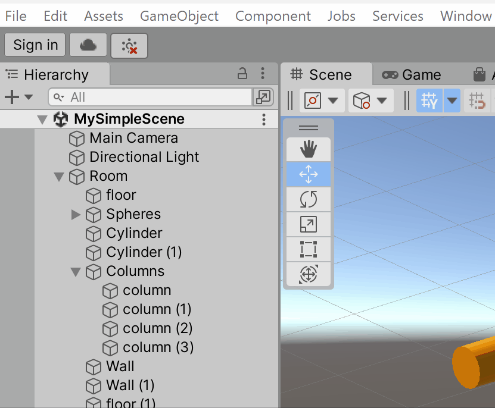

# How to Submit

## Important Notes

⚠️ Do **NOT** show the Unity Editor in your visual documentation. 

⚠️ **Build early and play test your builds.** Some bugs will only reveal themselves in a build, so make sure to catch those in advance of the deadline. A broken game will affect your project grade. 

 

---

## Submission Checklist

You should include the following documentation of your project by **11:59PM on the day of the project deadline**:

1. **Visual documentation**:
    - **at least ONE animated GIF** of your project in motion, roughly 600 pixels wide, ideally under 5MB in size.
    - **at least TWO stills** from your project (1920x1080)
    - **(Optional) Recording of gameplay.** Roughly 60 seconds, long enough to demonstrate how your game is played (1920x1080, mp4/h.264)
2. **Text description** that would be useful for someone viewing your project for the first time:
    - The basic premise of the game -- what is it about?
    - How to play the game -- how do you interact with the project?
3. **Project build for WINDOWS**
4. **Exported Unity package**

 

---

## Tools for Visual Documentation

### Animated GIFs

Animated GIFs are durable and easy to view (though not always small in size). In this course we will use animated GIFs as a quasi-archival format for animated visual material. Preferably, they should be 600 pixels wide and under 5MB in file size.

I personally use and recommend [ScreenToGif](https://www.screentogif.com/), which is a good tool for quickly making a gif. Photoshop, Premiere, AfterEffects, or other video editors can also export gifs. You may also find the following free tools helpful:

- [EzGif.com](https://ezgif.com/) is an online GIF maker, editor, and compressor. Great for reducing the file size of GIFs.
- [LICEcap](https://www.cockos.com/licecap/) is a badly-named free OSX app which can capture an area of your screen and save it directly to an animated GIF.
- [Online-convert.com](https://www.online-convert.com/) offers a browser tool for converting videos into GIFs.

 

### Screenshots and Screen Recordings

**Make a build first and run it full screen** to capture images and video of your project. 

For screen recordings, [OBS](https://obsproject.com/) works very well. 

You may also use the [Unity Recorder](https://learn.unity.com/tutorial/working-with-unity-recorder) to capture single frames and videos from within the Unity Editor.

 

#### Built-in OS screenshot shortcuts:

##### Windows

To take a screenshot and automatically save the file, press the **Windows key + PrtScn**. Your screen will go dim and a screenshot of your entire screen will save to the **Pictures > Screenshots folder**.

Also consider the snipping tool, which is a convenient way to capture a portion of your screen.

 

##### Mac

1. To take a screenshot, press **Shift + Command + 3**.
2. If you see a thumbnail in the corner of your screen, click it to edit the screenshot. Or wait for the screenshot to save to your desktop.

By default, screenshots save to your **desktop** with the name ”Screen Shot [date] at [time].png.”

 

---

## How to export projects from Unity

### Building your project

Start by opening the build settings under **File > Build Settings**.

 

Add all the scenes you want to include in your project by clicking and dragging them from your assets folder to “Scenes in Build” (also remove any scenes you don’t want to include). The topmost scene in this list will be the first to play when starting the game.

 

Create a Windows build by changing Target Platform to “Windows” and clicking build.

 

After the build has finished, create a zipped folder containing all of the files and folders that unity created. **The build needs all these folders, exes, and dlls to run properly.**

 

### Unity Packages

> Read the official documentation for [exporting and importing Unity packages](https://docs.unity3d.com/Manual/AssetPackagesCreate.html).

Rather than creating a zip file of your entire Unity project folder, you can save a lot of time (and space) by exporting only the assets for the scenes, materials, prefabs, etc. that you want to share. This is called exporting an asset package.

 

#### Exporting Unity Packages

You have two options:

- Find your scene file in the Project tab, right click the scene, and click “Export Package…”      
- OR Click **Assets > Export Package…**   

 

In the window that opens, de-select any assets that you don’t want to include. Be careful that you don’t exclude anything required to run your scene. If you only had your scene selected when clicking **Export Package…**, the window will only display the assets directly used in that scene. You can select entire folders, or even the top level Assets folder to bring up more assets to include in the export.

Make sure the **Include dependencies** box is checked and click **Export…** to save your unitypackage file.

 

#### Importing Unity Packages

To import a package into another project, double click the “.unitypackage” file with a project open and an import window will appear.

 

You can also click **Assets > Import Package > Custom Package…** to select the unitypackage file via explorer/finder.

Select the assets you want to import and click **Import**.