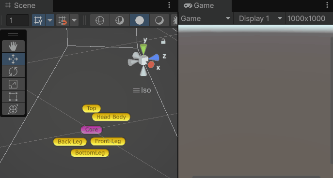
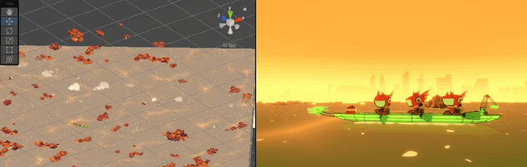
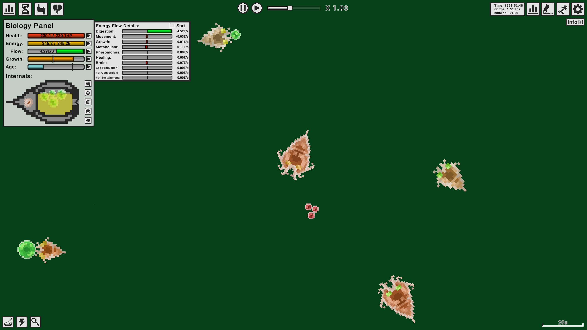
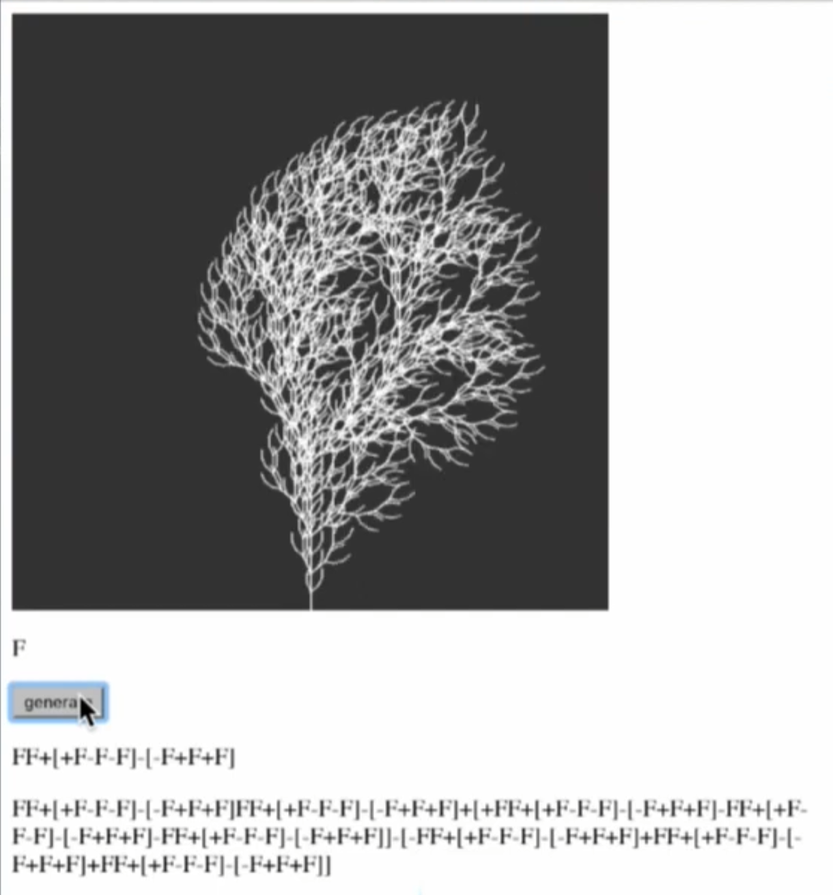
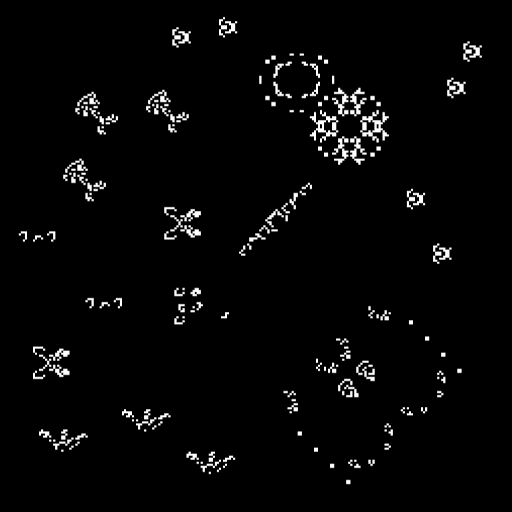
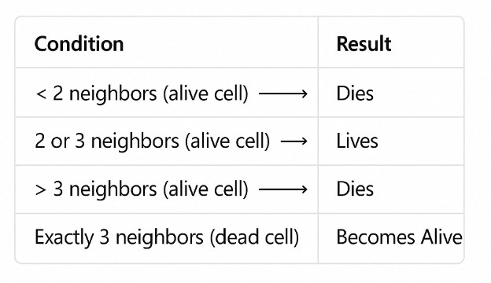

<!--jump to anchor tag adjusted to header height offset-->

# Project 1: Auto-Generator

📌 <b>FINAL PROJECT BUILD + DOCUMENTATION DUE:</b> Week 3 Tuesday, January 20

Submit Final Submission Here (TBD)

<blockquote>Please read the <a href="../how-to-submit">How To Submit</a> page for more detailed instructions.</blockquote>

## Prompt

In order to keep play interesting and unique for each iteration, video games often use custom algorithmic systems that dynamically generate different environments, characters, and other game data using the same set of assets.

To get familiar with building custom dynamic systems using Unity and C#, your first project prompt is as follows:

***Create a generator in Unity that only requires 1 ~ 2 button controls to run.***

---

**Consider the following options:**

* a landscape / level / terrain generator;
* a random character generator, eg. exquisite corpse;
* an evolution simulator, e.g. cellular automaton.

 
**Possible techniques:**

* modular architecture using prefabs, arrays/lists, instantiate/destroy functions, empty transforms as connection points; 
* procedural / algorithmic generation using random functions, perlin noise, custom parameters, L-systems, cellular automata, etc.   <figure><figcaption>-- [The Bibites](https://thebibites.itch.io/the-bibites) on itch.io</figcaption></figure><figure><figcaption>-- (Youtube video) "[Coding Traing #16: L-systems](https://www.youtube.com/watch?v=E1B4UoSQMFw)"</figcaption><figure><figure> <figcaption>-- [Conway's Game of Life](https://conwaylife.com/)</figcaption></figure>

 
**Tips:**

* Consider what **constraints** or **rules** you can impose to create unique forms and color palettes.
* **You may work in 2D or 3D.** Lean into your strengths as a visual designer / artist as much as possible with this project! (And also remember you don't have much time!)
* **Consider how a viewer will see / experience your generative designs.** Can they orbit the camera around? Can they press a button to generate new objects?

 

**Inspirations**

<figure><figcaption>-- Hao Liao and Joey Schutz, "<a href="https://jamschutz.itch.io/quick-character-creator">Quick Charcater Genreator</a>"</figcaption></figure>

<figure><figcaption>-- Will Herring, "<a href="https://grey2scale.itch.io/pet-the-pup">Pet the Pup at the Party</a>"</figcaption></figure>

<figure><figcaption>-- Lingdong Huang, "<a href="https://lingdonh.itch.io/better-horses">Better Horses</a>"</figcaption></figure>

<figure><figcaption>-- Kate Compton"<a href="http://www.galaxykate.com/apps/Prototypes/LTrees/">Flowers</a>"... who also wrote this Tumblr post about making generators "<a href="https://www.tumblr.com/galaxykate0/139774965871/so-you-want-to-build-a-generator">So you want to build a generator...</a>"</figcaption></figure>

<figure><figcaption>-- Titouan Millet, "<a href="https://titouanm.com/mucartographer/">Mu Cartographer</a>"</figcaption></figure>

<figure><figcaption>-- Nicky Case, "<a href="https://ncase.me/emoji-prototype/">Emoji Simulator</a>"</figcaption></figure>

 

## Requirements

**Your final project requires:**

- the use of **modular OR procedural generation techniques**, or even a mix of both!
- **at least 1~2 button controls** to run.

 
**Your final project is not required to:** 

- be a traditional video game;
- have sound / audio.

 

## Evaluation

Your final project will be evaluated according to the guidelines listed in the [course syllabus](./syllabus.md/#evaluation-criteria).

---

-->