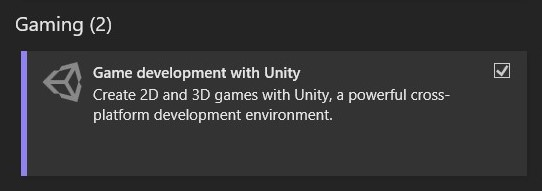
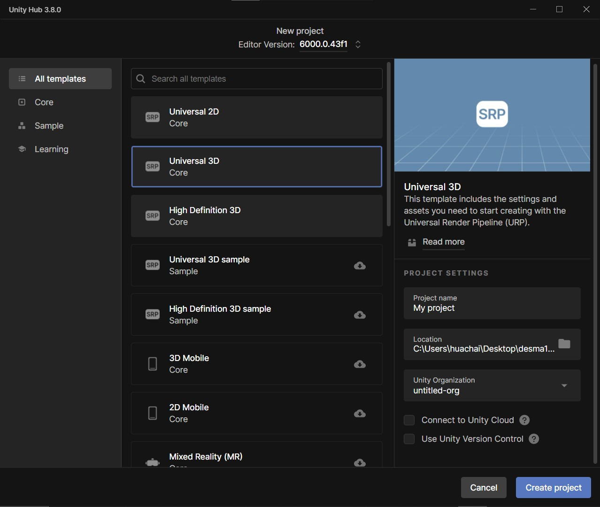

<!--jump to anchor tag adjusted to header height offset-->

# Tech Setup

## Setting up Unity and Visual Studio / Code

1. Download **Unity Hub**: [https://unity.com/download](https://unity.com/download)  

2. Open Unity Hub, and download **the latest version of Unity Editor with long term support (LTS)** — currently this is 6000.0.43f. 

   * Any editor version from 2022 or later should work fine, too. 

3. When downloading the Unity Editor, make sure to include the following modules (in check boxes)

   * ✅ **Microsoft Visual Studio Community**   
     (\*only available on WINDOWS)

     * If prompted to run the Visual Studio Installer, make sure that “Game Development with Unity” is checked under the Workloads tab.

     

     * **If you’re using a Mac device:**  
       Because Visual Studio for Mac is no longer supported, you’ll need to download [Visual Studio Code](https://code.visualstudio.com/) instead.

       Next, install the Unity for Visual Studio Code extension (published by Microsoft) from the [Visual Studio Code Marketplace](https://marketplace.visualstudio.com/items?itemName=visualstudiotoolsforunity.vstuc), or the [Extensions Marketplace](https://code.visualstudio.com/docs/configure/extensions/extension-marketplace) inside Visual Studio Code.

   * ✅ **Windows Build Support (IL2CPP or Mono)**

   * ✅ **Mac Build Support (IL2CPP or Mono)**

4. **Make a New Unity Project from Unity Hub.**

   In Unity Hub, go to Projects \> New Project \> Select your editor version at the dropdown field above \> Select Universal 3D (To start, we will use the Universal Render Pipeline and create a 3D Unity Project.) 

   All Unity projects are stored locally as a folder on your computer. Select a name (e.g. “GameEngineWeek1”) and location for your project folder.

   We’ll leave “Connect to Unity Cloud” and “Use Unity Version Control” unchecked for now. 

   Then click “Create Project.” 

   

5. **Set up Unity for Visual Studio / Code integration**

   Open up your newly created Unity project. In the Unity Editor, go to Windows \> Package Manager \> Make sure that Visual Studio Editor package (version 2.0.20 and above) has been installed on your project. 

   Then, go to Edit \> Preferences \> External Tools \> Select your External Script Editor as either “Visual Studio” or “Visual Studio Code”. This will be the default program that runs when you try to open up a script in Unity. 