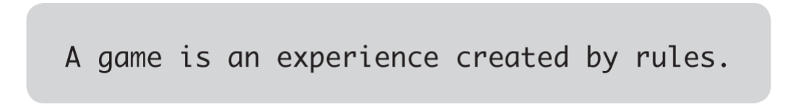

# Intro to Game Engine, Unity, and C&#35;

---

## What is a Game Engine?

Let's break this question down. First of all...

### What is a Game?

<figure>
<blockquote>

A game is an experience, and that experience has a certain character. [...] And if we’re discussing an experience, then that implies someone is there to have that experience, someone we refer to as a player. We can’t talk about a game without talking about the experience of the player playing that game, even if the playing experience we’re talking about is often our own.

<mark>The experience we call a game is created by the interaction between different rules</mark>, but the rules themselves aren’t the game, the interaction is! <mark>A game can’t exist without a player or players</mark>: someone needs to be engaging with the rules for the experience to happen.

</blockquote>
<figcaption>-- Chapter Three, Rise of the Videogame Zinesters. Anna Anthropy.</figcaption>
</figure>

For example, in a game of tag, what are the rules for...

1. **THE SETUP** -- how do you decide who's "it"? when can they start tagging people?
2. **THE LEVEL / PLAYING FIELD** -- how far can players go before they're "out-of-bounds"? are there safe zones where people can't be tagged? 
3. **PLAYER BEHAVIOUR** -- are players only allowed to travel in a certain manner (e.g. speedwalking, but no running), and how can that be enforced (e.g. speedwalking means both feet cannot be lifted off the ground at the same time at any moment.) If someone gets tagged, what happens to them? Do they freeze in position, become "it", or are they out of the game? 
4. **CONCLUDING THE EXPERIENCE** -- how do you know when the game has ended, and who the winner/loser is (if any)?

 

#### "Is xxx a game?"

<figure>
<iframe class="itch-html-embed" frameborder="0" src="https://html-classic.itch.zone/html/5171563/index.html" width="100%" height="400" ></iframe>
<figcaption>-- <a href="https://sweetfish.itch.io/game">is this a game?</a> by sweetfish on itch.io.</figcaption>
</figure>

Technically, this question is irrelevant to this class.

Regardless of what you end up making for your assignments, you'll eventually have to make decisions about the **parameters and conditions** of your project (which you could think of as being "the rules of your game") and consider how one's interaction / encounter of these "rules" will affect their overall experience of it.

In this class, we will focus on **how to implement these rules using game engines**, so that you can explore its creative affordances for designing particular experiences.

### What is an Engine?

<figure>

<figcaption>-- Marine Diesel Engine Animation GIF (<a href="https://tenor.com/en-GB/view/marine-diesel-engine-engine-gif-8550503">Source</a>)</figcaption>
</figure>

<figure>

<figcaption>-- Animation of Eadweard Muybridge’s Jockey riding a race horse from his ‘Animal Locomotion’ series, 1878/87 / J. Paul Getty Museum, Los Angeles, USA / Bridgeman Images</figcaption>
</figure>

 
Consider the following definitions from the Wikitionary page for <a href ="https://en.wiktionary.org/wiki/engine#English">"Engine"</a>:

 

> "A complex mechanical device which converts energy into useful motion or physical effects."

In a mechanical sense, <mark>an engine is an energy converter</mark> that can transform certain type(s) of input into other type(s) of "productive" output.

 

<blockquote>
"A person or group of people which influence a larger group; a driving force." 
</blockquote>
<blockquote>
"Anything used to effect a purpose; any device or contrivance; an agent."
</blockquote>

In an abstract sense, <mark>an engine is an information carrier</mark> that can contain, transfer, and transform ideas, beliefs, and principles. 

 

<blockquote>
"A large construction used in warfare, such as a battering ram, catapult etc. [from 14th c.]"
</blockquote>
<blockquote>
"The part of a car or other vehicle which provides the force for motion, now especially one powered by internal combustion. [from 19th c.]"
</blockquote>

From a historical and infrastructural standpoint, <mark>an engine is a catalyst of both the production and destruction of worlds, societies, and cultures.</mark>

 

> "A software or hardware system responsible for a specific technical task (usually with qualifying word)."
>>   a graphics engine;   a physics engine.

In computing, <mark>an engine is a specialised machine</mark> for performing a specific task.

 

In this class, we will be mostly using software programs designed specifically for game development... but really, <a href="#what-is-a-game-engine_1">anything can be a "game engine."</a>

It is also worth considering the various contexts in which the engine emerges, so that we can better grasp the possibilities and implications of this technology, and then decide how and where we would like to proceed with this tool.

### Put them together... GAME ENGINE! 

Returning to our first question: 

#### What is a game engine?

<figure>

<figcaption>-- <a href="https://wttdotm.com/guess_we_doin_games_now/desktop.html">guess we doin games now</a> by morry kolman (@WTTDOTM)</figcaption>
</figure>

- Tools designed specifically for developing games (e.g. Unity, [Bitsy](https://www.bitsy.org/), [PICO-8](https://www.lexaloffle.com/pico-8.php), [in-game](https://create.roblox.com/) [level](https://supermariomaker.nintendo.com/) [builders](https://www.minecraft.net/en-us/about-minecraft))
- Platforms which primarily serve some other non-game-making function (if any at all), but are nonetheless used for making games. (e.g. [Spread](https://eieio.games/nonsense/game-10-realtime-gsheet/)[sheets](https://www.youtube.com/watch?v=N2QC6VQXo8U), [Checkboxes](https://eieio.games/nonsense/game-14-one-million-checkboxes/), [Post-war junkyards and bombsites](https://www.ludozofi.com/home/library/adventure-playgrounds-and-postwar-reconstruction/))

<figure>

<figcaption>-- <a href="https://truthout.org/articles/when-play-is-criminalized-racial-disparities-in-childhood/">When Play Is Criminalized: Racial Disparities in Childhood</a>. Eisa Nefertari Ulen, TRUTHOUT.
</figure>

If a game is ["an experience that is made from the interaction between different rules"](#what-is-a-game), then broadly speaking, <mark>a game engine could be anything that converts rules and interaction into playable experiences. </mark>

---

## Unity is a Game Engine

We'll spend most of this course working in the Unity game engine. 

<!--HOST THIS IMAGE LOCALLY!-->

Unity, initially released in 2005, is a closed-source game engine, and Unity Technologies, the developer of the engine, has been a publicly traded company since 2020. 

The engine gained popularity through being free for small, independent developers, with a relatively easy learning curve. 

Compared to most other game engines, Unity also tries to avoid being aesthetically identifiable and not be tied to a particular genre of game. 

Other industries use Unity for things like [Architectural](https://unity.com/solutions/architecture-engineering-construction) and [Auto](https://unity.com/solutions/automotive-and-transportation) rendering, [Film and TV production](https://unity.com/solutions/real-time-filmmaking-explained), [AI training](https://unity.com/products/machine-learning-agents) and [computer vision](https://unity.com/products/computer-vision).

Unity also contracts with the US Department of Defense for [military training](https://www.vice.com/en/article/y3d4jy/unity-workers-question-company-ethics-as-it-expands-from-video-games-to-war) and [simulation.](https://www.youtube-nocookie.com/embed/0lLBnGe6Ecc?si=DGJKtpGZ18pKe-Dr)

### Anatomy of the Unity Editor

<figure>

<figcaption>-- Unity Editor window in default workspace layout</figcaption>
</figure>

Read the following articles from the Unity User Manual:

- [Unity's interface](https://docs.unity3d.com/Manual/UsingTheEditor.html)
- [GameObjects](https://docs.unity3d.com/Manual/GameObjects.html)
- [Transforms](https://docs.unity3d.com/Manual/class-Transform.html)
- [Using Components](https://docs.unity3d.com/Manual/UsingComponents.html)

### Unity C&#35;

Unity uses <mark>C#, a type of object-oriented language</mark>, as one of its primary scripting languages.

We typically write Unity C# scripts to make customised blueprints for accessing, organising, and implementing data inside our game project. This is helpful for:

1. storing information such as **variables** and **functions** inside an **object** or **class**;
2. programming interactive / dynamic behaviour in objects;

Most of the time, we're working with a class called <a href="https://docs.unity3d.com/ScriptReference/MonoBehaviour.html">MonoBehaviour</a> which behaves like a component that can be attached to any gameobject in our scene.

### Let's create a Unity C&#35; script!

Here's the general thought process when figuring out what to put in our script:

1. **OUTPUT** -- *"I need my script to do *THIS*..."*
2. **INPUT** -- *"... so I need to access *THESE VARIABLES*..."*
3. **METHOD** -- *"... and call *THESE FUNCTIONS* in order of *THIS SEQUENCE*."* 

### Anatomy of a C&#35; Script

Watch this video for a brief introduction to [C# Variables and Functions](https://www.youtube.com/watch?v=-c1RsydH2nA) in Unity.

#### Script Name
- use pascal case, *e.g. MyScript.cs*
- the file name of the script and the name of the MonoBehaviour must be exactly the same (case-sensitive).
    - e.g. if your C# file name is "ScoreManager.cs", then the line declaring your Monobehaviour class in that script file should look like this:  <pre><code>public class ScoreManager : MonoBehaviour
    {...}</code></pre>
- the name must be unique -- no two MonoBehaviours should have the same name.

#### Namespace

A reference library containing all the methods and classes for a specific context.
 <pre><code>using UnityEngine</code></pre>

#### Variables

Variables are labelled data containers that can be assigned values, and whose read/write access can be set by declaring them as public or private.

If a variable property exists somewhere in a component, there's likely some way to access it via scripting (to learn more, [Unity scripting reference](https://docs.unity3d.com/ScriptReference/index.html) is your best friend!)

When creating variables:

1. declare access permissions in lowercase (default: `private`)
2. declare what type of variable it is
    * `float` - a numerical value that can be in decimals
    * `int` - a numerical integer (whole numbers only)
    * `bool` - binary property that can be either assigned 'true' or 'false'
    * `string` - a sequence of characters
    * other public classes including `GameObject` and components (e.g. `Transform` )
3. name the variable
    - no spaces allowed.
    - use camel case.  <pre><code>int numberOfCamels</code></pre>
    - use clear and descriptive nouns, the intent of this variable should be immediately apparent from its name
        - if it is a bool, prefix with a verb (typically phrase as a question.)  <pre><code>bool isWalking, hasSpecialAbility;</code></pre>
    - use prefixes with an underscore to differentiate private member variables from public ones. <pre><code>private bool _currentHealth; 
    private static int s_winScore;</code></pre>

#### Functions

There are two main types of functions: 

- **method functions** -- a way to group lines of code under one name; good for if you need to call a specific set of codes multiple times;
- **event functions** -- automatically tells Unity what to do at very particular instances in the game.

Functions may take in variables as arguments.

When creating functions:

1. declare access permissions in lowercase  (default: `private`)
2. what type of value it returns in lowercase (if any) -- `void` returns no value.
3. name of the function in pascal case, followed by parenthesis containing any argument variables.  <pre><code>float MultiplyByTwo(float initialFloat){...}</code></pre>

### Key principles of Programming in Unity C&#35;

- **Single Responsibility** -- Every module of code (class, function, etc.) should have a one and only purpose in the software functionality. This will be very helpful for:
    - debugging scripts
    - making your scripts easily reusable for other projects.
- **Keep everything private unless it *absolutely* needs to be public.**
    - if a variable just needs to be visible in the Inspector but does not need to be publicly accessible, you should keep it private then add [SerializeField] before it.  <pre><code>[SerializeField] bool _currentIndex;</code></pre>
- **Anticipate errors, and help your script help you catch them**
    - if your script absolutely needs a type of component, precede your Monobehaviour declaration with `[RequireComponent(typeof(ComponentName))]`
    - use `Debug.Log` and `Debug.Error` to check for incorrect / null references. 
- **Use comments to contextualise your lines of code**

---

## Exercise before next class

Can you write a script that forces a GameObject to start at a specific position in the scene? 