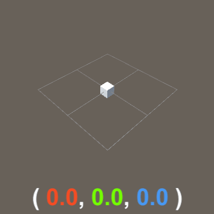
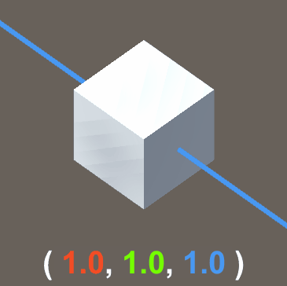
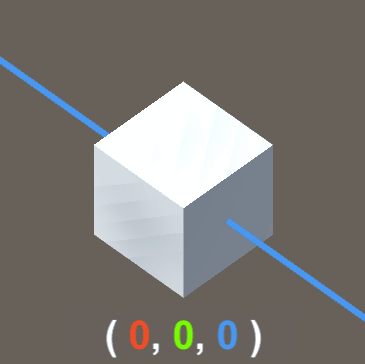
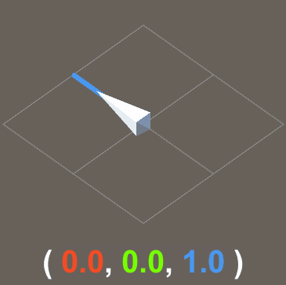
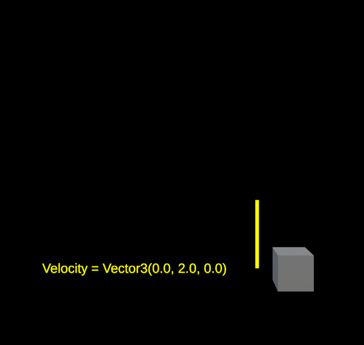
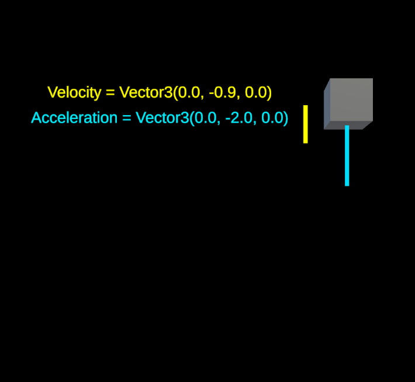
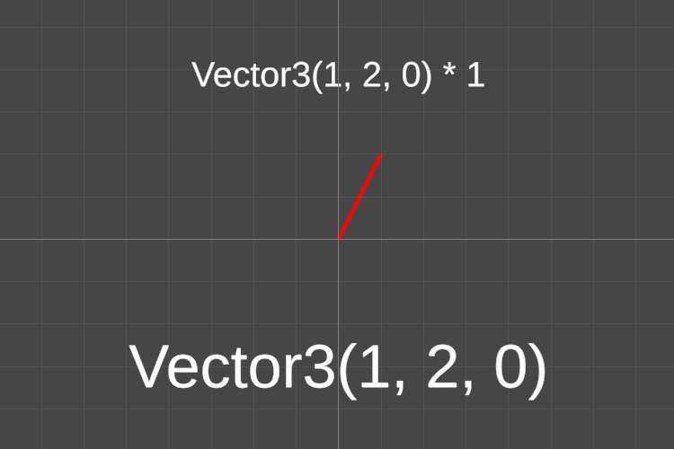
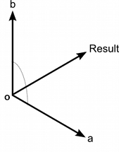
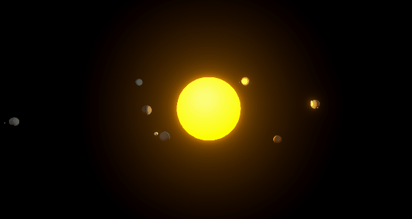

<script>hljs.highlightAll();</script>

# Transforms and Vectors

---

Before we begin...

<br>

## Review from last class

- [GameObjects](https://docs.unity3d.com/Manual/GameObjects.html) and [Components](https://docs.unity3d.com/Manual/UsingComponents.html)
- [C# Variables and Functions](https://www.youtube.com/watch?v=-c1RsydH2nA):
    - How to declare and initialise a variable?
    - How to write and call a custom method function?
    - Event functions -- `void Start()` and `void Update()`


---

## Exercise from last class

**Can you write a script that forces a GameObject to start at a specific position in the scene?**


<iframe width="100%" height="315" src="https://www.youtube.com/embed/eUbot2p48bo?si=4u45b6wa8BAhVXpU" title="YouTube video player" frameborder="0" allow="accelerometer; autoplay; clipboard-write; encrypted-media; gyroscope; picture-in-picture; web-share" referrerpolicy="strict-origin-when-cross-origin" allowfullscreen></iframe>


---

## Transforms

> Read about [Transforms](https://docs.unity3d.com/Manual/class-Transform.html) in the Unity Manual.

Every GameObject has a Transform component, which can be accessed via scripts using `gameObject.GetComponent<Transform>()` or `gameObject.transform`.

<br>

Using the Transform component, you may access the following properties:

- **Position**, **Rotation**, and **Scale**
- **Parent-Child** Hierarchy
- **Global** and **Local** Transforms


---

## Vectors

> Read about [Vector3](https://docs.unity3d.com/ScriptReference/Vector3.html) in the Unity Manual.

A vector is a group of numbers -- a 2D vector contains two values (x, y), and a 3D vector contains three values (x, y, z). 


In Unity, 3D vectors are represented by a data structure called [Vector3](https://docs.unity3d.com/ScriptReference/Vector3.html), which contains three float values represented by x, y, and z respectively.

```csharp
Vector3(float x, float y, float z)
```

When handling spatial and directional information in three dimensional contexts, we are typically working with Vector3 data structures.


### Vector3 variables and properties

**To declare and initialise a Vector3 variable:**

```csharp
Vector3 someVector = new Vector3(2,4,5);
// "Vector3" on the LEFT declares what type of variable "someVector" is;
// "new Vector3()" on the RIGHT acts as a constructor method 
// that creates and initialises a new Vector3 with xyz-values (2, 4, and 5).
```

Note: Even in 2D projects, transform properties are still stored as Vector3 data. In this context, you could choose to declare Vector3 variables in this way:

```csharp
someVector = new Vector3(2,4);
// which is the same as "new Vector3(2,4,0)" (ie. z-value is 0)
```

</br>

**To access x, y, and z components of a Vector3:**

```csharp
Debug.Log(someVector.x);
Debug.Log(someVector.y);
Debug.Log(someVector.z);
```

</br>

In Unity, you can also use **shorthands** for calling specific 3D vectors.

```csharp
Vector3.zero //Vector3(0,0,0)
Vector3.one //Vector3(1,1,1)
Vector3.forward //Vector3(0,0,1)
Vector3.right //Vector3(1,0,0)
Vector3.up //Vector3(0,1,0)
//etc.
```
</br>

### Using Vectors in Unity

Vectors can represent *position*, *scale*, *rotation*, and *direction* of an object in space, relative to X, Y, and Z axes. 

<br>

#### Position

Vector3 as spatial coordinates.
Origin is at (0,0,0).



<br>

#### Scale

Vector3 as relative scale.



<br>

#### Rotation

Vector3 as rotational configuration.

In Unity, rotation values are internally processed as [*Quarternion*](https://docs.unity3d.com/ScriptReference/Quaternion.html) values, which are more convenient for the computer to work with. In the inspector, we are reading *eulerAngle* representations of rotation in degrees along the X, Y, and Z axes.



<br>

#### Direction

Vector3 as relative direction.




<br>

### Vector Math Operations 

#### Addition (+) 

<div class="container">
    <div style="width: 30%">
        
    </div>
    <div style="width: 65%">
        
    </div>
</div>

<br>

##### Make an object move at a given velocity

```csharp
position += velocity * Time.deltaTime;
```




<br>

##### Make an object move at an accelerated velocity 

```csharp
velocity += acceleration * Time.deltaTime;
position += velocity * Time.deltaTime;
```



<br>

##### Make an object (e.g. camera) follow another object at a given offset

Usually it's easier to do this by parenting one object to another, but sometimes that configuration just doesn't work for your purposes... 

In that case, you may consider using vector math! 

[Unity's Roll-a-ball tutorial](https://learn.unity.com/tutorial/moving-the-camera?uv=6&projectId=5f158f1bedbc2a0020e51f0d#64ecddc9edbc2a25ce535b81) uses a similar technique for setting up a camera that follows the player object.

```csharp
//LateUpdate is another event function
//that is called every frame, but after Update()
void LateUpdate()
{
    //follow target position at offset
    //AFTER target position changes in Update()
    gameObject.transform.position = target.position + offset;
}
```

<br>

##### Spawn objects at regular intervals

*We'll discuss this next class when we get into arrays and instantiation!*

<br>

#### Subtraction (-)

<div class="container">
    <div style="width: 45%">
        
    </div>
    <div style="width: 50%">
        
    </div>
</div>

<br>

##### Determine direction from one point to another

```csharp
fromAToB = B - A;
//and if we just need the unit of this direction vector
//we can normalize it.
unitDirection = fromAToB.normalized;
```

<br>

##### Determine the distance between 2 points

```csharp
fromAToB = B - A;
float distanceAB = fromAToB.magnitude;

//OR we can use the Vector3 method "Distance()"
float distanceAB = Vector3.Distance(A,B);
```

<br>

#### Multiplication (*)



<br>

##### Scale the size / length of a vector

```csharp
someVector *= multiplier;
```

<br>

##### Flipping a vector's direction

```csharp
someVector *= -1;
```

<br>

##### Normalizing Vectors

Normalized vectors always have a magnitude of 1. This is useful for when you're using vectors only for its directional orientation.

```csharp
normalizedVector = someVector.normalized;
```

<br>

#### Dot Product

> Read about [Vector3.Dot](https://docs.unity3d.com/ScriptReference/Vector3.Dot.html) in the Unity Manual.

Dot product is useful for comparing the directions of two different vectors. 

```csharp
float dotProductAB = Vector3.Dot(A,B);

if (dotProductAB==0){
    //A and B are perpendicular 
} else if (dotProductAB==1){
    //A and B are pointing in exactly the same direction
} else if (dotProductAB==-1){
    //A and B are pointing in completely opposite directions
}
```

<br>

#### Cross Product

> Read about [Vector3.Cross](https://docs.unity3d.com/ScriptReference/Vector3.Cross.html) in the Unity Manual.

Cross product can produce a new vector that is perpendicular to two vectors.



```csharp
Vector3 OA = A - O;
Vector3 OB = B = O;

Vector3 crossAB = Vector3.Cross(OA,OB);
//crossAB is perpendcular to both vectors OA and OB.
```

<br>

### Other vector methods that may be useful

- [MoveTowards()](https://docs.unity3d.com/ScriptReference/Vector3.MoveTowards.html)
- [RotateTowards()](https://docs.unity3d.com/ScriptReference/Vector3.RotateTowards.html)
- [Reflect()](https://docs.unity3d.com/ScriptReference/Vector3.Reflect.html)

<br>

---

## In-class Exercise

In Unity, build a solar system in orbit with a sun, planets, and moons... and only use scripts for animations!

*(Hint: Try using [RotateAround()](https://docs.unity3d.com/ScriptReference/Transform.RotateAround.html).)*



---

## Exercise for next class

How do we make a solar system that dynamically generates at the start of the scene:

1. a random number of planets and moons; 
2. a set distance interval between each consecutive sibling planet?

---

## Some course reminders

- Fill up the [preliminary course survey](https://forms.gle/UtwGfebgKcHRvMCP7), if you haven't already.
- [Reading Response 1](./readings-and-homeplays.md/#reading-response-1) is due next class.
- Sign up for [Homeplay 1](./readings-and-homeplays.md/#homeplay-1)! 