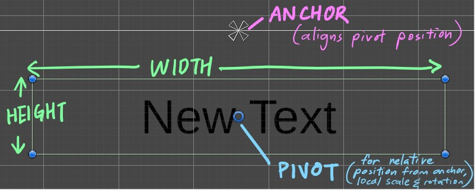
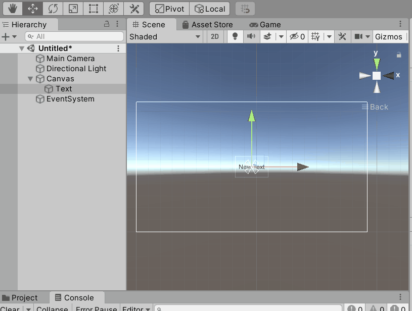
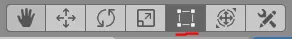
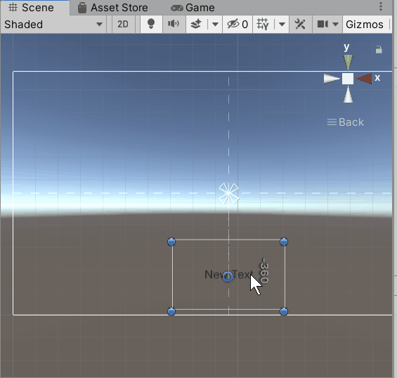
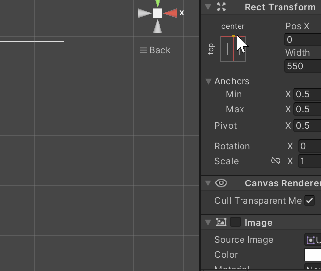
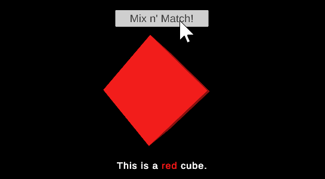
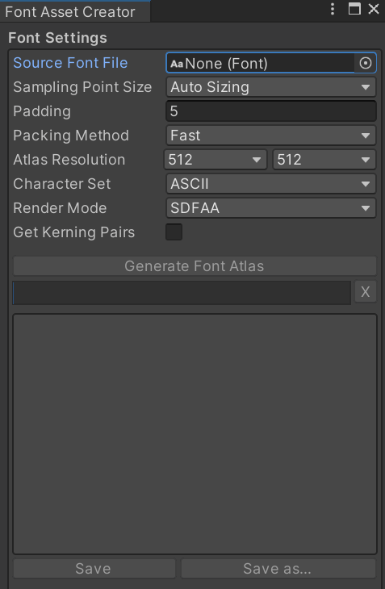
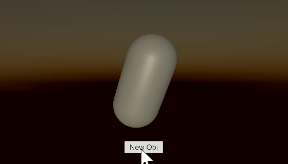
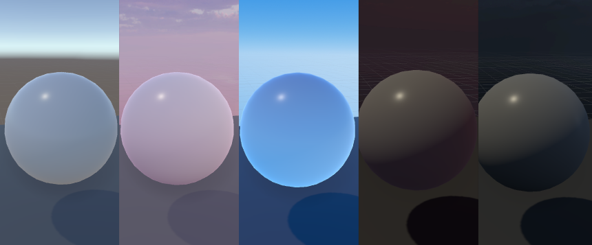

<script>hljs.highlightAll();</script>

# Basic Input, UI, Lights and Camera Settings

---

📦 **Unity packages from today's class:**
> 
> - [**UI Demo: Buttons and TextMeshPro**](https://drive.google.com/file/d/11NiH96VQSo0i4-ezlEJgN35MxKmKTAWc/view?usp=drive_link)
>       - Setting up Interactivity for Button component
>       - Change TextMeshPro using scripts, with custom style tags.
> - [**Using Buttons to Instantiate new object and Destroy old object instance**](https://drive.google.com/file/d/1Kvlhx5w7Vvp2_088Kd8DM8unlnHniuPk/view?usp=drive_link)

---

Before we begin...

<br>

## Review from last class

- Using Random.Range() and conditional statements to set probability of multiple outcomes.
- Noise
    - Difference between random noise and Perlin noise
    - Mathf.PerlinNoise for animations and terrain generation
- Using custom classes to store data about properties in our scene

<br>

---

## Basic Input

We can use the [Input](https://docs.unity3d.com/Manual/Input.html) class to access methods for mapping key or button inputs. 

### Using KeyCode

> Read the full documentation for Unity's list of key codes [here](https://docs.unity3d.com/ScriptReference/KeyCode.html).

**Key codes map directly to a physical key on the keyboard, mouse buttons and joystick buttons.** By passing key codes into our input method functions, we can tell Unity which inputs to detect.

<br>

#### Input.GetKey

Returns true while the user holds down the key identified.

```csharp
void Update(){
    if (Input.GetKey(KeyCode.Space)){
        Debug.Log("Spacebar is held down.");
        //will keep sending console message
        //for as long as player holds down the spacebar.
    }
}
```

<br>

#### Input.GetKeyDown

Returns true during the frame the user starts pressing down the key identified.

```csharp
void Update(){
    if (Input.GetKeyDown(KeyCode.Mouse0)){
        Debug.Log("Left mouse button pressed.");
        //only sends console message once
        //even if player continues to hold down the spacebar.
    }
}
```

<br>

#### Input.GetKeyUp

Returns true during the frame the user releases the key identified.

```csharp
void Update(){
    if (Input.GetKeyUp(KeyCode.Mouse1)){
        Debug.Log("Right mouse button released.");
    }
}
```

<br>

These are very simple and straightforward methods for mapping inputs to custom actions, but certainly isn't the only one available! Unity has more organised systems in place for setting up our inputs -- we will discuss those later in the quarter.

</br> 

<!--
### Using Unity's Legacy Input Manager

> Read more about the [Input Manager](https://docs.unity3d.com/Manual/class-InputManager.html) in Unity's Manual.

Unity has two Input modules, **the legacy version** (default) and **the new Input system** (which is a separate package that requires installation.) We'll just be covering the legacy Input module for now.

The legacy Input Manager allows you to **define inputs and their associated actions** for your Projects. This lets us call our inputs using the names of these actions (as strings) and map multiple types of input under the same action. 

Go to **Edit** > **Project Settings** > **Input Manager**, and expand the **Axes** dropdown list. 

Another more elaborate method for setting up input systems uses Unity's new Input System -- we'll cover this later in the quarter.

-->

## UI

For games it's often useful to add **user interface elements** like text and images on top of what the camera is seeing. Unity features a UI system, which we can use to add elements to our game like clickable buttons, meters, images, and text. 

To start with, we'll look at how to add text elements to your project.

<br>

### Create a New TextMeshPro (TMP) UI Object

Create a new TMP element by **right-clicking in the Scene Hierarchy panel** > **UI** > **Text - TextMeshPro**.


<br>

> **TextMeshPro** is an improved version of Unity's legacy text element. I recommend just starting with that whenever you're working with text.
> 
> The first time you make a TMP element in your project, it will prompt you to import TMP Essential Resources and Examples & Extras. **You only need to import Essential Resources to continue using TMP.**
>
> Read more about Unity's documentation of TextMeshPro [here](https://docs.unity3d.com/Packages/com.unity.textmeshpro@4.0/manual/index.html).

<br>

When you create your first UI element in your scene, Unity automatically adds two other objects -- a **Canvas** (inside which our TMP element is nested) and an **EventSystem**.

<br>

#### Canvas

<div class="div-container">
    <div style="width:60%;margin-right:2.5%;">
        <p style="margin-top:0 !important">
        <b>The Canvas is the container which will hold our UI elements.</b> By default it comes with three components:
        </p>
        <ul>
            <li>The <b>Canvas</b>, which determines how and where the UI elements are drawn. The size of the canvas corresponds to the screen.</li>
            <li>The <b>Canvas Scaler</b>, which controls how individual UI elements scale to fit different screen sizes. I like to change <b>UI Scale Mode</b> from <b>"Constant Pixel Size"</b> to <b>"Scale With Screen size"</b>, so that UI elements appear the same size no matter what resolution screen the player views your work on.</li>
            <li>the <b>Graphic Raycaster</b>, which helps with certain interactive UI elements. We can ignore this component for now.</li>
        </ul>
    </div>
    <div style="width:35%;">
        
    </div>
</div>

<br>

#### Event System


<div class="div-container">
    <div style="width:60%;margin-right:2.5%;">
        <p style="margin-top:0 !important">
        <b>The Event System helps make UI elements navigable with both keyboard/mouse, and joystick controls.</b> For now we can ignore this object.
        </p>
        <p>
        If you are not planning to make your UI elements clickable, it is okay to delete this object.
        </p>
    </div>
    <div style="width:35%;">
        
    </div>
</div>

<br>

#### UI Element Components

All UI elements will have these two components: 

- **Rect Transform** -- a special kind of transform designed to work with canvases.
- **Canvas Renderer** -- a component used to render graphics to the canvas. 

<br> 

### Using Rect Transforms 

> Read more about Rect Transforms and its properties, including pivots and anchors, in the Unity Manual [here](https://docs.unity3d.com/Packages/com.unity.ugui@3.0/manual/UIBasicLayout.html).

<br>



<br>

#### Positioning UI Elements



Use the **Rect Transform tool** (shortcut [T]) to adjust the position and size of UI elements within the canvas. Find it in the tool bar at the upper right of the screen.



<br>

With the rect tool, you can adjust the anchor position of a UI element by dragging these triangles around the screen. This text element is now anchored to the bottom center of the canvas.



<br>

You can anchor UI elements to different positions on the screen. For instance, sometimes you might want a health meter to always appear in the lower left corner of the screen, or a dialogue box to always appear in the upper center.

Try changing the size of the game view to see how your text elements change position.


<br>

Anchors can also be stretched across an area so that the UI element resizes relative to the canvas size. 


<br>

You can also edit the anchor point by using this dropdown in the inspector. Hold down SHIFT to set the position and ALT to set the pivot at the same time.



<br>

### Canvas Size & Aspect Ratio


**By default, your Game preview panel's aspect ratio is set to "Free Aspect."** Notice that the canvas changes its size to match the dimensions of the screen! This can cause a lot of confusion when working with UI elements.

<br>

To fix this problem, Use the dropdown in the Game window to set a fixed aspect ratio or pixel size. **I recommend setting it to 1920x1080.** You may need to increase the font size of your text, or find the canvas scaler component and change it to "Scale With Screen Size"


<br>

You may also notice that **the canvas is way larger than anything else in your scene**. That is OK!

<br>

### Controlling UI Elements with Scripts

UI elements are components, just like anything else in Unity. You can set their properties when the game is running with code! **To work with UI elements**, you typically need to include the following statement at the top of your script:

```csharp
using UnityEngine;
using UnityEngine.UI; //include this line to work with UI elements
```

<br>

Once you do, you can work with UI elements like any other component.


<br>

#### Scripting for TextMeshPro 

TextMeshPro is an exceptional case, because **its methods and properties are stored in its own namespace called `TMPro`**. For TextMeshPro elements, you will need to add this line at the top of your script, instead of `using UnityEngine.UI`. 

```csharp
using TMPro;
```

<br>

**To declare TextMeshPro components**, you will need to decide which class name to use depending on whether the TextMeshPro component is used as a **UI element nested inside a canvas**, or a **mesh in 3D world space**.

```csharp
public TextMeshProUGUI tmpUI; //if tmp is inside the UI canvas.
public TextMeshPro tmp; //if tmp is outside the UI canvas.
```

<br>

You can also **style your text** using style tags in arrow brackets <>. I recommend looking at [Unity's tutorial on styling TMPro elements](https://learn.unity.com/tutorial/textmesh-pro-style-sheets-and-styles#5f3f63beedbc2a176bb3ff97) to learn more. 



```csharp
//Note: the code below does not include other functions
//like checking whether to use "a" or "an" before the color name
//nor color randomizer functions for the cube's material.

using UnityEngine;
using TMPro;

public class UpdateText : MonoBehaviour
{
    public TextMeshProUGUI uiTmp;
    public Color col;
    public string colorName;

    //map this function to a button click event.
    public void SetText(){
        string colorHex = ColorUtility.ToHtmlStringRGB(col); // returns color as hexademical string in the format of "RRGGBB"
        uiTmp.text = "This is a <color=#" + colorHex + ">"+colorName+"</color> cube.";
    }
    
}
```

<br>

### Custom Font Assets for TextMeshPro

You can add custom .ttf and .otf font files into your asset folder, and convert them into a TextMeshPro Font Asset. 

Go to **Window** > **TextMeshPro** > **Font Asset Creator**.

Add your .ttf and .otf font file into Source Font File. Click **Generate Font Asset**. Unity will tell you if there are any characters missing or excluded from the selected font (this depends on what you put as your **Character Set** in the Font Asset Creator.)

Once you're ready, click **Save**. You can now use this Font Asset in your TextMeshPro components.



<br>

### Buttons

> Read about [Buttons](https://docs.unity3d.com/2019.1/Documentation/ScriptReference/UI.Button.html) in the Unity Scripting API. 

A button element will come with the following things:

- an **Image** component, which determines the button's sprite.
- a **Button** component, which determines the interactive aspects of the button (including color and transition settings for different button states)
- **a nested Text element** in the scene hierarchy, which determines what the button's label reads.

<div class="div-container">
    <div style="width:42.5%;margin-right:2.5%;">
    <figure>
        
        <figcaption>-- Button components in Inspector</figcaption>
    </figure>
    </div>
    <div style="width:42.5%;">
    <figure>
        
        <figcaption>-- Nested TextMeshPro component in Inspector</figcaption>
    </figure>
    </div>
</div>

<br>

#### Assigning Functions to OnClick() Event

Whenever we click a button, it triggers a UnityEvent called **OnClick()**. In the inspector, we can tell Unity which method functions should "listen" for this event so they can be called once the event is "invoked" (ie. when the event happens.)

We can add **multiple event listeners** to the a single UnityEvent, allowing us to simultaneously call as many functions as we want once an event is invoked.

<br>

**To add a method function as an event listener in the Inspector panel:**

1. In the **On Click ()** event box, click **+** to add a new listener to the list. 
2. Select the relevant GameObject that contains the component with our desired method function.
3. In the dropdown, look for the method function that we want to run when the event happens. 

<br>

If you want to add a **custom function** as an event listener through the Inspector panel:

- The function must be declared **public**.
- The function must be nested within a **MonoBehaviour** class that is **attached to a GameObject in your scene** as a script component.

<figure>
    
    <figcaption>-- In this example, I'm selecting a Cube object that has a ColorRandomizer script, and adding a SetRandomColor() function as an event listener.</figcaption>
</figure>

<br>

#### Creating a Button to Instantiate New Object and Destroy Previous Object

To replace an existing object in the scene with a new instantiation, you will need to use the [Destroy()](https://docs.unity3d.com/ScriptReference/Object.Destroy.html) method to remove it from the scene. 

Destroy() can be used to destroy GameObjects and components. 



```csharp
public GameObject[] prefabs;

GameObject obj; //this will store the most recently spawned object
int previousIndex; //our array index reference of the previously spawned object

void Start()
{
    SpawnObj(); // spawn new object at start of scene
}

// add this as a listener to the button's OnClick() event in the inspector.
public void SpawnObj() 
{
    //get a random index from prefabs
    int randomObj = Random.Range(0, prefabs.Length);
    
    if (obj != null) //if there is an existing obj in the scene
                        //(i.e. it's not our first time spawning an object)
    {
        while (randomObj == previousIndex) // as long as our random index is the same as our previous index
        {
            randomObj = Random.Range(0, prefabs.Length); 
            //continue randomising until we get a new index that's different from the previous one.
        }

        Destroy(obj); //destroy the old object
    }

    previousIndex = randomObj; // update previous index to current index.


    // spawn the random object and assign it to "obj" variable
    obj = Instantiate(prefabs[randomObj]); 
}
```

<br>

**If you don't want to completely destroy that instance of the GameObject or component from your scene**, you may consider using [SetActive()](https://docs.unity3d.com/ScriptReference/GameObject.SetActive.html) for GameObjects, and [.enabled](https://docs.unity3d.com/ScriptReference/Behaviour-enabled.html) for components instead. This would just "switch off" your objects or components, but keeps them available in the scene so you can switch them back on again.

<br>

There are also workflows for [setting up UnityEvents and Listeners using scripts](https://docs.unity3d.com/ScriptReference/Events.UnityEvent.AddListener.html), but we'll get to that in a later lesson!

<br>

---

## Lights and Camera Settings

Here is a basic overview of some elements you can consider using to easily establish the atmosphere and setting of your project. 

<br>

### Light Component

> Read more about [URP's light component](https://docs.unity3d.com/Packages/com.unity.render-pipelines.universal@14.0/manual/light-component.html) in Unity's documentation.

<br>

Add a Light object to your scene by **right-clicking in the Hierarchy panel** > **Light** > **choice of Light type** (you can change the type in the Light component later on.)

<br>

<figure>
    
    <figcaption>-- Light component in the Inspector panel.</figcaption>
</figure>

Some sections you can focus on now are (depending on the type of light you're using): 

- **Type**: Directional, Point, Spot, Area (baked only) – see examples of each here 
- **Light Appearance / Color**: Set color of the light based on color or temperature
- **Intensity**: Amount to multiply the light color to control the brightness of the light
- **Indirect Multiplier**: Intensity of indirect lighting
- **Shadow Type**: None, Soft, Hard 

<br>

### Environment Lighting


In the Unity Editor, go to **Window** > **Lighting** > **Environment**. Here, you can customize some of the following settings:

- **Skybox Material**: The skybox itself is a material that uses a special type of shader to create the impression of an image or color that surrounds the entire scene, which can contribute to the overall color and brightness of a scene. <br> <br><br>If you are going to use a skybox for your project, I recommend changing the default Unity skybox to a different material. <br><br> An easy way to do this is to import [a custom texture that is compatible for skyboxes](https://docs.unity3d.com/Manual/skybox-shaders.html) (e.g. 360 HDR images or Cubmemaps), and put it in a material asset with a Skybox shader. <br><br>The [Unity Asset store](https://assetstore.unity.com/) also has plenty of options, many of which are free.<br><br>
- **Realtime Shadow Colours**: Assign an ambient color to your realtime shadows. <br><br>
- **Environment Lighting Source**: You can have your scene be lit with either a skybox material, a gradient, or a solid colour.<br><br> 
- **Fog** (nested in "Other Settings"): Adds a fog effect for your game, with customizable colour, distribution, and density.

<br>

### Camera

Try exploring these settings for your Main Camera object. 

- **Projection**: You can set your camera to be either Perspective or Orthogonal, and decide how far/close your camera's lens is able to capture (*Field of View* for Perspective camera; *Size* for Orthogonal camera.)<br><br><figure>
    
    <figcaption>-- The same scene shown in perspective mode (left) and orthographic mode (right).</figcaption>
</figure>
- **Background Type** (under Environment section): You can decide between having a Skybox or Solid colour as the background material that your camera renders.

<br>


## Some course reminders

- [Project 1](./project-1.md) is due next Tuesday.