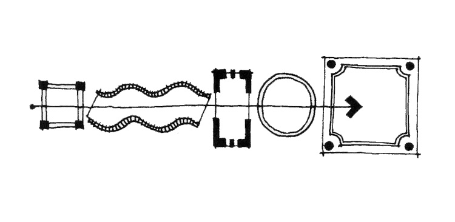
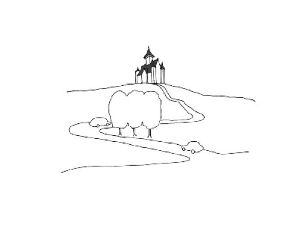

# Game + Play + Level Design!

---

> Review "[What is a Game?](./w0-unity-csharp.md/#what-is-a-game)" from Week 0.

 

## Verbs

Accept  
Accuse  
Achieve  
Acknowledge  
Acquire  
Adapt  
Add  
Adjust  
Admire  
Admit  
Adopt  
Adore  
Advise  
Afford  
Agree  
Aim  
Allow  
Announce  
Anticipate  
Apologize  
Appear  
Apply  
Appreciate  
Approach  
Approve  
Argue  
Arise  
Arrange  
Arrive  
Ask  
Assume  
Assure  
Astonish  
Attach  
Attempt  
Attend  
Attract  
Avoid  
Awake  
Bake  
Bathe  
Be  
Bear  
Beat  
Become  
Beg  
Begin  
Behave  
Believe  
Belong  
Bend  
Bet  
Bind  
Bite  
Blow  
Boil  
Borrow  
Bounce  
Bow  
Break  
Breed  
Bring  
Broadcast  
Build  
Burn  
Burst  
Buy  
Calculate  
Can/Could  
Care  
Carry  
Catch  
Celebrate  
Change  
Choose  
Chop  
Claim  
Climb  
Cling  
Come  
Commit  
Communicate  
Compare  
Compete  
Complain  
Complete  
Concern  
Confirm  
Consent  
Consider  
Consist  
Consult  
Contain  
Continue  
Convince  
Cook  
Cost  
Count  
Crawl  
Create  
Creep  
Criticize  
Cry  
Cut  
Dance  
Dare  
Deal  
Decide  
Defer  
Delay 
Deliver  
Demand  
Deny  
Depend  
Describe  
Deserve  
Desire  
Destroy  
Determine  
Develop  
Differ  
Disagree  
Discover  
Discuss  
Dislike  
Distribute  
Dive  
Do  
Doubt  
Drag  
Dream  
Drill  
Drink  
Drive  
Drop  
Dry  
Earn  
Eat  
Emphasize  
Enable  
Encourage  
Engage  
Enhance  
Enjoy  
Ensure  
Entail  
Enter  
Establish  
Examine  
Exist  
Expand  
Expect  
Experiment  
Explain  
Explore  
Extend  
Fail  
Fall  
Feed  
Feel  
Fight  
Find  
Finish  
Fit  
Fly  
Fold  
Follow  
Forbid  
Forget  
Forgive  
Freeze  
Fry  
Generate  
Get  
Give  
Go  
Grind  
Grow  
Hang  
Happen  
Hate  
Have  
Hear  
Hesitate  
Hide  
Hit  
Hold  
Hop  
Hope  
Hug  
Hurry  
Hurt  
Identify  
Ignore  
Illustrate  
Imagine  
Imply  
Impress  
Improve  
Include  
Incorporate  
Indicate  
Inform  
Insist  
Install  
Intend  
Introduce  
Invest  
Investigate  
Involve  
Iron  
Jog  
Jump  
Justify  
Keep  
Kick  
Kiss  
Kneel  
Knit  
Know  
Lack  
Laugh  
Lay  
Lead  
Lean  
Leap  
Learn 
Leave  
Lend  
Lie (in bed)  
Lift  
Light  
Lie (not to tell the truth) 
Like  
Listen  
Look  
Lose  
Love  
Maintain  
Make  
Manage  
Matter  
Mean  
Measure  
Meet  
Melt  
Mention  
Might  
Mind  
Miss  
Mix  
Mow  
Must  
Need  
Neglect  
Negotiate  
Observe  
Obtain  
Occur  
Offer  
Open  
Operate  
Order  
Organize  
Ought to  
Overcome  
Overtake  
Owe  
Own  
Paint  
Participate  
Pay  
Peel  
Perform  
Persuade  
Pinch  
Plan  
Play  
Point  
Possess  
Postpone  
Pour  
Practice  
Prefer  
Prepare  
Pretend  
Prevent 
Proceed  
Promise  
Propose  
Protect  
Prove  
Pull  
Punch  
Pursue  
Push  
Put  
Qualify  
Quit  
React  
Read  
Realize  
Recall 
Receive  
Recollect  
Recommend  
Reduce  
Refer  
Reflect 
Refuse  
Regret  
Relate  
Relax  
Relieve  
Rely  
Remain  
Remember  
Remind  
Repair 
Replace  
Represent  
Require  
Resent  
Resist  
Retain  
Retire 
Rid  
Ride  
Ring  
Rise  
Risk  
Roast  
Run 
Sanction  
Satisfy  
Scrub  
See  
Seem  
Sell  
Send  
Serve 
Set  
Settle  
Sew  
Shake 
Shed  
Shine  
Shoot  
Show  
Shrink  
Shut  
Sing  
Sink  
Sit  
Ski  
Sleep  
Slice  
Slide  
Slip  
Smell  
Snore  
Solve  
Sow  
Speak  
Specify  
Spell  
Spend  
Spill  
Spit  
Spread  
Squat  
Stack  
Stand  
Start  
Steal  
Stick  
Sting  
Stink  
Stir  
Stop  
Stretch  
Strike  
Struggle  
Study  
Submit  
Succeed 
Suffer  
Suggest  
Supply  
Suppose  
Surprise  
Survive  
Swear  
Sweep  
Swell  
Swim  
Swing  
Take  
Talk  
Taste  
Teach  
Tear  
Tell  
Tend  
Think  
Threaten  
Throw  
Tiptoe  
Tolerate  
Translate  
Try  
Understand  
Vacuum  
Value  
Vary  
Volunteer  
Wait  
Wake  
Walk  
Want  
Warn  
Wash  
Watch  
Wave  
Wear  
Weep  
Weigh  
Whip  
Will  
Win  
Wish  
Would  
Write 

 

Verbs tell us **what the player(s) can do** in the game. 

When pitching or scoping a game project, it's helpful to describe your idea in **a few sentences**, including verbs that introduce the main mechanic(s) of the game.

 

For example, when describing a premise: 
<blockquote>
e.g. A (noun) that (verbs) a (noun) and (verbs) (nouns). 
</blockquote>

And when describing a conditional event or state change: 
<blockquote>
e.g. If / when (noun) (verbs) a (noun), a (noun) (verbs).
</blockquote>

 

    

        <figure>
            
            <figcaption>-- zamsire - <a href="https://zamsire.itch.io/eggdog-extend">Eggdog Extended]</a></figcaption>
        </figure>
    

    

        

        An egg-shaped dog that <mark>stretches</mark> very high and <mark>collects</mark> strawberries.   When eggdog <mark>collides</mark> with something that's not a strawberry, the player <mark>loses</mark>.
        

    

 

What are the verbs in your game (meaning: what can the player do on a moment to moment basis in your game)?

When considering your own variations, try out different sentences that might be interesting. Remember to **keep your sentences short and simple.** 

As your game grows in depth and complexity, you may find yourself with a rich collection of sentences in your game plan.

    

        <figure>
            
            <figcaption>-- Joust (1982) proposal document (Source: <a href="https://x.com/OriginalPSP/status/878426207200694273/photo/2">Patrick Scott Patterson</a>)</figcaption>
        </figure>
    

    

        <figure>
            
            <figcaption>-- Joust (1982)</figcaption>
        </figure>
    

---

## Level

Once you have a list of actions and events, you’ll need **a place** for them to occur. 

 

<figure>
<blockquote>

A <b>level</b> is a space where a game happens. [...] All these game spaces set <b>boundaries</b> for players to move and interact.
  
Different levels offer <b>variation</b>. For example all basketball courts have similar shapes, but an outdoor court and an indoor gym offer different <b>experiences, cultures, and moods</b>.
  
Level designers focus on how different game spaces can make players <b>feel</b> and <b>behave</b>.

</blockquote>
<figcaption>-- <a href="https://book.leveldesignbook.com/introduction">The Level Design Book</a></figcaption>
</figure>

 

### What is level design?

There are two ways to understand level design:

- formal industrial sense of capital-L capital-D "**L**evel **D**esign" *without* environment art;
- broad common sense "level design" which *includes* environment art / anything in a level.

For your projects, you will be assessed on level design as a whole (visuals, environment properties, etc.) 

However, at the prototyping stage when you're developing a level or game mechanic, it's more conventional to take the approach of **L**evel **D**esign, which includes building a *functional* layout with **simple maps** and **grayboxing**.

Think of this as wireframing a level with placeholder assets. The non-functional "art" aspects such as modeling, lighting and texture don't need to happen before you can consider things like navigation, composition, interaction, movement, trajectory, and physical feel of the game. 

<figure>

<figcaption>-- Diagram comparing "Level Design" vs "level design" vs "environment art", using process images of Gallente Research Facility from Dust 514. (Source: <a href="https://book.leveldesignbook.com/introduction">The Level Design Book</a>)</figcaption>
</figure>

 

But before we start thinking about level layout, we need to know...

### What is your level trying to accomplish?

- Are you teaching the player a new mechanic?
- Are you telling a story?
- Are you making a space for recreational relaxation or competitive battle?

Think through what you’re trying to do and jot down what a player should **experience** over the course of the level, and what should they take away from **being** or **acting** in this space?

 

    

        <figure>
        
        <figcaption>-- An early game description of Atari's Battlezone (1980)</figcaption>
        </figure>
    

    

        <figure>
        
        <figcaption>-- Atari - Battlezone (1980)</figcaption>
        </figure>
    

 

In terms of the ball game, think about how the rules of the game are conveyed through **visual cues or props** on the original playing field's setup and design. (e.g. a line, a point, a bounded area...)

 

For your projects, consider layering your level with your own intentions for:

- how the level directs a player's experience
- how objects are revealed to the player
- what the objects or places can represent
- how time and space unfolds for the player
- how you can work *with* the player's imagination through sensual affect, perception, and cognition / consciousness... or what we call the "phenomenology" of the player.

 

### Layout

After you’ve nailed down what your goals and concepts are for your level. you can begin sketching or laying out ideas.

 

<figure>
        
        <figcaption>-- Super Mario Bros. (1985) planning sheet (Source: <a href="https://www.youtube.com/watch?v=DLoRd6_a1CI">Nintendo</a>)</figcaption>
        </figure>

If you need to communicate your level to others in a team, you’ll need to be more detailed and clear about your level. If it’s just you, then your layout can be a sketch, scribble, or anything that will aid in planning the space.

 

### Environmental Expressivity

When thinking about a player’s movement through your level, at both micro and macro scales, there are features to consider about the environment that can exist from **intrinsic** to **the concept of the game** to **helping a player know where to go next**.

 

#### Choice

Which are the possible actions? Is there a point of no return? 

 

#### Legibility

How does the player understand what they can and can't do in the world. A ladder implies climbing. Red tape implies no crossing. 

 

#### Signposting

    

        <figure>
        
        <figcaption>-- Scavengers Studio - <a href="https://store.steampowered.com/app/695330/SEASON_A_letter_to_the_future/">SEASON: A letter to the future</a></figcaption>
        </figure>
    

    

        <figure>
        
        <figcaption>-- Disney World - Big Thunder Mountain Railroad (<a href="https://theoryofthemeparks.blogspot.com/2015/08/wayfinding-in-themed-design-weenie.html">Source</a>)</figcaption>
        </figure>
    

Showing where to go with a big landmark (see [weenies](https://theoryofthemeparks.blogspot.com/2015/08/wayfinding-in-themed-design-weenie.html) in theme park design) - another method can be leading using lighting (tendency to avoid darkness, trying to find a light)

 

#### Progression of different spaces

<figure>

<figcaption>-- MICKIE (@jrap) - <a href="https://jrap.itch.io/obng">One button Nipple Golf</a>; The concept/level reveals itself by zooming further back with each level.</figcaption>
</figure>

 

Unlocking new areas, moving from small tunnels to open fields, different types of rooms (or a series of the same room)

 

How a player experiences a space is strongly influenced by how they arrive in it. Play with dichotomies: 

- **cramped** -> **open**;
- **light** -> **dark**;
- **mundane** -> **sacred**.

 

#### Denial and Reward

Add weight to a reveal, induce momentary “lostness”

 

#### Easter eggs

Hidden objects, images, and notes elicit close focus on the environment.

<figure>
    
    <figcaption>-- <a href="https://hiddenfolks.com/">Hidden Folks</a>
    </figcaption>
</figure>

 

#### Confusion / Surprise

Did I break the game? Am I supposed to be in this place? Jank can be a form of storytelling.

    

        <figure>
    
    <figcaption>-- David Kanaga - <a href="http://www.oikospiel.com/">Oikospiel</a></figcaption>
</figure>
    

    

        <figure>
    
    <figcaption>-- yumehiko - <a href="https://yumehiko.itch.io/hands">Hands</a></figcaption>
</figure>
    

 

Or the spectacle of surprise! 

<figure>
    
    <figcaption>-- <a href="https://whatthegames.com/golf">What The Golf?</a> (2019)
    </figcaption>
</figure>

#### Spatial Sound

A call from afar, music in the distance.

<figure>
    
    <figcaption>-- Will Herring - <a href="https://grey2scale.itch.io/pet-the-pup">Pet the Pup at the Party</a></figcaption>
</figure>

#### External Forces

Climbing, falling, descending, flying...

Where are you taking us?

Are we going down into the underworld or climbing towards heaven?

How are we getting there and how does that feel?

<figure>

<figcaption>-- <a href="https://youtu.be/DYjbCJXxWLg">Getting Over It with Bennett Foddy</a> (2017)
</figcaption>
</figure>

#### Spatial Memory

<figure>
<blockquote>
A place can feel familiar through multiple avenues - via the senses, and via various objects. And, through multiple scales - e.g. going to two Wal-Marts in the USA vs two Costcos in the USA/Japan. The 'components' of a place act together to give you this collection of memories, and if those components are present in high enough density in another part of the world, they can act to dredge up memories - even to the scale of perceiving something to be where it isn't.

</blockquote>
<figcaption>-- Melos Han-tani - <a href="https://melodicambient.neocities.org/posts/2023-02-20-Japanese-Costco">Japanese Costco: A Device For Crossing Spacetime</a></figcaption>
</figure>

<figure>

<figcaption>-- KOTAKE CREATE - <a href="https://store.steampowered.com/app/2653790/The_Exit_8/">The Exit 8</a></figcaption>
</figure>

<figure>

<figcaption>-- Aram Bartholl - <a href="https://arambartholl.com/dust-1-333/">Dust 1:333</a>, a sculptural replica of "one of the most played computer game maps in the world" from the first person shooter game "Counter Strike"</figcaption>
</figure>

 

Levels of games, virtual environments, can become part of our spatial memories.

Some game levels rely on the cues drawn from a collectively shared spatial memory to establish a familiar scape for the players to intuitively navigate. (e.g. those who already know soccer will know what to do with a goal post.)

When adapting from an existing game, you may choose to reference, exclude, or modify notable or iconic characteristics of the original environment to guide your player towards different behaviours. 

...and perhaps even subvert these expectations!

<figure>

<figcaption>-- <a href="https://syobonnoaction.com/syobon.html">Shobon no Action</a>, a.k.a. Cat Mario</figcaption>
</figure>

 

### Ideas and Inspiration

- [No Clip Website](https://noclip.website/) - online library of digital maps from various notable video games.
- Try and re-imagine a familiar space, but distort the proportions and distances to represent other tangible/intangible aspects (sense of time, feeling, temp, safety.)
- Adapt another piece of media into a level. A chapter of a book. A song.
- Draw a map from memory of something you do every day on the computer / phone / internet … how could you represent a non-spatial thing as a place to be navigated through?

---

## Play

Here are some elements you may consider as you figure out how you'd like players to interact with the game environment / other players:

### Agency

<figure>
<blockquote>
The satisfying power to take <b>meaningful action</b> and see the <b>results</b> of our decisions and choices.
</blockquote>
<figcaption>-- Janet Murray - Hamlet on the Holodeck(1997)</figcaption>
</figure>

*Player agency* is often seen as a central element of what makes games enjoyable as an interactive media, but this is definitely worth weighing against other implications of play.

What are the implications of *exercising* agency? 
What about games *without* agency? 

<figure>

<figcaption>-- Molleindustria - <a href="https://molleindustria.org/mcdonalds/">MacDonalds Video Game</a></figcaption>
</figure>

<figure>

<figcaption>-- Brenda Romero - <a href="https://brenda.games/train">Train (board game)</a></figcaption>
</figure>

 

You may consider what sort of agency is given to your player(s), and what that agency could represent in that context.

<figure>

<figcaption>-- HELO100 - <a href="https://brenda.games/train">(that really) Boils My Piss</a></figcaption>
</figure>

### Skill VS Chance

Aspects of your game that relies on the mastery of one's **ability**, and others that are left to the unpredictable hands of **fate** and **random probability**.

<figure>

<figcaption>-- Jeopardy</figcaption>
</figure>

Another way of viewing chance is in terms of "risk" level -- in game design, a standard principle is to balance **high risk** with **high reward**, so players are more likely to consider taking riskier actions. 

Risk assessments can become part of strategic play.

### Thematic Treatment

Same mechanics, different theme.

<figure>

<figcaption>-- The first activist game was designed more than 100 years ago by a Quaker woman called Lizzie Magie (it was the first game that obtained a US patent).  
She believed that the main cause of poverty was land monopoly and the way to solve it was to impose a single uniform tax that would discourage speculation. So she created a game to represent this conflict. Thirty years later a man called Charles Darrow patented a modification of the landlord’s game and turned into a “pro landlord” game. It would later become Monopoly.</figcaption>
</figure>

### Learning Curve / Level Difficulty / Flow / Complexity

The difference between learning an ability, and mastering it. 

<figure>

<figcaption>-- <a href="https://www.youtube.com/watch?v=Kv-aQrhGtPQ">CLOP 100% complete speedrun, with triple somersault and ending</a> (Youtube video)
</figcaption>
</figure>

> I wasn't kidding when I said I'd beat this game. It's done. Normal life can resume. Got a bit stuck a few times so speed isn't great, but my goodness what a finish. No "lame horse mode" here, this is done properly. 

 

Scaling the difficulty of your level in incremental levels can reward players at different stages of mastery. 

And at a particular equilibrium of challenge and skill, you may reach the *flow channel*.

 
<figure>

<figcaption>-- the Flow channel</figcaption>
</figure>
 
<figure>
<iframe width="560" height="315" src="https://www.youtube-nocookie.com/embed/tTVDSOnPLns?si=TCjhlVDXQtRDZdu4&amp;controls=0" title="YouTube video player" frameborder="0" allow="accelerometer; autoplay; clipboard-write; encrypted-media; gyroscope; picture-in-picture; web-share" referrerpolicy="strict-origin-when-cross-origin" allowfullscreen></iframe>
<figcaption>-- Thatgamecompany - fl0w Trailer; their co-founder Jenova Chen also wrote <a href="https://www.jenovachen.com/flowingames/thesis.htm">a thesis on flow in game design</a>.</figcaption>
</figure>

 

But if you are considering a more polemical approach that requries moments of critical reflection, you may consider going [against flow](https://mitpress.mit.edu/9780262045506/against-flow/).

 

When adjusting the difficulty of your ball game adaptation, consider the components that offer challenges to (and thus demand mastery skill) from your player. 

How can you complicate these components? Does changing/removing/amplifying/negating any of these make for something more interesting?

Maybe the result isn’t a “good” game, but it becomes interesting, unexpected, outrageous… 

<figure>

<figcaption>-- Nicolas Collins - <a href="https://routledgetextbooks.com/textbooks/9780367210106/">Handmade Electronic Music</a> (2006) - Appendix D
</figcaption>
</figure>

### Game Juice / Game Feel

(You'll learn this once you complete [reading response 2](./readings-and-homeplays.md/#reading-response-2)!)

 

.

.

.

.

.

.

and if you're doing a **multiplayer** game...

### Perfect information / imperfect information

    

        
    

    

        
A game possesses <i>perfect</i> information if each player, when making any decision, is perfectly informed of all the events that have previously occurred.

    

 

    

           
    

    

        
<i>Imperfect</i> information introduces uncertainty but it’s not the same as chance. Some games can have randomness with perfect information and others can have imperfect information without chance.

    

 

### Competition / Cooperation

Direct targeting, such as player elimination;

<figure>
    
    <figcaption>-- GrosChevaux - <a href="https://store.steampowered.com/app/1243960/Unspottable/">Unspottable</a></figcaption>
</figure>

 

Cooperating towards a common goal.

<figure>
    
    <figcaption>-- <a href="https://store.steampowered.com/app/1138850/Heavenly_Bodies/">Heavenly Bodies</a></figcaption>
</figure>

 

Or a little bit of both!

<figure>
    
    <figcaption>-- <a href="https://pikuniku.net/">Pikuniku</a></figcaption>
</figure>

 

### Symmetry / Asymmetry

Do all players play the game with similar power dynamics, or are their abilities and goals completely different according to what roles they take on?

 

### Synchronous / asynchronous

Does play happen at the same time, or are different players acting at different times?

<figure>

<figcaption>-- Vinny Roca - <a href="https://pickpanpuck.itch.io/sunken-garden-nine-to-five">Sunken Garden Five To Nine</a> A game that is played between 5 to 9 in the morning and evening each day.</figcaption>
</figure>

---

## Some course reminders

- Ball game research for Project 2 is due next Tuesday.
- Reading Response 2 is due next Thursday. 