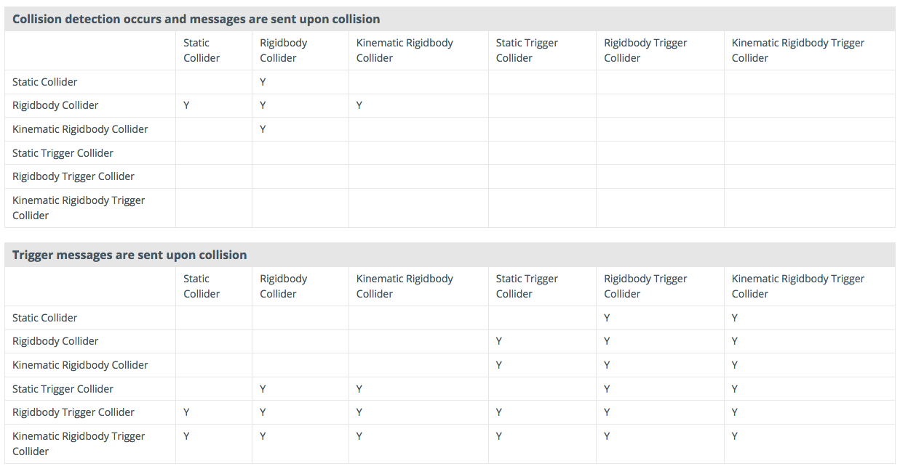

<script>hljs.highlightAll();</script>

# Physics Engine: Rigidbody, Collider, Collisions, Triggers

---

📦 **Unity packages from today's class:**
> 
> - Class Demo: [Rocketship](https://drive.google.com/file/d/1CtX8i419p3Tt_ZFlw0ZkOT6jcIpQsatI/view?usp=drive_link)

<br>

📚 **Other relevant resources to today's topic:**
>
> - The previous instructor for the Game Engine course, John Brumley made a wonderful sandbox to illustrate how Rigidbodies, collisions, triggers, and object tags can be used. You may find the package link [here](https://drive.google.com/file/d/1UKYuFHLns5P9PLSVDJrkA37vGY1rEMjh/view?usp=sharing). <br><br>
> - Unity Collision Matrix: a reference table for troubleshooting collisions and triggers <br> 
> - [Ultimate Frame Data](https://ultimateframedata.com/): archive of how video games like Super Smash Bros and Street Fighter have set up timed hit boxes for character attack sequences. <br> 

<br>

---

Remember when we used Transforms and vector math to move objects? 

In our accelerated velocity example, we used vector math to achieve an ease-in ease-out transition of the cube's change in position over time. This gave our cube the illusion of mass and physicality. 

```csharp
velocity += acceleration * Time.deltaTime;
position += velocity * Time.deltaTime;
```


<br>

But what if we were to consider other factors like an object's **physical properties** (e.g. mass, torque, bounciness) or other **external forces** (e.g. gravity, friction, collisions with other objects...)? 

Using pure vector math to simulate physically "realistic" movement would still be possible -- it would just become more complicated!

.

.

.

What if I told you Unity has an entire system in place for **simulating physics-based motion**? 👀

---

## Physics Engine

The two main components you will work with are the **Rigidbody** and the **Collider**

### Rigidbody

> Read Unity's overview of [Rigidbody physics](https://docs.unity3d.com/2022.3/Documentation/Manual/RigidbodiesOverview.html) and their documentation on the Rigidbody class in the [Unity Manual](https://docs.unity3d.com/2022.3/Documentation/Manual/class-Rigidbody.html) and [Scripting API](https://docs.unity3d.com/2022.3/Documentation/ScriptReference/Rigidbody.html).

<br>

<div class="div-container">
    <div style="width:47.5%">
        
    </div>
    <div style="width:47.5%">
        <ul>
            <li style="margin-top:0">Responsible for making an object move with physics
            </li>
            <li>Has properties like <b>mass</b>, <b>drag</b>, and <b>angular drag</b>, which affect the way an object responds to collisions and forces
            </li>
            <li>Movement and rotation can be constrained along the X, Y, and Z axes
            </li>
            <li>Moves independently, regardless of parent-child relationship.
            </li>
        </ul>
    </div>
</div>

#### Kinematic Rigidbodies

When isKinematic is "true", the rigidbody will **not** be affected by physics (i.e. animations have to be done by changing transform position in scripts or animation clips).

However, they can affect the motion of other rigidbodies through **collisions** (if detectCollisions is "true") or **joints** (if connected to a non-kinematic rigidbody with a joint.) 


### Collider

<div class="div-container">
    <div style="width:47.5%">
        <br><br>
    </div>
    <div style="width:47.5%">
        <ul>
            <li style="margin-top:0">A shape that the physics engine uses to detect when objects touch
            </li>
            <li>Comes in several shapes like <b>sphere</b>, <b>box</b>, and <b>capsule</b>*.<br><br><i>(*Note: There are also <b>mesh</b> colliders that take the shape of any custom mesh of choice -- these offer more accurate details in collider shapes, but have some <a href="https://docs.unity3d.com/2022.3/Documentation/Manual/mesh-colliders-introduction.html">limitations</a> with their range of use.)</i> 
            </li>
            <li>Multiple can be combined to make more complex shapes.
            </li>
            <li>Optionally can add a <b>Physic Material</b> to change bounciness and friction of an object.
            </li>
            <li>In the scene view, colliders are visualized with a green outline, and can have its scale, position, and sometimes orientation transformed using <b>Edit Collider</b> or the <b>Edit Bounding Volume</b> tool.
            </li>
        </ul>
    </div>
</div>

<br>

## Moving a Rigidbody 

### Using with Forces & Torque

> Read about [Rigidbody.AddForce()](https://docs.unity3d.com/2022.3/Documentation/ScriptReference/Rigidbody.AddForce.html) and [Rigidbody.AddTorque()](https://docs.unity3d.com/2022.3/Documentation/ScriptReference/Rigidbody.AddTorque.html) method functions in Unity's Scripting API.

<br>


This simple spacecraft is controlled in 2D using **force** and **torque**.
        
We can "push" rigidbodies by applying force to them, and make them spin by applying torque. This technique makes for **more physically realistic** motion, but can be **difficult** to control.

Use `FixedUpdate()` to update physics-based methods like `AddForce()` and `AddTorque()`.

```csharp
using UnityEngine;

public class Rocketship : MonoBehaviour
{
	Rigidbody rbody;
	bool rocketBoost = false;
	float spin = 0f;

    // Start is called before the first frame update
    void Start()
    {
		rbody = GetComponent<Rigidbody>();
    }

    // Update is called once per frame
    void Update()
    {
		//get input in the update function!
		rocketBoost = Input.GetKey(KeyCode.Space);

		spin = Input.GetAxis("Horizontal"); //-1 : 1
	}

	//use fixedupdate to update physics
		//its more consistent than update!
	private void FixedUpdate()
	{
		if (rocketBoost == true)
		{
			//pushes the rigidbody
			rbody.AddForce(transform.up * 100);
			//transform.up gives us up relative to this object's oriention
		}

		//spins the rigidbody
		rbody.AddTorque(new Vector3(0, 0, 1) * spin * 30f);
	}
}
```

<br>

### MovePosition

> Read about [Rigidbody.MovePosition()](https://docs.unity3d.com/2022.3/Documentation/ScriptReference/Rigidbody.MovePosition.html) in Unity's Scripting API.

<br>

Sometimes, we want an object to be able to move in a **more controlled** way, while still affecting other rigidbodies. This is where **MovePosition** comes in. 

The move position function automatically calculates what forces to apply to a rigidbody to move it to a given position. This offers more control over the object's motion.

To make it so an object like this is less affected by other objects and forces, make sure to **increase its mass and drag**.


```csharp
using UnityEngine;

public class MovePositionDemo : MonoBehaviour
{
	Rigidbody rbody;
	float h;
	public float speed = 4f;

    // Start is called before the first frame update
    void Start()
    {
		rbody = GetComponent<Rigidbody>();
    }

    // Update is called once per frame
    void Update()
    {
		h = Input.GetAxis("Horizontal");
    }

	private void FixedUpdate()
	{
		Vector3 newPosition = transform.position;
		newPosition += Vector3.right * h * speed * Time.deltaTime;
		//move the rigidbody to a given position
		rbody.MovePosition(newPosition);
	}
}
```

<br>

## Collision Detection

Use the following functions to detect when a collision occurs.

```csharp
public class CollisionDemo:MonoBehaviour
{
	void OnCollisionEnter(Collision collision)
	{
		//occurs the moment a collision begins
		Debug.Log("collision began with " + collision.gameObject.name);
	}
	void OnCollisionStay(Collision collision)
	{
		//occurs continuously while two objects touch
			Debug.Log("touching " + collision.gameObject.name);
	}
	void OnCollisionExit(Collision collision)
	{
			//occurs the moment two objects stop touching
		Debug.Log("collision with " + collision.gameObject.name + " ended");
	}
}
```

<br>

Note that these functions only work in a script attached to a game object with a rigidbody and a collider. The variable `collision` provides information about what was hit.

<br>

For example, you could get the [tag](https://docs.unity3d.com/Manual/Tags.html) belonging to the collider's GameObject.

```csharp
void OnCollisionEnter(Collision collision)
	{
		if (collision.gameObject.tag == "Enemy"){
            Debug.Log("Enemy hit!");
        }
	}
```

<br>

#### Collision Detection Modes

**Discrete** (default mode) is the least computationally demanding mode of collision detection, it's good for detecting slow collisions. 

If you have fast-moving rigidbody collisions, try setting it to **Continuous Speculative**.

If you notice some missed or inaccurate collisions, try using **Continuous** for collisions with static objects, or **Continuous Dynamic** for collisions with other fast-moving objects. 

<br>

## Triggers

You can also use the physics engine to detect when one collider enters the space of another without creating a collision. 

A collider configured as a Trigger (using the **isTrigger** property) does not behave as a solid object and will simply allow other colliders to pass through. This is useful for doors, collectables, and more.


<br>

When a collider enters its space, a trigger will call the `OnTriggerEnter` function on the trigger object’s scripts.

```csharp
public class TriggerDemo:MonoBehaviour
{
	void OnTriggerEnter(Collider other)
	{
		//occurs the moment an object enters the trigger
		Debug.Log(other.gameObject.name + " entered the trigger");
	}
	void OnTriggerStay(Collider other)
	{
		//occurs while an object is in the trigger
		Debug.Log(other.gameObject.name + " remains in the trigger");
	}
	void OnTriggerExit(Collider other)
	{
		//occurs the moment an object leaves the trigger
		Debug.Log(other.gameObject.name + " left the trigger");
	}
}
```

<br>

---

## 2D Physics

Adapting the above scripts and examples to [**2D physics**](https://docs.unity3d.com/2022.3/Documentation/ScriptReference/UnityEngine.Physics2DModule.html) requires switching out certain component and function names to their 2D equivalents... which usually just involves **adding “2D” to the end**. 

<br>

<table>
    <thead>
        <tr>
            <th></th>
            <th>3D Physics</th>
            <th>2D Physics</th>
        </tr>
    </thead>
    <tbody>
        <tr>
            <td rowspan=3>Components</td>
            <td>Rigidbody</td>
            <td>Rigidbody2D</td>
        </tr>
        <tr>
            <td>Collider</td>
            <td>Collider2D</td>
        </tr>
        <tr>
            <td>Collision</td>
            <td>Collision2D</td>
        </tr>
        <tr>
            <td rowspan=6 style="border-bottom: none;">Functions</td>
            <td>OnCollisionEnter</td>
            <td>OnCollisionEnter2D</td>
        </tr>
        <tr>
            <td>OnCollisionExit</td>
            <td>OnCollisionExit2D</td>
        </tr>
        <tr>
            <td>OnCollisionStay</td>
            <td>OnCollisionStay2D</td>
        </tr>
        <tr>
            <td>OnTriggerEnter</td>
            <td>OnTriggerEnter2D</td>
        </tr>
        <tr>
            <td>OnTriggerExit</td>
            <td>OnTriggerExit2D</td>
        </tr>
        <tr>
            <td>OnTriggerStay</td>
            <td>OnTriggerStay2D</td>
        </tr>
    </tbody>
</table>

<br>

```csharp
private void OnTriggerEnter2D(Collider2D other)
    {
        Debug.Log("2D trigger entered.");
    }
```

<br>

---

## Exercise

In preparation for Project 2...

### **OPTION A**: Player Movement

Make a player character placeholder (capsule, cube, sphere) that moves along a plane using **forces**, **torque**, or **MovePosition**. 

- what are the directions in which your player can move?
- how much friction should your player movement have?
- how is your character's motion affected by gravity, if at all? 

You could also try using [Input.GetAxis](https://docs.unity3d.com/ScriptReference/Input.GetAxis.html) to map to arrowkeys, WASD, or MouseX/Y; 

<br>

OR

### **OPTION B**: Ball Movement

Make a simple prototype of the **ball interaction** for your game.

- a paddle or club hitting a ball? 
- a ball throwing mechanic? 
- how bouncy or heavy should the ball be?

<br>

For both exercise options, focus on getting the *feeling* of the interaction right! 

<br>

---

## Some course reminders

- Reading Response 2 is due on Thursday. 