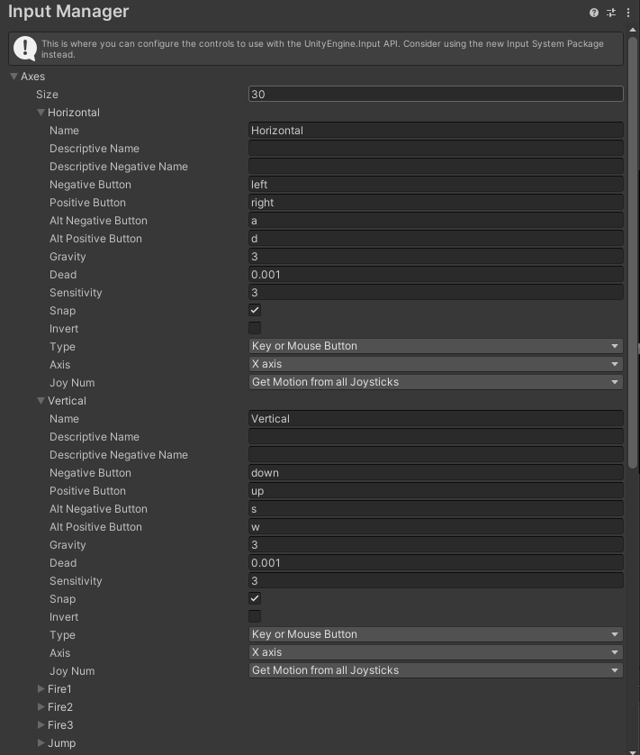
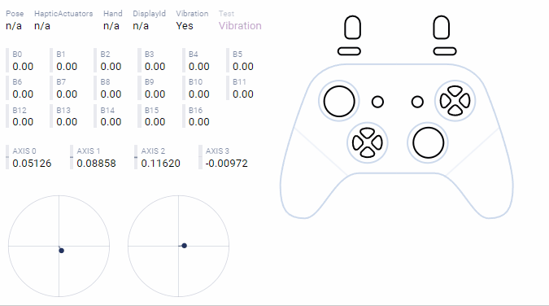
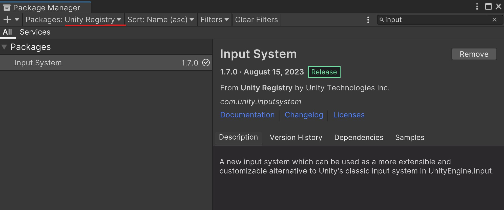
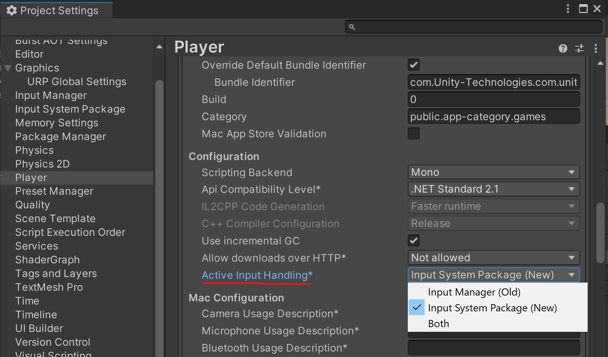
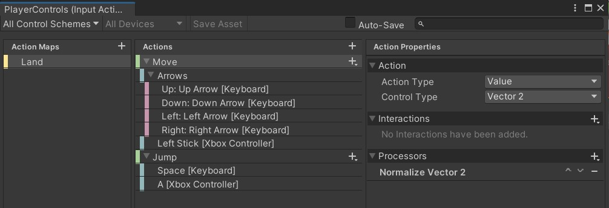
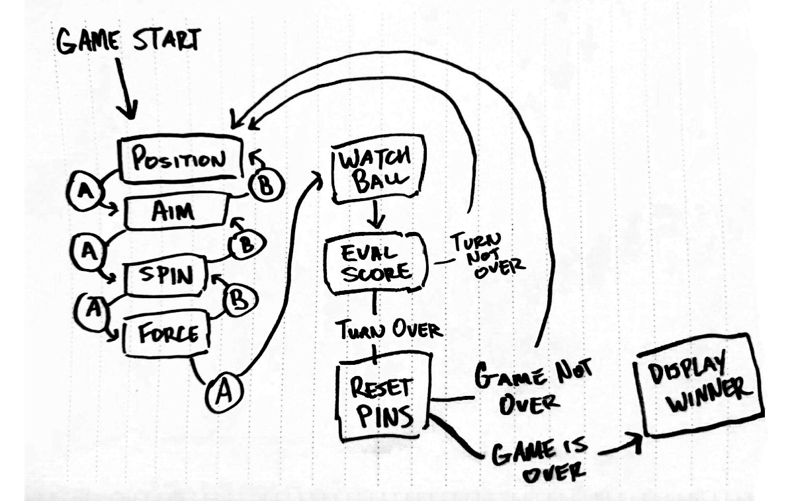
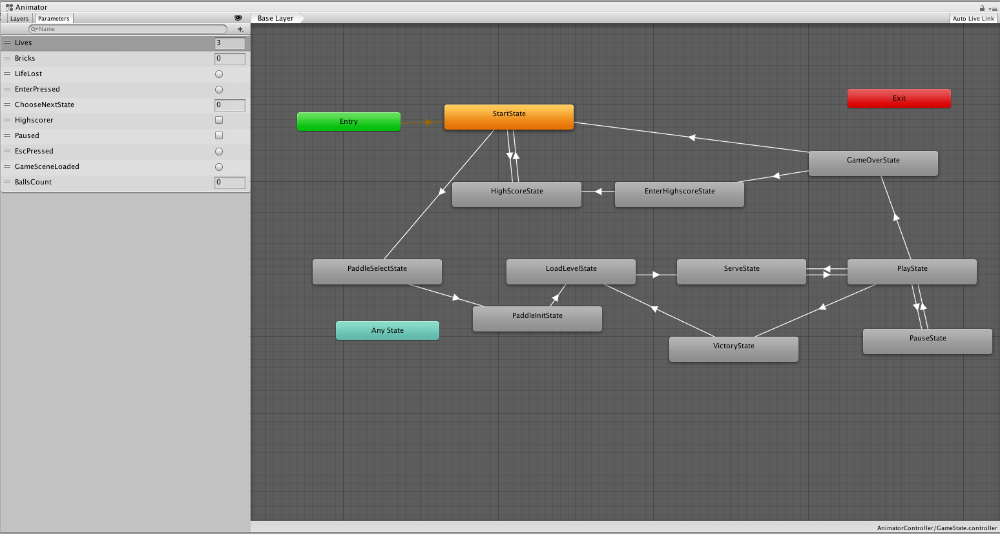
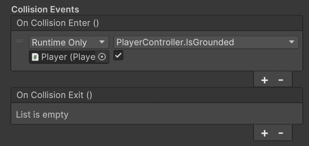

<script>hljs.highlightAll();</script>

# Input Systems, State Machines, Events

---

📦 **Unity packages from today's class:**

> Before importing both packages, make sure to install the Input System package on your Editor as well.
> 
> - [Cursor Input for World Space and Raycast](https://drive.google.com/file/d/1fxOu-Rvy_G3shZh2Rm6OedAWwUqqYJ8M/view?usp=drive_link)
> - [New Input System Demo](https://drive.google.com/file/d/1f43f0bme2UTEzqcRk4T30ldGEymuVnJH/view?usp=drive_link)

<br>

📚 **Other relevant resources to today's topic:**

> - [Gamepad Tester](https://hardwaretester.com/gamepad): Online tool for testing gamepad input; useful for understanding how joystick buttons are mapped.
> - [Unity's Rollaball Tutorial: Moving the Player](https://learn.unity.com/tutorial/moving-the-player?uv=2022.3&projectId=5f158f1bedbc2a0020e51f0d#650b1ec9edbc2a263aa43ebd): A simple example of how to set up player movement using Unity's new Input System. 

---

To recap, we've already learned how to map inputs to certain lines of code [using KeyCodes and GetKey](./w2-2-basicinput-ui-lights-camera.md/#basic-input). 

However, as we get more ambitious with our projects, it makes sense to use a more organised solution for mapping input controls to specific actions. 

---

## Legacy Input Solution: the Input Manager

From the most recent version of Unity's Manual (Unity 6, 6.000)

> Unity has a built-in legacy input solution called the Input Manager. This is not the recommended workflow, as it is less flexible than the Input System Package, and will be removed in future versions of Unity.

<br>

As of now, Unity legacy input system is still their default solution. 

<br>

### Input Manager

Go to **Edit** > **Project Settings** > **Input Manager**.



<br>

The Input Manager comes with a default set of actions that are already mapped to keyboard and joystick controls. These actions can be called using their names. 

<br>

### Directional Input from Keyboard and Joysticks

Use [Input.GetAxis](https://docs.unity3d.com/ScriptReference/Input.GetAxis.html) to read analog values from a gamepad. The output range would be from -1 to 1 along both horizontal and vertical axes.

The joystick is mapped to the axes **Horizontal** and **Vertical** by default, which also read the WASD and Arrow keys. 



<br>

```csharp
float moveX = Input.GetAxis("Horizontal");
float moveY = Input.GetAxis("Vertical");
```

<br>

It's sometimes useful to convert these inputs into a vector, for instance if you are using directional input to change a character's velocity:

```csharp
Vector3 heading = new Vector3(Input.GetAxis("Horizontal"), 0, Input.GetAxis("Vertical"));
```

<br>

### Directional Input from Mouse

You can also use the axes **Mouse X** and **Mouse Y** to get information about how the mouse is moving. 

Note that this does *NOT* give you the position of the cursor on screen, but tells you the **direction** and **speed** the player is moving the mouse. 

This is often used to aim the camera in first person games.

```csharp
float sensitivity = 8f;
public GameObject camera;

void Update()
{
	float mouseX = Input.GetAxis("Mouse X");
	camera.transform.Rotate(Vector3.up, mouseX * sensitivity * Time.deltaTime);
}
```

<br>

### Get Button Presses from Keyboards and Gamepads

The GetKey functions are great for getting keyboard input, but Unity also lets us detect keyboard and gamepad inputs all at once using the **GetButton** functions.

```csharp
if(Input.GetButton("Jump"))
{
	Debug.Log("space or joystick button 3 are pressed");
}

if(Input.GetButtonDown("Fire1"))
{
	Debug.Log("left ctrl or left mb or joystick button 0 was just pressed down");
}

if(Input.GetButtonUp("Fire2"))
{
	Debug.Log("left alt or right mb or joystick button 1 was just released");
}
```

<br>

You can customize which string values and button mappings the input system uses for these functions in the Input Manager, but in most cases the default settings work well. You have access to **Jump**, **Fire 1**, **Fire 2**, **Fire 3**, which map to the four face buttons on a gamepad, to several commonly used keys on the keyboard, and in some cases to the buttons on the mouse.

<Br>

### Cursor Input

#### Screem Space and World Space

It's easy enough to read the screen coordinates of the cursor.

Use **Input.mousePosition** to get the current position of the cursor in screen space.

```csharp
Vector3 mousePos = Input.mousePosition;
//x is the x coordinate of the cursor in screenspace
//y is the y coordinate of the cursor in screenspace
//z is always 0.
```

<br>

In screen space, the **bottom-left of the screen or window** is at **(0, 0)**. The **top-right of the screen or window** is the **height** and **width** of the screen in pixels, at ([Screen.width](https://docs.unity3d.com/ScriptReference/Screen-width.html), [Screen.height](https://docs.unity3d.com/ScriptReference/Screen-height.html)).

The trick is to convert from screen space to the game's world coordinates (aka "**world space**"). 

How a position in screen space corresponds to world space depends on where the camera is looking, whether the camera uses perspective or orthographic projection, and how "deep" into the scene you want the cursor to be.

If you get a reference to the camera in your scene, you can convert from a screen coordinate to a world coordinate with **Camera.ScreenToWorldPoint**.

```csharp
Camera camera;
void Start()
{
	camera = GetComponent<Camera>();
}

void Update()
{
	Vector3 mousePos = Input.mousePosition;
	mousePos.z = 1; //the z component of the vector will
	//determine the distance of our new position from the camera
	Vector3 worldPos = camera.ScreenToWorldPoint(mousePos);
}
```

In this case, ScreenToWorldPoint gives us a point one unit in front of the camera, with the same apparent position on screen as the cursor.

<br>

#### Raycasting from the camera

If you want to interact with objects in a 3D scene using the mouse, at some point you will have to use **raycasting**.

First, you need to get a Ray that passes from the camera, through your cursor, into the scene.

A Ray contains **two vectors**, which represent the ray's **origin point in space** and its **direction vector**.

```csharp
Camera camera;
void Start()
{
	camera = GetComponent<Camera>();
}

void Update()
{
	Vector3 mousePos = Input.mousePosition;
	Ray cursorRay = camera.ScreenPointToRay(mousePos);
}
```

<br>

Then, you can use the ray to **raycast** against the ground or other objects in your scene.

```csharp
RaycastHit hitInfo
if(Physics.Raycast(cursorRay, out hitInfo))
{
	Debug.Log(hitInfo.point); //prints the position in the scene that the raycast hit...

    //or do something else, depending on what you hit!
    if (hitInfo.collider.CompareTag("Enemy")){
        Debug.Log("Found Enemy!");
    }
}
```

---

## Unity's (New) Input System Package

The Input System is Unity's latest solution for binding controls to actions. It's meant to consolidate everything input-related in a single interface, so you can do the following from the Input Action Editor:

- map actions across different types of control devices;
- organise action maps for different contexts (e.g. player controls, UI controls)
- determine how input values should be processed, and how buttons should be interacted with.
- managing inputs for local multiplayer projects.

### Installing the Input System

Go to **Window** > **Package Manager** > look for **"Input System"** in the **Unity Registry**, and click **Install**. The Unity Editor will ask you to restart your project, so make sure to save any changes beforehand!



<br>

It's still possible to use both the old Input Manager and the new Input System package at the same time (most use cases for this are to help ease the transition across both input solutions.) 

You can set the method for handling input in **Edit** > **Project Settings** > in the **Player** tab, look in **"Other Settings"**, and scroll down to **Active Input Handling**.



<br>

### Making an Input Action Asset for Player Controls

First, add a **Player Input component** to your Player GameObject. 

Next, create an new **Input Action Asset**. You can click the "**Create Actions...**" button from the Player Input component to create an asset with Unity's presets; or start from scratch by right clicking in your **Project asset tab** > **Create** > **Input Actions**.

<br> 

#### Input Action Asset

Double click on your Input Action Asset to open up the **Input Action Editor** window. 

This is where you can store and manage the following information: 

- **Action Map**: separates a set of actions for a specific context (eg. Player movement, UI controls)
- **Actions**: contained within Action Maps; single events that can be triggered with the assigned inputs. 
- **Bindings**: contained within Actions; determines which physical controls will trigger the Action. 
- **Control Scheme**: which device contains the specific controls that players can use; could also be used to assign player controls in local multiplayer settings. 

<br>

Changes in this editor have to be saved regularly. You could also toggle "**Auto Save**" at the top of the window. 



<br>

#### Action Callback Functions

One easy way to access action events in scripts is to use the callback functions for each action.

For example, if you create an Action called "Jump", the Input System will map the name of this action to a callback function called "OnJump". 

The same rule applies for any action of any name:

- "Move" gets mapped to "OnMove"
- "Fire" gets mapped to "OnFire"
- "CustomAction" gets mapped to "OnCustomAction"

... and so forth!

<br>

This means we can decide what happens when the action gets triggered by calling the function in scripts. 

Before we can access these functions, we must include the Input System namespace at the top of our script:

```csharp
using UnityEngine.InputSystem;
```

For a button type action called Jump:

```csharp
void OnJump(){
    // write a code for the player jump motion here! 
}
```

<br>

If we need to use the values from our action inputs, we can pass them as arguments for our functions in this way: 

```csharp
Vector2 movement;

void OnMove(InputValue moveValue) 
{
    // move takes an input value of type Vector2
    // so we should get a Vector2 value. 

    movement = moveValue.Get<Vector2>() * speed;
}
```

You may also check whether a button is pressed using InputValue.isPressed -- though this will only work if the Action triggers on both the **Press and Release**, which can be done with a **Press** Interaction for that Action or by using a Value Action Type.

```csharp
bool modifierPressed;

void OnModifier(InputValue value)
{
    modifierPressed = value.isPressed;
}
```

---

## State Machines

> adapted from [Game Programming Patterns](https://gameprogrammingpatterns.com/state.html) by Robert Nystrom.

### The Problem

We have a player character that jumps. Push the jump button, and they should jump. Simple enough: 

```csharp
void Update()
{
	if(Input.GetButtonDown("Jump"))
	{
		yVelocity = JUMP_VELOCITY;
    setGraphics(IMAGE_JUMP);
	}
}
```

<br>

Spot the bug?

There’s nothing to prevent “air jumping” — keep hammering Jump while the player is in the air, and they will float forever. The simple fix is to add an `isJumping` boolean field to our player that tracks when they're jumping, and then do:

```csharp
void Update()
{
	if(Input.GetButtonDown("Jump") && isJumping == false)
	{
		yVelocity = JUMP_VELOCITY;
        setGraphics(IMAGE_JUMP);
		isJumping = true;
	}
}
```

<br>


### Another Problem

Next, we want the player to duck if the down button is pressed while they're on the ground and stand back up when the button is released:

```csharp
void Update()
{
  if (Input.GetButtonDown("B") && isJumping == false)
  {
    // Jump if not jumping...
  }
  else if (Input.GetButtonDown("Crouch"))
  {
    if (isJumping == false)
    {
      setGraphics(IMAGE_DUCK);
    }
  }
  else if (Input.GetButtonUp("Crouch"))
  {
    setGraphics(IMAGE_STAND);
  }
}
```

<br>

Spot the bug this time?

With this code, the player could:

1. Press **down** to duck.
2. Press **Jump** to jump from a ducking position.
3. Release **down** while still in the air.

The player will switch to their standing graphic in the middle of the jump. Time for another Boolean variable…

```csharp
void Update()
{
  if (Input.GetButtonDown("Jump"))
  {
    if (!isJumping && !isDucking)
    {
      // Jump...
    }
  }
  else if (Input.GetButtonDown("Crouch"))
  {
    if (!isJumping)
    {
      isDucking = true;
      setGraphics(IMAGE_DUCK);
    }
  }
  else if (Input.GetButtonUp("Crouch"))
  {
    if (isDucking)
    {
      isDucking = false;
      setGraphics(IMAGE_STAND);
    }
  }
}
```

<br>

Suppose we want to add other moves, like a cool dive attack if the player presses down in the middle of a jump, or a dash that's only available on the ground. To add these features with this approach, we would need to add more Boolean variables, and keep adding onto our increasingly complicated series of if / else statements...

Clearly, we need another approach!

<br>

### Finite State Machines

Grab a pen and paper, then draw a flow chart that maps out each and every possible action the player could be doing in a **box**: standing, jumping, ducking, and diving. 

When the player can respond to a button press in one of those states, draw an **arrow** from that box, label it with that button, and connect it to the state they change to. 

...and you've just created a *finite state machine*!


Finite state machines (FSM) came out of a branch of computer science called automata theory, whose family of data structures also includes the famous Turing machine. FSMs are the simplest member of that family.

The gist is:

- **You have a fixed *set of states* that the machine can be in.** For our example, that’s standing, jumping, ducking, and diving.
- **The machine can only be in *one* state at a time.** Our heroine can’t be jumping and standing simultaneously. In fact, preventing that is one reason we’re going to use an FSM.
- **A sequence of *inputs* or *events* is sent to the machine.** In our example, that’s the raw button presses and releases.
- **Each state has a *set of transitions*, each associated with an input and pointing to a state.** When an input comes in, if it matches a transition for the current state, the machine changes to the state that transition points to.

For example, pressing down while standing transitions to the ducking state. Pressing down while jumping transitions to diving. If no transition is defined for an input on the current state, the input is ignored.

In their pure form, that’s the whole banana: states, inputs, and transitions. You can draw it out like a little flowchart. Unfortunately, the compiler doesn’t recognize our scribbles, so how do we go about implementing one?

<br>

### Implementing a State Machine

Lets start simple with strings and `if` statements...

```csharp
string state = "ground"

void Update()
{
	if(state == "ground")
	{
		GroundUpdate();
	}
	else if(state == "jumping")
	{
		JumpUpdate();
	}
	else if(state == "dive")
	{
		DiveUpdate();
	}
}
```

<br>

We write a function to encapsulate each state: `GroundUpdate`, `JumpUpdate`, and `DiveUpdate`. For now, this function can handle transitions as well. Our `GroundUpdate` function could look like this:

```csharp
void GroundUpdate()
{
	//if pressing jump,
	if(Input.GetButtonDown("Jump"))
	{
		//transition to jump state
		state = "jumping";
	}
	else
	{
		//control ground movement here
	}
}
```

<br>

This solution basically works, but is vulnerable to typos. If we ever misspell or capitalize one of our state names, the game will stop working.

Consider using an [**enum**](https://learn.microsoft.com/en-us/dotnet/csharp/language-reference/builtin-types/enum) to prevent this problem!

<br>

### Enumerations

> Read Microsoft's documentation for [C# Enumerations](https://learn.microsoft.com/en-us/dotnet/csharp/language-reference/builtin-types/enum).


```csharp
enum State{Ground, Jump, Dive}; //define the members of the enum type State here
State currentState = State.Ground;

void Update()
{
	if(currentState == State.Ground)
		GroundUpdate();
	else if(currentState == State.Jump)
		JumpUpdate();
	else if(currentState == State.Dive)
		DiveUpdate();
}
```

With an `enum`, we can define specific values with clear names. Your text editor will autocomplete the names of each member of the `enum` for you, which prevents errors from typos.

In many cases, an `enum` and a series of `if / else` statements will be totally adequate to implement a simple state machine. It's good not to over-engineer if you can help it.

You might also use a `switch` statement instead of a series of `if` statements, which looks like this:

```csharp
enum State{Ground, Jump, Dive}; 
State currentState = State.Ground;

void Update()
{
	switch(currentState)
	{
		case State.Ground: GroundUpdate(); break;
		case State.Jump: JumpUpdate(); break;
		case State.Dive: DiveUpdate(); break;
	}
}
```

<br>

### State Machines and Game Logic

There are many other cases in which it is useful to think in terms of discreet states and transitions between them.

States can be useful for structuring the overall logic or turn order of a game. Suppose we are creating a bowling game. On a player's turn, the player should be able to choose:

- their initial position,
- the direction they are aiming at,
- the spin of the ball,
- the amount of force the ball is thrown with

<br>

Then, once the ball is thrown, the following should happen automatically:

- the player watches the ball as it travels down the lane towards the pins
- once the pins are knocked down, score is evaluated and displayed
- If the player has used both throws, the pins are reset for the next player

<br>

Although this is mostly a linear sequence, we can still think in terms of states to describe the order of events in our game. Plotting our bowling game as a flow chart reveals a surprising level of complexity:



It's important to remember that there is no single best way to implement a state machine. **A state machine is simply a pattern you can use to think through organizing your code.**

The state machine describing our bowling game is significantly more complicated than our jump example, controlling sound, physics, animation, input, timers, different menus and screens and more.

Rather than encapsulate the logic for our entire game inside one script, like our earlier example, we could break each state out into it's own script, on a different game object. 

Each state GameObject could contain a canvas with UI elements nested inside. Then we can activate and deactivate each game object to begin and end it's state.

We might also think of Position, Aim, Spin, and Force as sub-states of a larger state called "Player Turn". The Player Turn state could have it's own script, which stores the values chosen during the Position, Aim, Spin, and Force sub-states, and applies them to the ball only at the end of the turn....

<br>

### Animation States

Finally it's worth noting that Unity controls animations using a kind of state machine called an animator controller. We'll discuss this more in another week, but the editor for this should look familiar.



<br>

---

## UnityEvent

Remember our OnClick() event for setting up interactivity with UI Buttons? 

OnClick() is a **UnityEvent** that belongs to the Button component class. We add **listeners** through the inspector, so when the event is **invoked** (ie. the event happens), the button calls the functions that are listening to this event at the same time.

We can set up **customised UnityEvents** for other objects and scripts (such as triggers, collisions, etc.) UnityEvents uses the namespace `using UnityEngine.Events;` -- make sure to include this at the top of your script. 



```csharp
using UnityEngine;
using UnityEngine.Events;

public class EventHandler : MonoBehaviour
{
    public UnityEvent onCollisionEnter, onCollisionExit;

    void OnCollisionEnter(Collision col){
        onCollisionEnter.Invoke();
    }

    void OnCollisionExit(Collision col){
        onCollisionExit.Invoke();
    }
}
```

<br>

UnityEvents can be useful for connecting different scripts in your game, and executing multiple functions at the same time upon a game state change. 

For example, when your player dies, the following scripts need to be run: 

- play the player character's lose animation.
- update UI to show lose screen UI elements.
- stop receiving player input.
- the player score needs to be reset.
- the scene needs to be changed.

UnityEvents also keeps your game programming architecture modular using something called the [**Observer Pattern**](https://unity.com/how-to/create-modular-and-maintainable-code-observer-pattern). Our event listeners are **observers** that passively observe whether the event has been invoked or not, and can act in response to an event, but they don't interfere with other listeners, nor do they depend on each other. 

The observer pattern keeps things manageable and organised when we want to set up complex event systems! This allows your objects to communicate but stay loosely coupled using **a “one-to-many” dependency**. When one object changes states, all dependent objects get notified automatically.


<br>

---

## Some course reminders

- **Project 2 Prototype Playtest** is due next Thursday.