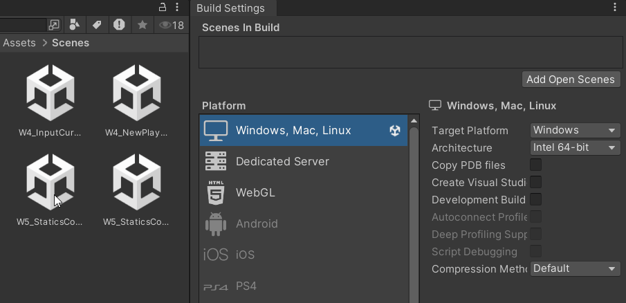
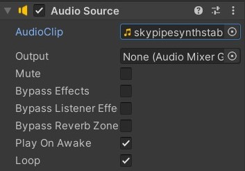
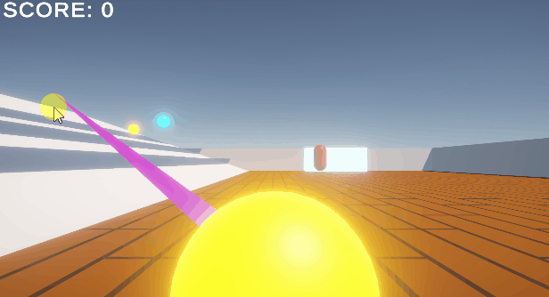
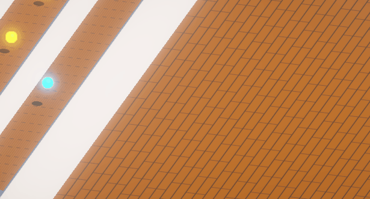
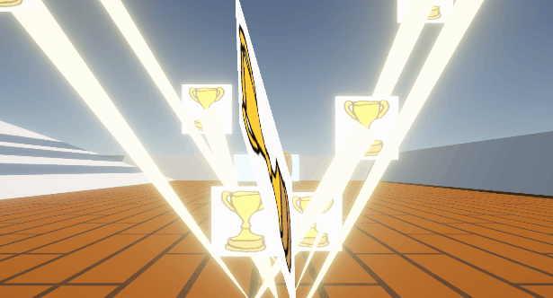

<script>hljs.highlightAll();</script>

# Statics, Scenes, Sounds, VFX

---

## Static Variables and Methods

> Take a look at Unity's tutorial on [Statics](https://learn.unity.com/tutorial/statics-l#).

So far, we have been working with **non-static** variables and methods which belong specifically to an instance of that class. This means they require a reference to an instance in order to be used.

If a variable or method is declared as **static**, it is **shared across all instances of a class**, so you do not require a reference to an existing instance in order to use them.

<br>

For example, we have some static and non-static variables and methods in this MonoBehaviour class called PlayerInfo:

```csharp
using UnityEngine;
using System.Collections;

public class PlayerInfo : MonoBehaviour 
{
    // this non-static variable would belong specifically to an instance of this class. 
    public string playerName = "Avery"; 

    // this static variable is true for all instances of the PlayerInfo class.
    public static int expLevel = 0;

    public static void AddExpLevel()
    {
        expLevel++;

        /*

        //Note: static methods cannot use non-static variables nor methods.
        //the following code would give us an error if uncommented.

        Debug.Log(playerName);

        */
    }

}
```

<br>

And here's how we can call methods and variables from PlayerInfo in a separate script.

**Statics:**

```csharp
void Start(){
    //we can call static methods and variables from PlayerInfo in other scripts without a reference. 

    PlayerInfo.AddExpLevel();

    Debug.Log("new player experience level: "+ PlayerInfo.expLevel);

    /*

    //if we try to call a non-static variable/method without a reference
    //Unity won't be able to recognise it, and will ask for a reference to that class instance

    Debug.Log("Player name: " + PlayerInfo.name);

    */
}
```

<br>

**Non-statics:**

```csharp
//here's how we would call a non-static variable/method

//get a reference to an instance of that class
PlayerInfo p_Info; 

void Start(){

    //make sure that we initialise p_Info; 
    //let's say PlayerInfo is attached to the same GameObject as this script
    p_Info = GetComponent<PlayerInfo>();

    //NOW we should be able to access any non-static variable or method
    Debug.Log("p_Info name:" + p_Info.playerName);

}
```

<br>

By default, you won't be able to see static variables in the inspector, regardless of whether they are `public`, `private`, or attached with a `[SerializeField]` attribute. There are workaround solutions for this (such as the following script example), otherwise your static variables would need to be initialised somewhere inside your script. 

```csharp
public class ScoreManager : MonoBehaviour{

    public static int s_startingScore; // not visible in Inspector
    public int startingScore; // visible in Inspector

    void Awake(){
        //initialise static variable in Awake()
        s_StartingScore = startingScore;
    }
}
```

<br>

## Static Classes

You can also create **static classes** to contain other static variables and methods. 

For example, if you have a set of mathematical functions that you plan to use across multiple scripts for your game, you could consider storing them inside a static class called "Utilities". 

Note that static classes **cannot** derive from MonoBehaviours, nor contain non-static member variables and methods. 

```csharp
using UnityEngine;
using System.Collections;

public static class Utilities 
{
    //A static method can be invoked without an object of a class. 
    //Note that static methods cannot access non-static member variables.

    public static float Add(float num1, float num2){
        return num1+num2;
    }
}
```

<br>

Now, with this script saved in our project's Assets folder, we can easily access this method using `Utilities.Add(...)`.

```csharp
float firstNumber= 6;
float secondNumber = 13;
float sum = Utilities.Add(firstNumber,secondNumber);
```

<br>

## When to declare as static?

Statics are useful for the following purposes:

- handling information that remains **consistent for all instances of a class**
- calling **standardised information across multiple scripts** without having to reference a specific class instance every time.

<br>

The following are several common use cases for static variables and methods:

### Score Keeping

Make public static variables and methods to count and update your score, so they can be easily accessed by other objects in your scene.

```csharp
using UnityEngine;
using System.Collections;

public class GameManager : MonoBehaviour{

    //make a static variable to contain the score number
    public static int scoreCount = 0;
    public static int scoreToWin = 10;

    //create a static function that checks if the game has been won
    public static bool CheckWin(){
        //if scoreCount is equal to or exceeds minimum score to win
        if (scoreCount>=scoreToWin){
            return true;
        } else {
            return false;
        }
    }
}
```

<br>

In another script (e.g. a trigger event handler script on a goal collider), you can access the static variables and functions like so:

```csharp
using UnityEngine;
using System.Collections;

public class GoalTrigger : MonoBehaviour
{
    public UnityEvent onScoreGoal;
    public UnityEvent onWin;
    private void OnTriggerEnter(Collider other)
    {
        if (!GameManager.CheckWin())
        {
            if (other.CompareTag("Ball"))
            {
                //can score points
                GameManager.scoreCount += other.GetComponent<BallInfo>().points;
                onScoreGoal.Invoke();
                if (GameManager.CheckWin())
                {
                    onWin.Invoke();
                }
            }
        }
        
    }
}
```

<br>

### Setting up a timer

> Based on this [solution](https://gamedevbeginner.com/how-to-make-countdown-timer-in-unity-minutes-seconds/) from gamedevbeginner.

You may use a countdown timer to set a time limit for the game, or determine a lifespan for objects of a certain type in your scene. 


```csharp
public UnityEvent onLose; //make sure to add the UnityEngine.Events namespace at the top of your script

public static bool gameLost = false;

//for Countdown timer
public static float timeRemaining = 10f; //in seconds

private void Update()
{
    if (!CheckWin()&&!gameLost)
    {
        if (timeRemaining > 1) 
                //if this is set to ">0" instead,
                //there will be a second-long delay
                //when the timer display text is stuck at 00:00
                //before the onLose event is invoked. 
        {
            timeRemaining -= Time.deltaTime;
        }
        else
        {
            timeRemaining = 0;
            gameLost = true;
            onLose.Invoke();
        }
    }
}
```

<br>

... and if you'd like to display this on a TextMeshProGUI component:

```csharp
TextMeshPro tmp; //make sure to add the TMPro namespace at the top of your script

private void Start()
{
    tmp = GetComponent<TextMeshPro>();
}

private void LateUpdate()
{ 
    if (!GameManager.CheckWin()&&!GameManager.gameLost)
    {
        //Mathf.FloorToInt() rounds down the value passed into the function.

        float minutes = Mathf.FloorToInt(GameManager.timeRemaining / 60); 
        //division function (/) gets the quotient of time remaining (in seconds) divided by 60... which gives us the number of minutes.

        float seconds = Mathf.FloorToInt(GameManager.timeRemaining % 60); 
        //modulus function (%) gets the remainder of time remaining (in seconds) divided by 60... which gives us the number of seconds.

        // the "{0:00}:{1:00}" argument in string.Format is responsible for
        // formatting it into "minutes (2 digits) : seconds (2 digits)";
        // the first "0" in "{0:00}" represents "variable 0", which is our "minutes" variable;
        // the "00" after the colon(:) in "{0:00}" tells the function to format it into a two-digit format. 
        tmp.text = string.Format("{0:00}:{1:00}", minutes, seconds);
    } 
}
```

<br>

... or perhaps you prefer a stopwatch timer that counts up! Try using the script above as a base to start modifying into a timer that counts up instead.

<br>

### Singletons

A **singleton** is a class that holds a public static reference to an instance of its own type. It ensures that there is only ever a single instance of this class.

Consider using a singleton pattern for a **GameManager** script that manages the core elements of your game. The following is the simplest version of a Singleton Game Manager (without any other functionality):

```csharp
using UnityEngine;
using System.Collections;

public class GameManager : MonoBehaviour
{
	// singleton business
    // "get; private set" allows this GameManager instance to be retrieved throughout the project but only set from the class containing it
	public static GameManager Instance { get; private set; }
	void Awake()
	{
		// check if a GameManager already exists
		if (Instance != null && Instance != this)
		{
			// if one does, destroy this gameobject
			Destroy(gameObject);
		}
		else
		{
			// if it doesn't, save this manager to the Instance var
			Instance = this;
			// keep object around between scene changes
			DontDestroyOnLoad(gameObject);
		}
	}
	// end singleton business
}
```

<br>

Because this GameManager uses `DontDestroyOnLoad`, you can attach things as children to the manager that you want to stay on every scene. For example. background music.

We'll revisit this singleton script again next class!

<br>

---

## Scene Management

> Read the documentation for the [SceneManager](https://docs.unity3d.com/2022.3/Documentation/ScriptReference/SceneManagement.SceneManager.html) class in Unity's Scripting API.

We can manage our scenes during run-time using Unity's SceneManager class. Consider adding a game title screen, adding a function to restart your current game, or add new levels to your game. 

<br>

### Loading a new scene in Unity

Before we get into scripting, make sure that all the scenes for your project have been loaded in the Build Settings. 

In the Unity Editor, go to **File** > **Build Settings** > Drag in all the relevant scenes from your Assets folder into the "**Scenes in Build**" section.

Each scene in your build is assigned an **index number**, as indicated to the far right of each row. Make sure your scenes are in the intended order, with **"0" marking the first scene** that is loaded upon starting the build. 



<br>

Finally, we can start writing a script for loading our scene!  

When managing scenes through scripts, remember to include the following namespace at the top of your script. 

```csharp
using UnityEngine.SceneManagement;
```

<br>

use `SceneManager.LoadScene()` to get our new scene. 

```csharp
using UnityEngine;
using UnityEngine.SceneManagement; //make sure to include this namespace!!

public class SceneLoader : MonoBehaviour
{   
    //you can load a scene by its name
    public void LoadThisScene(string sceneName){
        SceneManager.LoadScene(sceneName);
    }

    //or load a scene by its index in the build settings
    public void LoadThisScene(int index){
        SceneManager.LoadScene(index);
    }

    //if your scenes are in the correct order
    //you can also load the next scene like this
    public void LoadNextScene(int index){
        SceneManager.LoadScene(SceneManager.GetActiveScene().buildIndex + 1);
    }

    //you can also reload the current scene using the same method function
    public void ReloadScene(){
        SceneManager.LoadScene(SceneManager.GetActiveScene().buildIndex);
        //or 
        //SceneManager.LoadScene(SceneManager.GetActiveScene().name);
    }
}
```

<br>

## Quitting the Application

`Application.Quit` shuts down the running application. This call will be ignored in the Unity editor, so it will only work after you build your project.

```csharp
using UnityEngine;
using System.Collections;

// Quits the player when the user hits escape

public class ExampleClass : MonoBehaviour
{
    void Update()
    {
        if (Input.GetKey("escape"))
        {
            Application.Quit();
        }
    }
}
```

<br>

---

## Sound Effects

In order for sound to work, Unity requires two components in your scene:

- an **Audio Listener** component -- your Camera should have this by default. 
- an **Audio Source** component on any GameObject.

### Audio Source

> Read the documentation for the [AudioSource component](https://docs.unity3d.com/2022.3/Documentation/ScriptReference/AudioSource.html) in Unity's Scripting API.

<br>

<div class="div-container">
    <div style="width:47.5%">
        
    </div>
    <div style="width: 47.5%">
        <p style="margin-top:0">Add an <b>AudioSource component</b> to a GameObject in your scene. If you're planning to do 3D spatial sound, consider being intentional about which GameObject you attach it to, and where this object is located in your scene.<br><br>You could start by attaching an <b>Audioclip</b> from your Assets folder into the AudioSource component through the Inspector, but we can always assign the clip through script as well. 
        </p>
    </div>
</div>

#### Playing a Background Track on Loop



In the inspector, attach the background audio track into the AudioClip variable. Make sure **Play On Awake** and **Loop** are checked.

<br>

#### Playing a Sound Effect Once

Unity's AudioSource component is able to play multiple AudioClips simultaneously, but *only* using this method called `PlayOneShot()`. This is ideal for playing short one-off sound effects in your scene.

```csharp
public class AudioSourceLoop : MonoBehaviour
{
    AudioSource m_AudioSource;

    // we'll play this clip once every time the ball collides to the ground.
    // and we can randomly select from an array of audio clips.
    public AudioClip[] bounce_sfx; 

    void Start()
    {
        //Fetch the AudioSource component of the GameObject (make sure there is one in the Inspector)
        m_AudioSource = GetComponent<AudioSource>();
    }

    //we could pass this public function into a collision handler attached to the ball object.
    public void PlayBounceSfx(){
        m_AudioSource.PlayOneShot(bounce_sfx[Random.Range(0,bounce_sfx.Length)]);
    }

    //you may also consider adjusting the volume or pitch of the sound
    //depending on how fast the ball is travelling, for example
    public void PlayBounceSfx(float vol){

        //PlayOneShot() accepts a second optional argument to set the playback volume
        //as a float clamped between 0.0 and 1.0, min max inclusive
        m_AudioSource.PlayOneShot(bounce_sfx[Random.Range(0,bounce_sfx.Length)], vol);
    }
}
```

<br>

---

## Visual Effects

Here's some simple visual effects you may consider adding to your projects:

### Line Renderer

> Read the documentation for the Line Renderer component in the [Unity Manual](https://docs.unity3d.com/2022.3/Documentation/Manual/class-LineRenderer.html) and [Scripting API](https://docs.unity3d.com/2022.3/Documentation/ScriptReference/LineRenderer.html).



<div class="div-container">
    <div style="width: 47.5%">
        
    </div>
    <div style="width: 47.5%">
        <p style="margin-top:0;"> The <b>Line Renderer</b> takes an array of two or more points in 3D space, and draws a straight line between each one.<br><br>To create a Line Renderer, go to <b>GameObject</b> > <b>Effects</b> > <b>Line</b>; OR add a <b>Line Renderer component</b> to a GameObject in your scene.
        </p>
    </div>
</div>

<br>

In the Line Renderer component, you may set the **positional coordinates**, **colour**, and **width** of the line, as well as whether the positions set are aligned to global or local origin using the **Use World Space** boolean variable.

<br>

### Trail



<div class="div-container">
    <div style="width: 47.5%">
        
    </div>
    <div style="width: 47.5%">
        <p style="margin-top:0;"> The <b>Trail Renderer</b> uses the same line rendering algorithm as the Line Renderer, so both share many similarities in editor layout and rendering features.<br><br>Add a <b>Trail Renderer component</b> to any moving GameObject in your scene to create a trailing motion path.
        </p>
    </div>
</div>

<br>

One notable feature in the Trail renderer is the **Time** (which determines the lifetime of the trail) and the **Emitting** boolean (which allows you to toggle the trail emission on and off.)

<br>

### Particle System

> Read Unity's documentation for [Particle Systems](https://docs.unity3d.com/2022.3/Documentation/ScriptReference/ParticleSystem.html).



<br>

You can create a particle system by adding a pre-made GameObject (**GameObject** > **Effects** > **Particle System**) or adding the Particle System component to an existing GameObject.

Try adjusting the **general parameters** (top most section) as well as settings for **Emission**, **Shape**, **Trails**, and **Renderer**.

---

## Some course reminders

- **Project 2 Prototype Playtest** is due Thursday! 