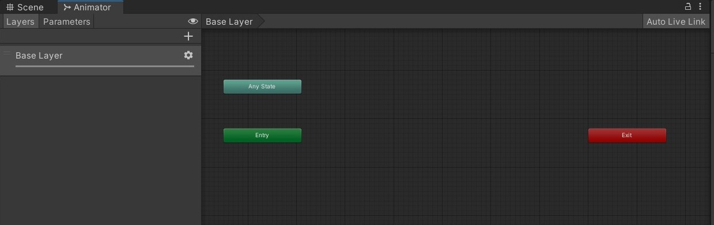
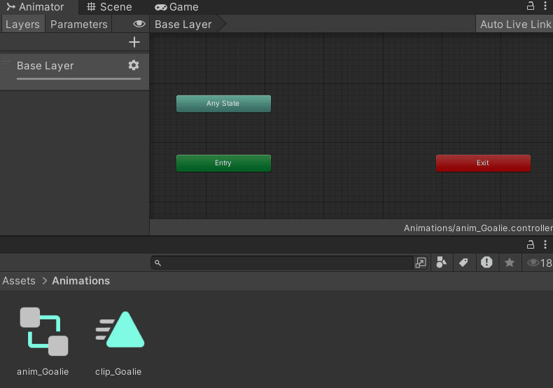
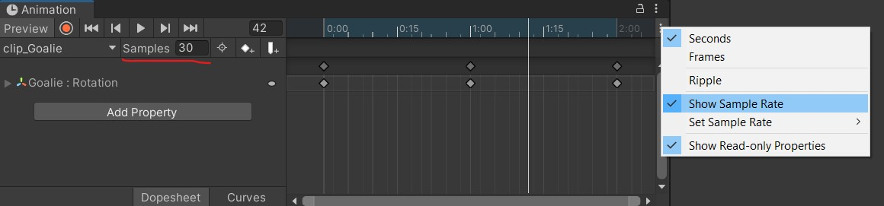
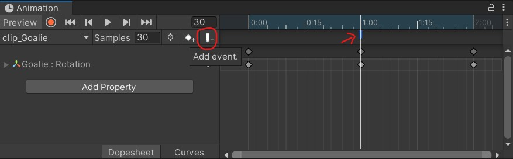

<script>hljs.highlightAll();</script>

# Animation, Coroutines, Persistent Data

---

📦 **Unity packages from today's class:**
> 
> - Class Demo for Persistent Data: [PlayerPrefs](https://drive.google.com/file/d/1R_RPTlQ_6cgxJIx1jqhKcePq6CBRn4aA/view?usp=drive_link) and [Serialization](https://drive.google.com/file/d/1oNMR45ogcwncnedLQuj6oGcs2hc5jY62/view?usp=drive_link)

<br>

📚 **Other relevant resources to today's topic:**
>
> - [Example character Sprite Sheet for Class Demo](https://drive.google.com/file/d/1KSmyTj-9Q5NIcUfgZNh-W-xuZoH1emmC/view?usp=drive_link).

<br>

---

## Coroutines

> Read Unity's documentation for [Coroutines](https://docs.unity3d.com/2022.3/Documentation/Manual/Coroutines.html).

In most situations, when we call a method, Unity runs it to completion within a single frame update. 

Using coroutines, we can spread our code excecution across several frames. Coroutines have methods for adding timed delays before proceeding with the next line of code. This gives us the option to:

- set up **custom animation systems** using scripts (e.g. flipbook script that switches out frames over a set time interval)
- compose **a timed sequence of events** (e.g. a cutscene; setting a timer for state changes)

For example, the Singleton Game Manager package from yesterday used Coroutines to delay a scene loading function. 

### Declaring Coroutines

First, we declare a coroutine function with an IEnumerator return type. An IEnumerator is set up like any regular function, except it *must* have a `yield return` statement somewhere in its body. 

In this example, we use `yield return new WaitForSeconds(someFloatValue);` to add a delay in seconds before proceeding to the next line of code.

```csharp
IEnumerator DelaySceneLoad(int index, float delay)
{
	//wait for "delay" amount of seconds
	yield return new WaitForSeconds(delay); 

	//then load scene
	SceneManager.LoadScene(index);
}
```

<br>

We could also use `yield return null` to pause the execution for a frame before continuing our coroutine run -- though if your coroutine only yield returns null throughout its body, it may make more sense to keep it as a non-coroutine function.

```csharp
IEnumerator Fade()
{
    Color c = renderer.material.color;
    for (float alpha = 1f; alpha >= 0; alpha -= 0.1f)
    {
        c.a = alpha;
        renderer.material.color = c;
        yield return null;
    }
}
```

<br>

### Running and Stopping Coroutines

We use the [StartCoroutine()](https://docs.unity3d.com/2022.3/Documentation/ScriptReference/MonoBehaviour.StartCoroutine.html) function to set a coroutine running. 

```csharp
public void StartGame()
{
	StartCoroutine(DelaySceneLoad(1, 1));
}
```

<br>

We can also use the [StopCoroutine()](https://docs.unity3d.com/2022.3/Documentation/ScriptReference/MonoBehaviour.StopCoroutine.html) function to stop specific coroutines during runtime, or the [StopAllCoroutines()](https://docs.unity3d.com/2020.1/Documentation/ScriptReference/MonoBehaviour.StopAllCoroutines.html) function which stops all coroutines running on this behaviour.

```csharp
bool c_isRunning = false;

void Start(){
	StartCoroutine(LoopingCoroutine());
}

void StopButton(){
	if (c_isRunning){
		StopCoroutine(LoopingCoroutine());
		c_isRunning = false;
	}
}

IEnumerator LoopingCoroutine(){
	if (!c_isRunning) {
		c_isRunning = true;
	}
	yield return null;
	LoopingCoroutine();
}
```

<br>

## Unity's Animation System

So far we've looked at methods for dynamically and procedurally animating objects in our scene. However, sometimes we just need a simple solution for playing linear, baked animation sequences. Unity's animator component offers a solution for this!

### Animator

*(Note: There is another class called Interactive Animation that gets into more advanced techniques with Unity's animation system. We'll just cover the basic functions in this class!)*

To begin animating an object, we must first add an Animator component. This Animator component takes an <b>Animation Controller</b> asset, so that's what we'll make in our assets folder next. 


<br>

Right click in your **Assets folder** in your Unity Editor > **Create** > **Animation Controller**, and drag it into the "Controller" field of your Animator component.


<br>

Next, double click the Animation Controller to open up the **Animator panel**.



<br>

As we've mentioned in the previous lecture, the Animator component works like a state machine that begins from the green "Enter" state upon being enabled. 

Here you can click and drag **Animation clip** assets into the Animator workspace, make **transitions** between them, and even add **conditional parameters** that determine when the Animator should shift from one state to another. 

<br>

### Animation Clip

Create an **Animation** asset in your Assets folder, then click and drag it into your Animator panel. 

If this is your first animation clip in your animator, then it will turn into an orange box, which indicates that it is your animator's **default state** (i.e. it's the first state that your animator enters upon being enabled.) Other clips will be gray boxes unless explicitly set as default states later on. 



<br>

Double click on your animation clip from the Assets folder, then select the object that your Animator component is attached to. This should show you the **Animation** timeline. 

Here we can animate specific properties of your object's components by adding keyframes along a timeline, and even set the sample rate (which functions like a playback frame rate) if you have "Show Sample Rate" checked in your Animation panel




<br>

You may also set up **Animation Events** that trigger during the animation clip. If you have any script components attached to the same object as the Animator component, you can select any public method to call using this event. 

You can use this method for adding sound effects to particular parts of the animation clip. 



<br>

## Persistent Data

*(Note: Persistent data is ****optional**** for this project, but good to know about!)*

We'll introduce two methods for saving persistent data in Unity: **PlayerPrefs** and **Serializations**.

### PlayerPrefs VS Serialization

[**PlayerPrefs**](https://docs.unity3d.com/ScriptReference/PlayerPrefs.html) is a feature of Unity which allows you to save small amounts of data in the user's registry. PlayerPrefs can also be converted to and from XML and JSON files.

This is best for saving preferences like input configuration, volume settings, etc. In our class, you can use this to save a high score if you wish. However, they're not designed for storing large amounts of game data.

Because the player can edit anything saved in PlayerPrefs, whether it's through the [registry](https://docs.unity3d.com/2022.3/Documentation/ScriptReference/PlayerPrefs.html) or converted XML/JSON files, playerprefs aren't ideal for saving important game data. It's not hard to cheat.

...

**Serialization** is a feature of C# which allows you to convert a C# object into a binary data (1s and 0s in series, hence "serialization"), saved on disk as a binary file.

Serialization allows us to store more complex data including arrays and bools, by converting the contents of a C&#35; object directly into a data file. 

Because it is in binary, that data is harder (though not impossible) for a player to edit, making it harder to cheat at a game. Binary files are also really compact in size, making it feasible for storing large amounts of data. The disadvantage of serialization is that it is a little harder to set up than PlayerPrefs.

<br>

### PlayerPrefs Example Code

This example shows how to use PlayerPrefs to save data. PlayerPrefs allows you to save and load *some* primitive data types (string, int, float, but *not* bool) into the user's registry. Each **value** that you store can be accessed with an associated string, called a **key**.

Playerprefs is best used for small pieces of data. As the name suggests, it's well suited things like player preferences (volume settings, input sensitivity, etc). It is possible for a user to edit this data outside of the game, meaning if you use this to store important game data, the user can easily cheat.

For your project, it's acceptable to use PlayerPrefs to store high score data, but for more complex data, or data which you don't want to let the player easily manipulate, you'll want to use serialization to store data.

```csharp
using UnityEngine;

public class PlayerPrefsExample : MonoBehaviour
{
	public string nameData;
	public string classData;
	public int levelData;
	public float volumeData;
	public bool boolData;

	public void LoadData()
	{
	//this if/else statement uses the HasKey function to check if a key exists
	//if so, it uses the GetString function to load the value of that key into a variable
	//if not, it assigns a default value to the variable
		if (PlayerPrefs.HasKey("playerName"))
			nameData = PlayerPrefs.GetString("playerName");
		else
			nameData = "no name";

		//we can also supply GetString with a second argument, which is a default value.
		//Here, if the key "className" doesn't exist, the GetString function will return the default value "no class"
		classData = PlayerPrefs.GetString("className", "default");

		//you can use GetInt and GetFloat the same way as GetString to load data.
		//Optionally, you can also supply a default value to these functions.
		levelData = PlayerPrefs.GetInt("playerLevel",1);

		volumeData = PlayerPrefs.GetFloat("musicVolume", 1f);

		//because PlayerPrefs can't store bools directly,
			//here I'm using an int to represent a true false value
			//a value of 1 means 'true', a value of 0 means 'false'
		
		boolData = PlayerPrefs.GetInt("invertMouse",0) == 1;
		Debug.Log("Loaded data from PlayerPrefs!");
	}

	public void SaveData()
	{

		//use SetString, SetInt, and SetFloat to store values in playerprefs.
		//the first argument is the key, the second is the data to be stored

		PlayerPrefs.SetString("playerName", nameData);
		PlayerPrefs.SetString("className", classData);
		PlayerPrefs.SetInt("playerLevel", levelData);
		PlayerPrefs.SetFloat("musicVolume", volumeData);

		//remember, we can't store bools directly, but we can use an int to represent a bool...
		//true=1, and false=0
		if (boolData==true)
			PlayerPrefs.SetInt("invertMouse", 1);
		else
			PlayerPrefs.SetInt("invertMouse", 0);
		Debug.Log("Saved data to PlayerPrefs!");
	}

}
```

<br>

In the Editor, you may delete your PlayerPrefs data by going to **Edit** > **Clear All PlayerPrefs**.

<br>

### PlayerPrefs To JSON Example Code

This workflow is useful for keeping track of a list of scores and associated names. Instead of creating multiple different PlayerPref entries, we can create a list of objects and convert the entire list into a single [JSON](https://www.json.org/json-en.html) string.

JSON (JavaScript Object Notation) is a text-based format for representing structured data. Data is stored as javascript-style objects and can also be written as an array of objects. It's easy for both machines and humans to parse and write.

```json
[
{
    "name": "Player001",
    "score": 101
},
{
    "name": "Player002",
    "score": 56
},
{
    "name": "Player003",
    "score": 26
},
{
    "name": "Player004",
    "score": 24
}
]
```

<br>

First, we need to create a small class that contains a name and a score. Note that making the class **serializable** allows it to be converted to JSON. 

```csharp
[System.Serializable]
public class HighScore
{
	public string name;
	public int score;
}
```

<br>

Having a **list** of HighScore objects also involves another class:

```csharp
public class HighScores
{
	public List<HighScore> highScoreList;
}
```

From there, we can convert the list into a JSON string, then use PlayerPrefs to save and load the JSON string.

```csharp
// save a list of highscores
void SaveHighScores(List<HighScore> scores)
{
	// create list object
	HighScores highScores = new HighScores { highScoreList = scores };
	// convert to JSON
	string json = JsonUtility.ToJson(highScores);
	// save prefs
	PlayerPrefs.SetString("HighScoreTable", json);
}

// load a list of highscores
public static List<HighScore> LoadHighScores()
{
	// grab scores as json
	string json = PlayerPrefs.GetString("HighScoreTable");
	// if empty, make a new list
	if (json == "") return new List<HighScore>();
	// convert back to list
	HighScores loadedScores = JsonUtility.FromJson<HighScores>(json);
	// return the list of scores
	return loadedScores.highScoreList;
}
```


<br>

### Serialization Example Code

> If you're interested in using this technique, I recommend following [Brackey's video tutorial on saving and loading data](https://www.youtube.com/watch?v=XOjd_qU2Ido).

For this technique, we use a few built-in features of C&#35; to access and write to files, including the **binary formatter** and **filestream**.

<br>

The process looks like this:

| Monobehaviour C&#35; Class | → | Serializable C&#35; Class | → | Binary Formatter | → | Binary File |
|----------------------------|-|------------------|-|-|-|-------------|
| C&#35; class instance that uses and updates its data during project runtime | | C&#35; class for local data storage; constructor method takes the MonoBehaviour class as an argument, and makes a serializable copy of its data | | converts serialized C&#35; object into 1s and 0s. | | file on disk containing the data saved as 1s and 0s |

<br>

In the unity package example, I have a MonoBehaviour Player class that contains some public variables storing player information (**player name** and **score**), and is attached to our player GameObject in our scene (so we have access to the player's **transform** component.)

```csharp
using System.Collections;
using System.Collections.Generic;
using UnityEngine;

public class Player : MonoBehaviour
{
    public string playerName;
    public int score=0;

	//...
}
```

<br>

Next, I made a serializable class called PlayerData to store a copy of specific player information locally. I've also made a constructor method that takes a Player class, so we can get its variables. 

Note that for non-primitive data types like Vector3, we need to convert them into primitive data types. Here I've converted the Vector3 position data into a float array that stores the X, Y, and Z position values.

```csharp
[System.Serializable] //so we can save this information locally!
public class PlayerData //not a Monobehaviour because we don't need this attached as a component
{
    public string playerName;
    public int score;
    public float[] position;

    public PlayerData (Player player)
    {
		//all basic types can be serialized
        playerName = player.playerName;
        score = player.score;

		//unity-specific types like Vector3 and Color can't be serialized,
    	//however you can convert them to arrays of ints or floats to save them!
        position = new float[3];
        position[0] = player.transform.position.x;
        position[1] = player.transform.position.y;
        position[2] = player.transform.position.z;
    }
}
```

<br>

The next step is to make a public static class that converts this PlayerData into a binary format. We can create static functions for saving and loading player data here.

```csharp
using UnityEngine;
using System.IO; // allow working with files on operating system
using System.Runtime.Serialization.Formatters.Binary; // allows us to access binary formatter


public static class SaveSystem
{
	//save this Player
    public static void SavePlayer(Player player)
    {
        BinaryFormatter formatter = new BinaryFormatter();
		
		//store our save file in this location
		//because we're storing binary data
		//we can name this file with whatever file extension.
        string path = Application.persistentDataPath + "/player.data";

		//start a new file stream to create a file
        FileStream stream = new FileStream(path, FileMode.Create);

		//create a new PlayerData type that makes a copy of our player information
        PlayerData data = new PlayerData(player);

		//serialize PlayerData into binary format.
        formatter.Serialize(stream,data);

		//close stream
        stream.Close();
    }

	//load function that returns a PlayerData type
    public static PlayerData LoadPlayer()
    {
		//get this path where our save file is located.
        string path = Application.persistentDataPath + "/player.data";

		//check if this file exists
        if (File.Exists(path))
        {
            BinaryFormatter formatter = new BinaryFormatter();

			//start a new file stream to open an existing file
            FileStream stream = new FileStream(path, FileMode.Open);

			//deserialize this file into a PlayerData type.
            PlayerData data = formatter.Deserialize(stream) as PlayerData;

			//close stream
            stream.Close();

			//return PlayerData
            return data;

        } else
        {
			//file does not exist.
            Debug.LogError("Save file not found in " + path);
            return null;
        }
    }    
}
```

<br>

Lastly, we can return to our MonoBehaviour Player class, and create functions to call these static functions for saving and loading data. If we're loading data, we would also need to update our current Player variables to match our loaded data.

```csharp
using System.Collections;
using System.Collections.Generic;
using UnityEngine;

public class Player : MonoBehaviour
{

	//...


	//you may attach these public functions to a button onClick event, for example
	
    public void SavePlayer() 
    {
        SaveSystem.SavePlayer(this);
    }

    public void LoadPlayer()
    {
        PlayerData data = SaveSystem.LoadPlayer();

        playerName = data.playerName;

        score = data.score;

        Vector3 position;
        position.x = data.position[0]; 
        position.y = data.position[1]; 
        position.z = data.position[2];
        transform.position = position;
    }
}
```

---

## Some course reminders

- **Project 2** is due next Thursday! 