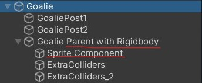

<script>hljs.highlightAll();</script>

# Sprites and Video players

---

Here are some workflows for adding still and moving images to your scene. 

## Add a texture material to a 3D Plane

### Lit VS Unlit shaders

When creating a new material in the Universal 3D pipeline, the default shader used for this material is a **Universal Render Pipeline (URP) Lit shader**. This means your material render will account for lighting in your scene. 

If you change this to an **URP unlit shader**, the material renders independently of the surrounding lighting. 

<figure>

<figcaption>-- Lit shader (left) and unlit shader (right).
</figcaption>
</figure>

<br>

URP also has shaders that are specific to sprite textures. In the **shader drop down**, go to **URP** > **2D** > select a **Sprite shader**. 


<br>

### Material Properties

*(Note: The following properties may or may not be available depending on what material shader you're using. Pictured below are properties available in the URP Lit shader.)*


Here are some notable properties you may consider adjusting for your material asset:

- **Workflow Mode**: Choose between [metallic or specular](https://docs.unity3d.com/2021.3/Documentation/Manual/StandardShaderMetallicVsSpecular.html).
- **Surface type**: Opaque by default. If your texture has transparent areas, you may need to change this to Transparent to reflect the alpha channel. 
- **Render face**: Front (only) by default. In 3D meshes, each face has a normal vector which determines which side the material should render on. If you want your texture to be visible on both sides of your mesh surface, you may need to change this to be "Both".
- **Texture maps**: Add a texture asset in the box to the left of "Base Map". 
- **Emission**: Emit light across the material surface (you may also add an image texture here as an emission map). If you have Global Volume, this will add a glow effect to your material surface at a positive-value intensity. 
- **Tiling and Offset**: Determines how your texture is scaled / positioned along the mesh surface. 
- **Specular Highlights and Environment Reflections** (under Advanced Options): Toggle these checkboxes and see how they affect the way your material is lit. 

<br>

### Watch out for Z-fighting in intersecting mesh surfaces! 

<figure>
    
    <figcaption>-- Comparison between a bush of 3 intersecting planes which has z-fighting and strange overlap renders (left) and a bush made of 6 non-intersecting planes joined at the center (right).
    </figcaption>
</figure>

When meshes intersect with other mesh objects, especially if they're overlapping on top of one another, you may encounter a bug that flickers between the two meshes as your camera moves past it. This may be due to **Z-fighting**, which happens when the camera confuses the depth levels of intersecting mesh objects, and can't determine which to render on top of the other. 

The best practice is to **keep your mesh objects separate** from each other, and avoid intersecting mesh objects altogether. 

<br>

---

## Sprite Renderer Component 

This component allows you to use 2D sprites in GameObjects without using any meshes. 

First, make sure your image is **imported as a "Sprite (2D and UI)" texture type**. This allows you to select this image for the Sprite component for objects in your scene, and for UI Images. 


<br>

If you're importing **a sprite sheet** containing multiple sprites, you will also need to do the following:

1. Set the **Sprite Mode** to "Multiple"
2. Install the **2D Sprite package** from Unity's package manager -- this will enable the Sprite Editor that you can use to slice your sprite sheet into individual sprites.
3. When opening up the Sprite Editor, you may choose to **Slice Grid by Cell Size or Cell Count**. Click "Apply". Now you will have access to individual sprites when you click the expand arrow on your sprite sheet asset.


<br>

Once you have your texture correctly imported, create a new empty GameObject and add a Sprite Renderer component. 


Consider adjusting the following properties according to your needs: 

- **Sprite**: Set this to the sprite texture you imported.
- **Color**: Change the tint of your sprite material. 
- **Order in Layer** (under Additional Settings): Determines the order in which overlapping sprites are rendered (higher order values render above sprites with lower order values.)

<br>

### Using the Sprite Component on a 3D Moving Rigidbody 

If you're applying a sprite to a moving 3D object (let's say a player gameobject), I recommend attaching the sprite component **inside a separate gameobject**, then **parent it to your player GameObject** that has your Rigidbody, collider components, and player movement scripts.

In my package example, here is how my enemy object is arranged in my scene hierarchy:

> - Parent object with Rigidbody, colliders, and physics-based movement script. 
>   - Child object with Sprite component and sprite-related scripts (eg. rotating towards player camera, sprite switcher)



<br>

### Change Sprite using Scripts

```csharp
public Sprite sprIdle, sprAction; // attach your sprite textures in the inspector
SpriteRenderer sprRend; // attach this script to the same object containing your sprite renderer

void Start()
{
    sprRend = GetComponent<SpriteRenderer>();
    ChangeSprite(sprIdle); 
}

//you could also call this function in a public UnityEvent
//and attach the Sprite as an argument in the inspector. 
public void ChangeSprite(Sprite toThisSprite)
{
    sprRend.sprite = toThisSprite;
}

//you could also consider using a coroutine function
//to reset the sprite back to its idle state after a set duration

```

### Rotate Sprite Towards Camera

This method uses the [Vector3.RotateTowards()](https://docs.unity3d.com/2022.3/Documentation/ScriptReference/Vector3.RotateTowards.html) function to rotate sprites towards the camera. 

```csharp
public class RotateTowardsPlayer : MonoBehaviour
{
    public float rotationSpeed;

    private void LateUpdate()
    {
        //Camera.main is a method for getting your camera that's tagged "MainCamera" 
        //typically only a single MainCamera exists in your scene
        //make sure to tag your player camera as MainCamera.

        //first get directional vector3 from this object to camera position.
        Vector3 targetDirection = Camera.main.transform.position - transform.position;

        float step = rotationSpeed * Time.deltaTime;

        //Rotate the forward vector towards the target direction by one step
        Vector3 newDirection = Vector3.RotateTowards(transform.forward, targetDirection, step, 0.0f);

        //rotate our object along this new direction.
        //here, i'm setting the y-vector as 0 so it rotates along the world Y-axis.
        transform.rotation = Quaternion.LookRotation(new Vector3(newDirection.x,0,newDirection.z));
    }
}
```

---

## Video Player Component

> Read the documentation for the video player component on [Unity's Manual](https://docs.unity3d.com/2022.3/Documentation/Manual/class-VideoPlayer.html).

### Importing a Video into your Assets folder.

> Check out the following documentation on Unity's Manual: 
> 
> - [video file compatibilities](https://docs.unity3d.com/2022.3/Documentation/Manual/VideoSources-FileCompatibility.html) across different target platforms;
> - [video transparency support](https://docs.unity3d.com/2022.3/Documentation/Manual/VideoTransparency.html), if you're using videos with alpha channel renders. 

Select the video clip in your assets folder. Make sure to tick the checkbox for **"Transcode"** in the Inspector panel, and then hit **Apply**.


<br>

The simplest way of attaching a video onto a mesh object is to add a video player component, then attach the transcoded video clip asset inside the video player as a "Video Clip". 

The default render mode should be set to "Material Override", which replaces the current material base texture with the video. 

<figure>
    
    <figcaption>-- Video Player on different 3D primitive objects.
    </figcaption>
</figure>

<br>

### Video Player Properties


Here are some notable properties to take note of when setting up your video player:

- **Source**: Defaults to "Video Clip." You may change this to URL if you want to paste an online video link -- note that you may need Wi-fi access during runtime for your video to play. 
- **Play On Awake**: Automatically plays the video at the start of the scene. To manually trigger the video playback, call the [Play()](https://docs.unity3d.com/2022.3/Documentation/ScriptReference/Video.VideoPlayer.Play.html) command from the Video Player class in a C# script. 
- **Loop**: loops the video playback.
- **Playback speed**: Defaults at 1. Change this number if you want the video to play faster (higher float) or slower (lower float).
- **Render Mode**: Defaults to "Material Override". More info about using other render modes are listed in the sections below. 
- **Alpha**: Defaults to 1. Transparency level of the video. 
- **Audio Output Mode**: Defaults to "Audio Source". You may set a different Audio Source, or set the Audio Output Mode to "None" if you want the video to play without any audio tracks. 

<br>

### Video to Render Texture workflow

If you want to further customise how the video renders onto a material, you may consider setting the video player output to a **render texture** instead. 

The following demonstrates the workflow of this method: 

| Video Player | → | Render Texture | → | Texture Map on Material |
|--------------|---|----------------|---|----------------|
| Takes a video clip and renders its playback according to the selected render mode, which in this case would be "Render Texture". | | An asset that receives the video player's output as a texture | | Render texture can be plugged into a material's base colour, normal, emission, etc. | 

<br>

**STEP BY STEP INSTRUCTIONS:**

1. Create a video player component in an empty GameObject in your scene. You will only need **one video player component per video clip** in your scene, i.e. you don't need a video player component on every mesh object that's rendering the video. 
<br><br>Set the **render mode** to "Render Texture."<br><br><br><br>
2. In your assets folder, create a **Render Texture** asset. You may set the size of the texture to match your video clip's resolution or aspect ratio.<br><br><br><br>
3. Attach this render texture to the **Target Texture** property in the video player component. <br><br><br><br>
4. Create a new **Material** asset, then attach your render texture asset as a texture for the material's base colour property. This workflow also allows you the option to plug in the video texture to other material properties besides the base colour. 
<br><br><br><br>

<br>

### Video to Camera Plane

Setting the video player's render mode to **"Camera Far Plane"** allows you to project the video along the far plane of the selected camera view. This could be an option for playing a video in the camera's background.


<br>

Setting the video player's render mode to **"Camera Near Plane"** allows you to project the video along the nearest plane of the selected camera view. This could be an option for playing a video over other objects in the scene. 


<br>

---

## Some course reminders

- **Project 2** is due Thursday! 