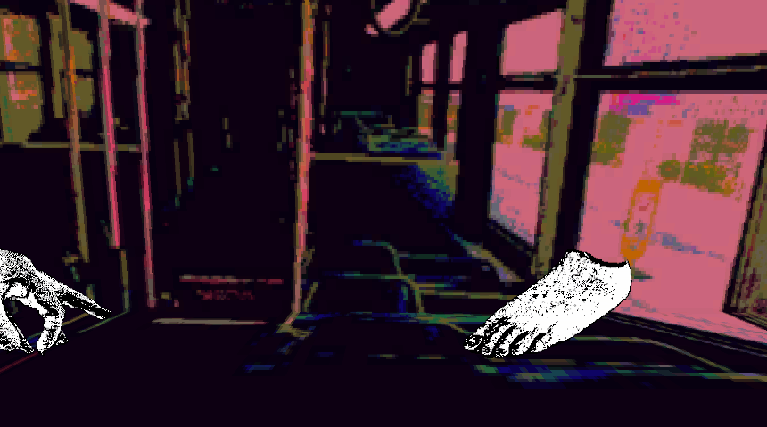
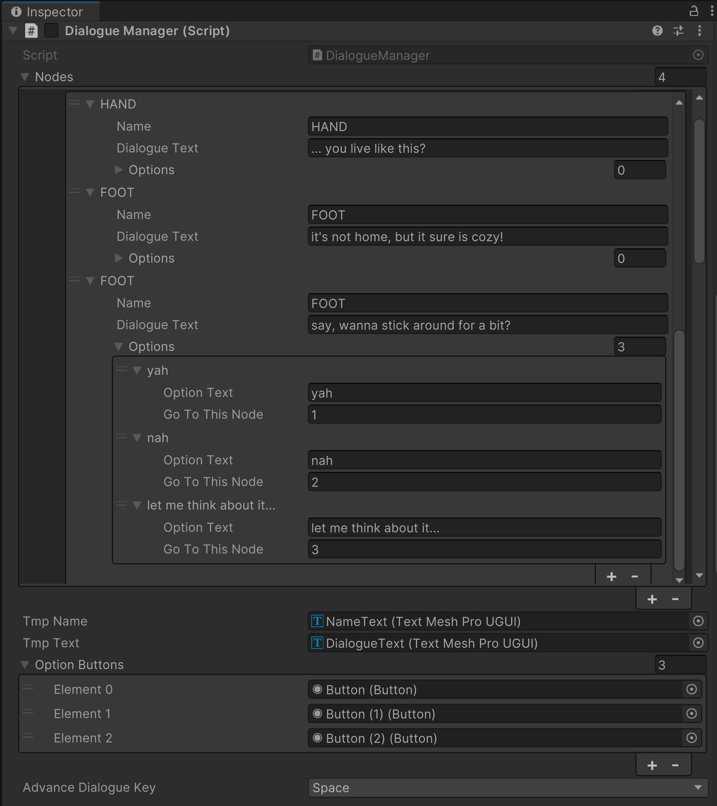

<script>hljs.highlightAll();</script>

# Interactive Text

---

📦 **Unity packages from today's class:**
> 
> - Class Demo: [Custom Dialogue System in Unity using C# scripts and Trigger Event Handlers](https://drive.google.com/file/d/1gJ0TIe_eD4ZOvHYbarFxefn4aez9BAld/view?usp=drive_link) -- Note: Player movement is controlled by keyboard buttons Q W E R; Dialogue Advancement uses spacebar key. 

<br>

📚 **Other relevant resources to today's topic:**
>
> - Styling Text in TextMeshPro: [https://learn.unity.com/tutorial/textmesh-pro-style-sheets-and-styles#](https://learn.unity.com/tutorial/textmesh-pro-style-sheets-and-styles#)
> - Recommended Video Tutorials: 
>     - Modifying or Animating TextMeshPro objects in custom scripts: [https://www.youtube.com/watch?v=FXMqUdP3XcE](https://www.youtube.com/watch?v=FXMqUdP3XcE)
>     - Typewriter effect: [https://youtu.be/_nRzoTzeyxU?t=821](https://youtu.be/_nRzoTzeyxU?t=821)
>     - Dynamic scaling for Dialogue Background Image: [https://www.youtube.com/watch?v=K13WnNL1OYM](https://www.youtube.com/watch?v=K13WnNL1OYM)
> - Other tools for interactive text in Unity:
>     - [Ink](https://www.inklestudios.com/ink/), by Inkle, with [Unity integration asset](https://assetstore.unity.com/packages/tools/integration/ink-integration-for-unity-60055).
>     - [Twine](https://twinery.org/), with Unity integration using [Cradle](https://github.com/daterre/Cradle). 

<br>

---


Last week, we made interactive text using the tiny game engine Bitsy. Most of you have included the following components in your Bitsy game:

- a **dialogue sequence** that plays upon interacting with a sprite, object, or ending/exit tile; 
- **branching lists** of dialogue that use **conditional statements** to determine which text to display at any given point;
- specific **actions** that get triggered upon arriving at a particular dialogue line (e.g. a room transition, or a variable change);
- a map of **rooms** that reveal different spaces, dialogues, and narratives. 

<figure>

<figcaption>-- <a href="https://visager.itch.io/flirting">flirting</a>. Visager.
</figcaption>
</figure>

<br>

**Early Text Adventure Video Games**

<figure>
<div class="div-container">
<div style="width:65%">

</div>
<div style="width:33%">
<br>
</div>
</div>
<figcaption>-- Hunt the Wumpus (1973). Gregory Yob. 
</figcaption>
</figure>

<br>

**Natural Language Parsers for Player Interface + Interaction**

<figure>

<figcaption>-- Colossal Cave Adventure (1976). William Crowther.
</figcaption>
</figure>

<br>

<figure>
<div class="div-container">
<div style="width:47.5%">

</div>
<div style="width:47.5%">

</div>
</div>
<figcaption>-- <a href="https://jaredsorensen.itch.io/parsely">Parsely</a> (2018). Jared A. Sorensen.
</figcaption>
</figure>

<br>

**More adventure games (now with visual graphics)**

<figure>
<iframe width="100%" height="500" src="https://www.youtube-nocookie.com/embed/lUH8nR-_Jfc?si=bH-oRKhlDhhqM7WV&amp;start=111" title="YouTube video player" frameborder="0" allow="accelerometer; autoplay; clipboard-write; encrypted-media; gyroscope; picture-in-picture; web-share" referrerpolicy="strict-origin-when-cross-origin" allowfullscreen></iframe>
<figcaption>-- pedit5, or "The Dungeon" (1975). Rusty Rutherford.
</figcaption>
</figure>

<br>

<figure>
<iframe width="100%" height="500" src="https://www.youtube-nocookie.com/embed/VlChfc4AR4w?si=Ybhs-D_twHxW0y5W&amp;start=55" title="YouTube video player" frameborder="0" allow="accelerometer; autoplay; clipboard-write; encrypted-media; gyroscope; picture-in-picture; web-share" referrerpolicy="strict-origin-when-cross-origin" allowfullscreen></iframe>
<figcaption>-- Ultima I (1981). Richard Garriott.
</figcaption>
</figure>

<br>

**Visual Novels**

<figure>
<iframe width="100%" height="500" src="https://www.youtube-nocookie.com/embed/BZq8MYRMHCM?si=Tkia1ec3U5_t5qLx&amp;start=64" title="YouTube video player" frameborder="0" allow="accelerometer; autoplay; clipboard-write; encrypted-media; gyroscope; picture-in-picture; web-share" referrerpolicy="strict-origin-when-cross-origin" allowfullscreen></iframe>
<figcaption>-- The Portopia Serial Murder Case (1983). Yuji Horii.
</figcaption>
</figure>

<br>

<figure>

<figcaption>-- <a href="https://brianna-lei.itch.io/butterfly-soup-2">Butterfly Soup 2</a>. Brianna Lei. Using <a href="https://www.renpy.org/">RenPy</a>.
</figcaption>
</figure>

<br>

<figure>

<figcaption>-- <a href="https://angelawashko.com/section/437138-The%20Game%3a%20The%20Game.html">The Game: The Game</a>. Angela Washko. 
</figcaption>
</figure>

<br>

<figure>

<figcaption>-- <a href="https://sweetfish.itch.io/goncharov">GONCHAROV 2073</a>. sweetfish. Using <a href="https://candle.itch.io/tape-window">tape window engine</a>.
</figcaption>
</figure>

<br>

**Hypertext Fiction**

<figure>

<figcaption>-- <a href="https://everestpipkin.itch.io/shell-song">Shell Song</a>. Everest Pipkin. Using <a href="https://candle.itch.io/tape-window">Twine</a>.
</figcaption>
</figure>

<br>

<figure>

<figcaption>-- <a href="https://sites.rhizome.org/anthology/lialina.html">My Boyfriend Came Back From The War</a> (1996). Olia Lialina.
</figcaption>
</figure>

<br>

**In-game Text as Performance**

<figure>

<figcaption>-- <a href="https://dss-edit.com/elden-poem/">Elden Poem</a>. Danny Snelson. 
</figcaption>
</figure>

<br>

<figure>
<iframe width="100%" height="500" src="https://www.youtube-nocookie.com/embed/pAv8n3mY5N8?si=hKGHDXnz5O5sDoAm" title="YouTube video player" frameborder="0" allow="accelerometer; autoplay; clipboard-write; encrypted-media; gyroscope; picture-in-picture; web-share" referrerpolicy="strict-origin-when-cross-origin" allowfullscreen></iframe>
<figcaption>-- <a href="https://dkoikos.itch.io/oikospiel">Oikospiel Book 1</a>, Act 2 - Salt and Scab 2: Bridge from Kochiri. David Kanaga.
</figcaption>
</figure>

<br>

## Interactive Text in Unity

We can set up interactive text in Unity using trigger/collision detections and a custom dialogue system. We'll also learn how to set up **multiple dialogue options** for players to select.

Let's start with a trigger event that toggles the visibility of a dialogue text. 

<br>

## Toggling Text Visibility Using Trigger Events

**To use Trigger Events** (and you can easily modify this example for a collision event instead):

1. Set up your player object with **tag "Player"**.
2. Create a **trigger zone** that the player will enter/exit to toggle the visibility of the dialogue. This can be an empty GameObject with a trigger collider.
3. Set up your player and trigger zone for [**trigger detection**](./w4-1-physics-engine.md/#triggers) -- here's a link to the [collision matrix](./img/unitycollisionmatrix.png) for your reference. 
4. Add an object to your scene that will display your dialogue (e.g. an sprite image, a TextMeshPro object). Disable the GameObject so it's hidden at the start of the game. 
5. **Create a new C# script**, then copy-paste the following code into your MonoBehaviour class. Attach this script onto your **trigger zone object**.

```csharp
//in the inspector, attach the dialogue object from your scene into this variable
[SerializeField] GameObject dialogueGraphics; 

void OnTriggerEnter(Collider col){

    //check if the collider belongs to "Player" tag.
    if (col.gameObject.tag == "Player"){ 

        //check if dialogue graphics are toggled off
        if (!dialogueGraphics.activeSelf){ 

            //then toggle on. 
            dialogueGraphics.SetActive(true);
        }
    }
}

//then toggle the object off upon exiting the trigger collider. 
void OnTriggerExit(Collider col){
    if (col.gameObject.tag == "Player"){ 
        if (dialogueGraphics.activeSelf){ 
            dialogueGraphics.SetActive(false);
        }
    }
}
```

Alternatively, you could also set up **event handlers** that invoke multiple actions upon entering the trigger zone, e.g. if you want a sound effect to play when the dialogue activates. 

There are many possibilities for customising this trigger setup. In my example Unity package for this lesson, I used different trigger zones to enable / disable / destroy different dialogue graphics in my scene. 



<br>

## Setting up custom dialogue systems in Unity

What if we want to make **a list of dialogue lines** that get played in order? And what if we want to set up a **branching dialogue list** that displays different text according to whether specific conditions are met? This is where **a custom dialogue system** may come in handy. 

There are many existing Unity packages, extensions, and assets that already provide a foundational infrastructure for this (e.g. Twine, Ink, and other available products in the Unity asset store -- we will look at Yarn Spinner shortly after this), but I will show you how to build your own from scratch in C#. 

### Anatomy of a Dialogue Tree

<figure>
    
    <figcaption>-- Example of a dialog tree (or conversation tree), depicting a fictional conversation between a player character and a non-player character. Source: <a href="https://en.wikipedia.org/wiki/Dialogue_tree">Wikipedia</a>.
    </figcaption>
</figure>

In most video games and interactive text software, our dialogue is programmed in a **node-based structure** called a dialogue tree. Components typically include (listed in order of increasing scope):

1. **Options**: buttons that allow players to select their actions / responses in the game. Typically used as connectors between multiple nodes.

2. **Lines**: the text that is played at any point of a given sequence, including other relevant information such as: 

    - which character is currently speaking;
    - how the line is delivered in terms of emotional expression through voice, sprites, typography, and pacing;
    - a list of available options with which the player can choose to respond.

3. **Nodes**: a group of lines that represent a singular game state. Multiple nodes may be linked through dialogue options, events, or conditional statements. 

<br>

We will make a **custom serializable C# class** for each of these components, and then use them in a **MonoBehaviour class** that we will attach to an object in our game scene as our dialogue manager script. 

### Example Dialogue System using custom C&#35; classes

**Inspector preview**


<br>

**C# Script**

Try parsing through this script from the very bottom, then slowly move up. 

```csharp
using System.Collections;
using System.Collections.Generic;
using UnityEngine;
using UnityEngine.UI;
using UnityEngine.Events;
using TMPro;

//our dialogue system here is broken up into the following hierarchy:
// LINES (and OPTIONS) -> NODES -> NODE MANAGER

//our dialogue manager script acts as a NODE MANAGER
//that will determine which node should be played at any time

//here, our dialogue manager will also update the dialogue graphics
//as we switch across different dialogues.

public class DialogueManager : MonoBehaviour
{
    public DialogueNode[] nodes; //an array of nodes, each associated with an array index
    int currentNode = 0;

    public TextMeshProUGUI tmpName,tmpText;

    public Button[] optionButtons;
    int[] optionNodeDestinations; 
        // each integer is associated with a button option,
        // which determines which node in our DialogueNode array to go to next.

    [SerializeField] KeyCode advanceDialogueKey;
        // select which key to use to go to next dialogue line.

    public void OnEnable()
    {
        //initialise array of size equal to number of optionButtons available.
        optionNodeDestinations = new int[optionButtons.Length];

        nodes[currentNode].ResetLine();
        UpdateNode();
    }

    public void Update()
    {
        //update dialogue text if advance dialogue key pressed.
        if (Input.GetKeyDown(advanceDialogueKey))
        {
            
            if (nodes[currentNode].GetOptions().Length == 0) //only proceed to next dialogue line if there aren't any button options available.
            {
                //if the next line does not return to the beginning
                if (nodes[currentNode].NextLine() != 0)
                {
                    //go to the next line
                    nodes[currentNode].currentLine++;

                    //and update the dialogue graphics
                    UpdateNode();
                }
                else
                {
                    //otherwise we've reached the end of this node
                    //so excecute the onEnd event for that node
                    nodes[currentNode].onEnd.Invoke();
                }
            }
        }
    }

    public void UpdateNode()
    {
        //uncomment the following code to log the current line and node index inside the console.
            //Debug.Log("current Node: " + currentNode + "; current Line: " + nodes[currentNode].currentLine);
        
        
        //update text for name and dialogue line
        tmpName.text = nodes[currentNode].GetName();
        tmpText.text = nodes[currentNode].GetText();

        //if we have options...
        if (nodes[currentNode].GetOptions().Length>0)
        {
            //get our options!
            DialogueOption[] opts = nodes[currentNode].GetOptions();

            //activate the number of buttons equal to the number of options
            //in our current example, we only have a max of 3 options and buttons.
            for (int i = 0; i < opts.Length; i++)
            {
                if (!optionButtons[i].gameObject.activeSelf)
                {
                    optionButtons[i].gameObject.SetActive(true);
                }

                //update button text
                optionButtons[i].GetComponentInChildren<TextMeshProUGUI>().text = opts[i].optionText;

                //and replace the values received by the button's onClick event
                optionNodeDestinations[i] = opts[i].goToThisNode;

            }
        } else
        {

            //otherwise hide all active buttons
            foreach (Button b in optionButtons)
            {
                if (b.gameObject.activeSelf)
                {
                    b.gameObject.SetActive(false);
                }
            }
        }
    }

    //we can use this function to jump to different dialogue nodes.
    //good for branching narratives! 
    public void ChangeNode(int toThisNode)
    {
        currentNode = toThisNode;
        nodes[currentNode].ResetLine();
        UpdateNode();
    }

    //functions called in each button's onClick event
    public void ChangeNodeButtonOne()
    {
        ChangeNode(optionNodeDestinations[0]);
    }
    public void ChangeNodeButtonTwo()
    {
        ChangeNode(optionNodeDestinations[1]);
    }
    public void ChangeNodeButtonThree()
    {
        ChangeNode(optionNodeDestinations[2]);
    }
}

//NODES contain groups of dialogue lines
//that should be played in the same sequence

//this helps us organize our lines into mutliple branches.
[System.Serializable]
public class DialogueNode
{
    public DialogueLine[] dialogues;

    [HideInInspector] 
    //our inspector gets easily cluttered in this script
    //so i'm hiding this public integer to optimise our editor layout.
    public int currentLine = 0; 

    public UnityEvent onEnd;
        //i have a onEnd unity event that gets called once the player exits outside of this dialogue node. 

        //you may consider modifying this dialogue system script using UNITY EVENTS that trigger:
            // different character portraits and speech bubbles that correspond to who's speaking / what's being said.
            // camera changes
            // inventory modifications, etc.


    //some functions to provide a shorthand method
    //for accessing these datas.
    public string GetText() { return dialogues[currentLine].dialogueText; }
    public string GetName() { return dialogues[currentLine].name; }
    public DialogueOption[] GetOptions() { 
            return dialogues[currentLine].options;
    }
    
    //returns the index of the upcoming line of dialogue
    public int NextLine()
    {
        if (currentLine < (dialogues.Length - 1))
        {
            int nextLine = currentLine+1;
            return nextLine;
        } else
        {
            //returns 0 if we've reached the end of the node.
            return 0;
        }
    }

    //restart from beginning of dialogue node
    public void ResetLine()
    {
        currentLine = 0;
    }
}

//a LINE has:
//  a name (of a character speaking);
//  a dialogue text (of what's being said);
//  an optional set of options (that players can choose from)

[System.Serializable]
public class DialogueLine
{
    public string name;
    public string dialogueText;
    public DialogueOption[] options;

    //if you want some unity events to trigger once the player enters/exits a dialogue line, 
    //you may consider adding a public UnityEvent variable in this class.
}


//an OPTION has:
//  a text that gets displayed on the button
//  a destination node index that determines which dialogue node the player goes to next upon selecting this option.
[System.Serializable]
public class DialogueOption
{
    public string optionText;
    public int goToThisNode;
}
```

<br>

The benefit of customising your own dialogue system in C# is that you can design your own workflow that works best for your purposes. However, it's easy to get lost in the clutter of array elements in our inspector. 

If you have more complex branching dialogues, or prefer a more tidy workflow, you may consider integrating an external narrative game tool into your Unity project.

<br>

## Yarn Spinner

Yarn Spinner's Github page introduces their tool in the following manner: 

> Yarn Spinner is a dialogue system that lets you write interactive conversations in a **simple, screenplay-like** format, which can be loaded into your game and run.

<figure>

<figcaption>-- A collection of games that have been made using Yarn Spinner. Taken from Yarn Spinner's home page. 
</figcaption>
</figure>

<br>

Yarn Spinner has a simple-to-parse syntax, and has a lot of built-in functionality for setting up and displaying dialogues. It only takes a bit of setting up and some familiarity with their syntax to get a basic interactive dialogue up and running. Things may get more complicated once you get into extra customisations with dialogue graphics (e.g. setting up a custom speech bubble and options view.)

<br>

### Setting up Yarn Spinner

> If you need a refresher on anything below (including Yarn Spinner syntax), I recommend watching this Yarn Spinner workshop recording: 
>
> <iframe width="100%" height="500" src="https://www.youtube-nocookie.com/embed/KwrM8dMJ4F4?si=dzx-cLgBumEg3QWH" title="YouTube video player" frameborder="0" allow="accelerometer; autoplay; clipboard-write; encrypted-media; gyroscope; picture-in-picture; web-share" referrerpolicy="strict-origin-when-cross-origin" allowfullscreen></iframe>

Follow the instructions in the section titled "[Install via the Unity Package Manager](https://docs.yarnspinner.dev/using-yarnspinner-with-unity/installation-and-setup#install-via-the-unity-package-manager-1)" on the Yarn Spinner documentation page.

Then, download the **Yarn Spinner extension in Visual Studio Code** to access syntax highlighting and their node graph preview.

Finally, follow these steps to get a simple dialogue runner up and running in your Unity Scene: [https://docs.yarnspinner.dev/using-yarnspinner-with-unity/quick-start](https://docs.yarnspinner.dev/using-yarnspinner-with-unity/quick-start)

---

How do we write in Yarn Spinner in the first place?

### Syntax for Yarn Spinner

> Read Yarn Spinner's syntax documentation in their [beginner's guide](https://docs.yarnspinner.dev/beginners-guide/syntax-basics).
> 
> Use the online text editor [Try Yarn Spinner](https://try.yarnspinner.dev/) to playtest your yarn scripts before bringing them into Unity! You may also copy-paste any of the following code snippets in this section to see how they work. 

#### Nodes, Lines, and Options

Everything in Yarn is structured around **nodes** and **lines**. 

Here's how an empty node with a single line looks like: 

```yaml
title: Start
---
// A NODE starts with the header, which contains the node's TITLE.
    //Node titles are not shown to the player 
    //and MUST start with a letter
    //and CAN contain any letters, numbers and underscores
    //but CANNOT contain a period, spaces, or other symbols.

//the BODY of a node begins with the "---" marker

//and must contain at least ONE LINE of text
Hello, world!

//a node must END with the "===" marker.
===
```

<br>

Almost every line of text you write inside a node is a **line**. The user has to press a key to advance to the next line. 

If there is a set of characters without spaces before a colon (:) at the beginning of the line, Yarn Spinner will mark that as **the name of the character**. 

```
title: Start
---
Here is some text.

Horse: And here is a horse named "Horse"!
Horse: delivering a line of dialogue or two!
Horse: ... or three!!!
Horse: *neighs into the sunset*
===
```

<br>

You may also set up **dialogue options** using the "->" marker. You can also nest options inside other options. 

```
title: Start
---
Don't you just love having *multiple options* to choose from?
-> I sure do!
    You know it, buddy!
-> ...but what if I want more text inside other options?
    Boy, oh boy- you're in luck!
    You can even put options inside other options!
    -> Like this?
        Exactly!
    -> Or this? 
        You bet!
===
```

<br>

#### Built-in Commands

Having lots of options can get complex, so it’s often a good opportunity to break your story up into **multiple nodes** and jump between them. 

Use the `<<jump>>` command to jump to a different node. 

```
title: Start
---
Narrator: Are you ready? Remember, it's ride or die!
-> I was born ready!
    <<jump PlayerIsReady>>
-> Maybe later.
    <<jump PlayerNotReady>>
===
title: PlayerIsReady
---
Narrator: LET'S RIDE!!!!!
===
title: PlayerNotReady
---
Narrator: There is no "maybe later" in this game.
Narrator: We will ride without you, and that's that.
You died. 
===
```

<br>

You can also use the `<<wait>>` command to pause a number of seconds before the next line plays. This can be used for dramatic effect, or for setting up cutscenes in between dialogue lines. 

```
title: Start
---
PatientDog: Look at how long I can wait before speaking!
<<wait 3>>
PatientDog: BARK!
===
```

There's also the `<<stop>>` command that stops the dialogue runner in the middle of a node. You may use this at the end of an if statement, or a shortcut option button that ends the conversation. 

```
title: Start
---
TalktativeNPC: I could go on and on about this topic for hours!
-> Tell me more!
-> (Leave without saying anything.) 
    <<stop>>
TalkativeNPC: You sure are a good listener!
<<jump TalkativeNPCPartTwo>>
```

<br>

#### Variables and Conditional Statements

You can also use **variables** to store information and set up **conditional statements**. 

Variables are denoted by the "$" sign before their name. You can declare and set them as numbers, strings, or booleans. You may also use them in your lines by calling them in curly brackets, e.g. `The current number is {$number}.`

If statements must close with an `<<endif>>` line. We can also use if statements to choose which options to make available.

```
title: Start
---
<<declare $apples = 0>>
Horse: Hey. Got any apples? 
-> Yeah. <<if $apples > 0>>
    Horse: Well? You gonna hand 'em over or not?
    <<set $apples = $apples-1>>
    Horse: Mmm... Now THAT is an Apple.
    <<if $apples > 0>>
        Horse: I know you've got {$apples} more of those bad boys lining your pocket. 
        Horse: Lucky for you, this baby pony of a stomach has had its fill for the day.
    <<endif>>
-> Yeah (lie.) <<if $apples == 0>>
    Horse: You can't fool me. 
    Horse: A horse's nose never lies.
-> No. <<if $apples == 0>>
    Horse: Well? Why am I even talking to you? 
-> No (lie.) <<if $apples > 0>>
    Horse: You can't fool me. 
    Horse: A horse's nose never lies.
===
```

<br>

#### Functions

Yarn Spinner has a set of built-in functions that allow you to **randomize numbers in a given range**, **count the number of times a node has been visited**, etc. They are all listed on [their documentation page here](https://docs.yarnspinner.dev/getting-started/writing-in-yarn/functions#custom-functions). 

How do we call custom functions from our Unity C# scripts in Yarn Spinner? 

##### Using YarnCommand attribute in C&#35; scripts

> More documentation about custom functions here: [https://docs.yarnspinner.dev/using-yarnspinner-with-unity/creating-commands-functions](https://docs.yarnspinner.dev/using-yarnspinner-with-unity/creating-commands-functions)

In our C# script, add the Yarn.Unity namespace at the top of the script. Then, add a `[YarnCommand]` attribute just before our method function (which must be set to `public`!), and call the custom function name we will use in the Yarn script inside parentheses ().

```csharp
using Yarn.Unity;

public class CharacterMovement : MonoBehaviour {

    [YarnCommand("leap")] 
    public void Leap() {
        Debug.Log($"{name} is leaping!"); 
    }
}
```

<br>

Attach this script to a GameObject in your scene. Rename this GameObject to "MyCharacter".

In our Yarn script, inside double arrows << >>, we can call the **custom function name** AND **the name of the GameObject** that this MonoBehaviour script is attached to.

```
title: Start
---
<<jump MyCharacter>>
===
```

<br>

If your function takes in parameters, you may add them after the GameObject name inside the double arrows.

**C# example**

```csharp
using System.Collections;
using System.Collections.Generic;
using UnityEngine;
using Yarn.Unity; //remember to include this namespace.

//this is a script attached to a GameObject called MyCharacter.
public class CharacterSpriteSwitcher : MonoBehaviour {

    //...

    [YarnCommand("switch_sprite")] 
    public void SwitchSprite(int num) {
        spriteRenderer.sprite = sprites[num]
    }
}
```

**Yarn example**
```
title: Start
---
<<switch_sprite MyCharacter 2>>
===
```

##### Custom Start Command in Unity C&#35;

```csharp
using System.Collections;
using System.Collections.Generic;
using UnityEngine;
using Yarn.Unity; // remember to include this namespace.

public class DialogueTrigger : MonoBehaviour{
    public DialogueRunner dialogueRunner;
    public KeyCode advanceDialogueKey;

    void Update(){
        if (Input.GetKeyDown(advanceDialogueKey)){
            dialogueRunner.StartDialogue("Start") // call the title name of your node.
        }
    }
}

```

### How to do other stuff in Yarn Spinner

You may refer to **Yarn Spinner's FAQ page** to explore what could be possible in this tool: [https://docs.yarnspinner.dev/using-yarnspinner-with-unity/faq](https://docs.yarnspinner.dev/using-yarnspinner-with-unity/faq)

Yarn Spinner's Unity package also includes additional sample scenes that demonstrate how to set up specific features. They can be found inside **the Unity Package manager** > look for the **Yarn Spinner package** under My Registries > **Samples** > Install any sample scenes you'd like to study as a reference. 

---

## Some course reminders

- **Project 3 Sketch** is due Thursday.
